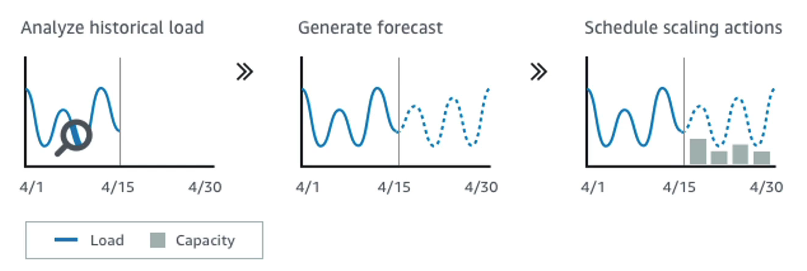
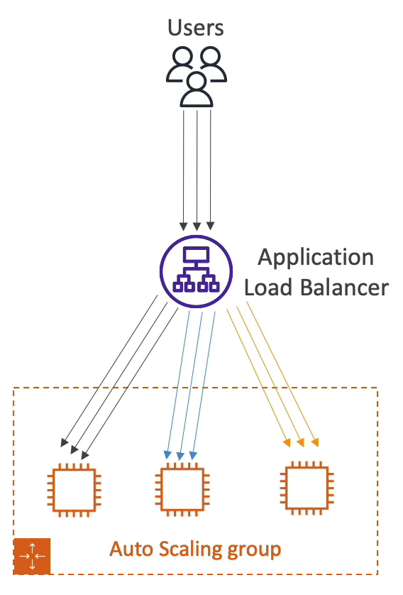

# Auto Scaling Group 조정 정책

오토 스케일링 그룹의 스케일링 정책에 대해 살펴보자

### 동적 스케일링 정책(Dynamic Scaling Policies)
동적 스케일링 정책은 세 가지 유형이 존재한다.
1. 대상 추적 스케일링(Target Tracking Scaling)
   - 가장 간단하고 설정하기도 쉽다. 
   - 예를 들어 오토 스케일링 그룹의 모든 EC2 인스턴스 평균 CPU 사용률을 추적하여 40% 대에 머무르게 하고 싶을 경우 사용한다. 즉, 기본이 되는 기준점을 세우고 상시 가용이 가능하도록 하는 것이다.
2. Simple / Step Scaling
   - 대상 추적 스케일링 보다 좀 더 복잡하다.
   - 예시1) CloudWatch 에 전체 ASG 에서 CPU 사용률이 70%를 초과하는 경우, 두 개의 유닛을 추가할 수 있도록 설정할 수 있다.
   - 예시2) 전체 ASG 내의 CPU 사용률이 30% 이하로 떨어지면 유닛 하나를 제거한다는 설정을 추가할 수 있다.
   - CloudWatch 경보를 설정할 때에는 한 번에 추가할 유닛의 수와 한 번에 제거할 유닛의 수를 단계별로 설정할 필요가 있다.
3. 예약 작업(Scheduled Actions)
   - 예시1) 금요일 오후 5시에 아이유 콘서트 예매가 예정되어 있기 때문에 여러 사람들이 애플리케이션에 접속하는 것에 대비해 ASG 최소 용량을 금요일 5시에 자동으로 10까지 늘린다.
   - 스케일링이 필요한 시점을 미리 아는 경우에 이 방식을 사용하면 된다.

### 예측 스케일링(Predictive Scaling)
새로운 스케일링 방법 중에 하나다.

말 그대로 과거의 트래픽을 분석하여 언제 트래픽이 급증하고 급감할 지를 예측하여 해당하는 날에 자동으로 스케일링을 해주는 방식이다.

머신 러닝을 기반이며 손쉬운 ASG 오토 스케일링이며 향후 대두될 방식일 것이다.

### 확장하기 좋은 지표

1. CPU 사용률 : 일반적으로 인스턴스에 요청이 갈 때 마다 CPU 사용률이 오른다.
2. Request Count Per Target : EC2 인스턴스는 한 번에 1000개의 요청을 안정적으로 처리한다. 아래처럼 3개의 인스턴스를 갖는 오토 스케일링 그룹이 있고, 현재 ALB 에서 인스턴스로 요청이 분산되서 나가고 있다. 현재 대상별 요청 수 지표(Request Count Per Target)는 3이 된다. 

3. 평균 네트워크 입출력량(Average Network In/Out) : 업로드와 다운로드가 무척이나 많아서 네트워크에 병목 현상이 발생한 것으로 판단되면 평균 네트워크 입출력량을 기반으로 스케일링을 수행해서 특정 임계값에 도달할 때 스케일링을 수행하도록 설정 가능
4. 커스텀한 지표 : CloudWatch 에서 애플리케이션 별로 지표를 설정하고 이를 기반으로 스케일링 정책을 바꿀 수 있다. 

### Scaling Cooldowns

스케일링 작업이 끝날 때 마다 인스턴스의 추가 또는 삭제를 하기 전에 갖는 휴식 시간이라고 보면된다. 기본적으로 5분(300초)의 휴식 시간을 갖는다.

휴식 시간동안에는 ASG가 추가 인스턴스를 실행하거나 종료할 수 없다. 새로운 인스턴스가 안정화될 수 있도록 하며 새로운 지표의 양상을 살펴보기 위해서다.

따라서 스케일링 작업이 발생할 때 기본으로 설정된 휴식 시간이 있는지 확인해야 한다. 

휴식 시간이 지나지 않은 경우에는 인스턴스를 실행하거나 종료할 수 없고 휴식 시간이 지났으면 인스턴스를 실행하거나 종료할 수 있다.

