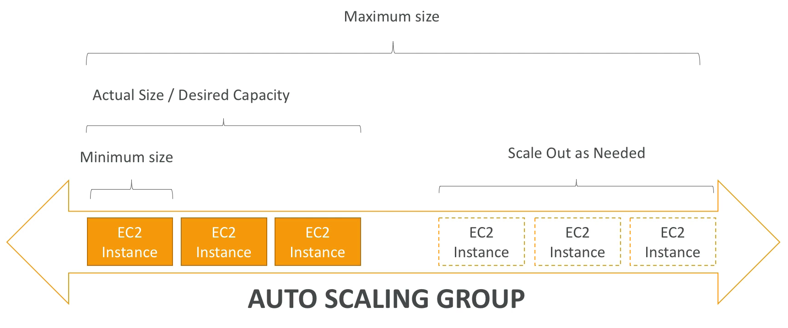
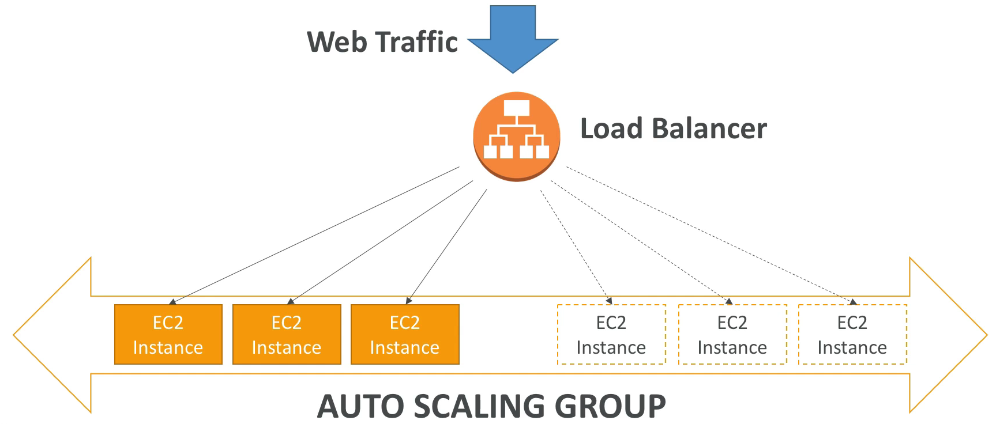
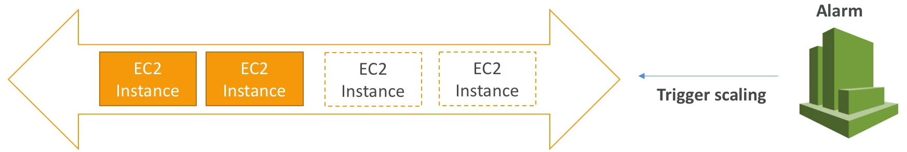

# Auto Scaling Group

ASG 에는 증가되는 트래픽 양에 따라 인스턴스를 증가시키는 스케일 아웃 작업과 트래픽 양이 줄어듦에 따라 인스턴스를 감소시키는 스케일 인 작업을 설정할 수 있다.

또한, 특정 갯수만큼만 스케일 아웃시키거나 스케일 인 하여 인스턴스의 최대 최소 갯수를 정할 수 있다.

마지막으로, 이전까지 했던 작업들과 다르게 새 인스턴스를 로드 밸런서에 자동으로 등록할 수 있는 기능도 있다.

- Minimum size : 오토 스케일링 그룹에서 꼭 실행되야 하는 인스턴스 갯수로, 최소 크기를 나타낸다.
- Actual Size / Desired Capacity : ASG 에서 현재 실행 중인 인스턴스 갯수를 나타낸다.
- Maximum size : 부하가 심해진 경우에 스케일 아웃을 통해 추가될 인스턴스 갯수를 의미한다. 여기에는 최소 크기, 기대 용량, 최대 크기 파라미터가 있고 기억하면 좋다.

스케일 아웃은 인스턴스를 추가하는 기능이고 스케일 인은 인스턴스를 제거하는 기능이다.

로드 밸런서를 사용하면 로드 밸런서로 웹 트래픽이 모두 몰리게 되고, 로드 밸런서와 연결된 오토 스케일링 그룹을 통해 스케일 아웃이나 스케일 인 작업을 통해 인스턴스로 트래픽이 분산된다.

즉, 오토 스케일링 그룹이 스케일 아웃을 하여 인스턴스가 추가되면 생성된 인스턴스가 로드 밸런서에 연결되고 트래픽이 분산된다는 뜻이다.

로드 밸런서와 오토 스케일링 그룹은 함께 협력해서 작동한다.

ASG 는 아래와 같은 속성을 갖는다.
- launch configuration
  - AMI + 인스턴스 유형
  - EC2 User Data : 인스턴스 맨 처음 생성될 때 작업할 것들을 적는 스크립트
  - EBS Volumes
  - Security Group
  - SSH Key Pair
- 최소 크기 / 최대 크기/ 최초 용량 및 기대 용량
- 네트워크 + 서브넷
- 로드 밸런서 정보 : 사용하는 로드 밸런서 정보에 따라 연결된 타겟 그룹의 정보를 정의한다.
- 스케일링 정책 : 스케일 아웃이나 스케일 인에 대한 정책 설정

오토 스케일링 그룹에 의해 스케일 인/아웃 이 되서 인스턴스가 추가 생성되면 이 생성에 대한 알람이 필요하다.

CloudWatch 알람을 기반으로 오토 스케일링 그룹을 스케일링 하는 것이 가능하며 알람 기능을 설정하여 확인할 수 있다.

즉, 스케일 아웃이 필요로 하면 클라우드 워치를 통해 '지금 당장 스케일 아웃을 해서 인스턴스를 추가해야 해!' 라고 알람이 온다.

ASG 는 알람을 통해 조정되며 평균 CPU 사용량을 모니터링 한다. 이 클라우드 워치의 알람을 기반으로 스케일 아웃 및 스케일 인 정책을 수립할 수도 있다.

오토 스케일링 규칙으로 여러 가지를 세팅해줄 수 있다. 예를 들어,

1. 오토 스케일링 그룹 대상의 평균 CPU 사용량을 기반으로 스케일 인/아웃을 규칙을 정할 수 있다.
2. 인스턴스 당 ELB 에서 보내는 요청 갯수를 기반으로 스케일 인/아웃을 규칙을 정할 수 있다.
3. 평균적인 네트워크 인/아웃을 기반으로 스케일 인/아웃 규칙을 정할 수 있다.

내가 지금 당장 사용하고 있는 애플리케이션에 적합한 것으로 판단되는 스케일링 정책이 있다면 그걸 사용하면 된다.

이런 규칙들은 쉽게 설정이 가능하고, 논리적으로 쉽게 추론하여 설정해줄 수 있다.

ELB 의 연결된 인스턴스 당 요청을 1000 개 만 받게 하겠다, CPU 사용률을 평균 40% 로 설정하겠다. 이런식으로 스케일링 규칙을 생성할 수 있다.

진짜 정말로 다양한 오토 스케일링 규칙을 세팅할 수 있다...

단적으로, 사용자가 9시에 몰린다면 그 시간대에만 적용되는 오토 스케일링 그룹을 걸어준다던가..

오토 스케일링 그룹 자체는 무료이지만 실행된 리소스, EBS 볼륨, 연결된 인스턴스 등은 유료로 구매를 해야 한다.

ASG 에 인스턴스가 있을 때 혹시라도 인스턴스에 오류가 발생하여 인스턴스가 종료된 경우 ASG 가 인스턴스가 종료된 것을 확인하고 자동적으로 새로운 인스턴스를 추가해준다.

이런 안전성의 목적으로 ASG 를 사용한다.

로드 밸런서가 특정 인스턴스를 비정상이라고 표기한 경우 ASG 는 해당 인스턴스가 비정상이니 종료하고 새로운 인스턴스를 만들어 교체하라는 판단을 내린다.

아주 아주 유용한 서비스이다.