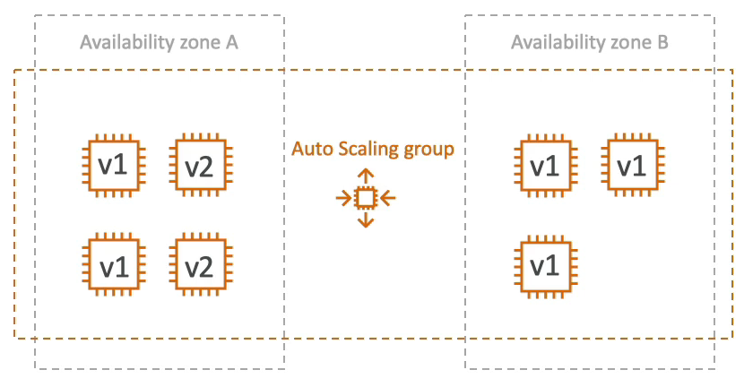

# Auto Scaling Group - 솔루션 아키텍트용

### ASG 기본 종료 정책
아래는 기본 종료 정책에 대한 우선 순위이다.

1. 가장 많은 인스턴스가 있는 AZ을 찾는다.
2. AZ에 여러개의 인스턴스가 존재할 경우 가장 오랫동안 실행된 인스턴스를 종료한다.

아래 그림을 보면 오토 스케일링 그룹이 있고 두개의 가용 영역이 있다.

A 가용 영역에는 두 개의 v1 인스턴스와 두 개의 v2 인스턴스가 실행 구성으로 되어 있고 B 가용 영역에는 세 개의 v1 인스턴스가 있다.

v1은 가장 오랫동안 실행된 인스턴스이다.

기본 종료 정책에 따라 우선 가장 많은 인스턴스가 있는 A 가용 영역에서 인스턴스를 삭제할 것이다.

또한 네 개의 인스턴스 중에서 가장 오랫동안 실행된 v1 인스턴스를 선택하여 종료시킨다.

기본 종료 정책을 사용하는 ASG는 AZ 전체에 걸쳐 인스턴스 수의 균형을 맞추려고 한다.

### ASG 생명 주기(ASG for Solutions Architects Lifecycle Hooks)

기본적으로 ASG에서 인스턴스가 실행되자마자 서비스가 시작되지만 인스턴스를 실행할 때 발생하는 긴 프로세스가 존재한다.

따라서 인스턴스가 실행되면 Pending 상태가 되고, Pending 상태에서 수면 주기 훅을 정의하면 인스턴스가 Pending:Wait 상태로 전환되고 Pending:Wait 상태에선 해당 인스턴스를 구성하는 옵션들을 설정할 수 있게 된다.

그런 다음 준비가 완료되면 Pending:Proceed 상태로 변경되고 해당 상태로 들어가면 InService 상태로 변경된다.

인스턴스가 종료되면 Terminating 상태가 된다. 그리고 Terminating:Wait 상태가 된 후 Terminating:Proceed 상태로 변경된다.

이런 Terminating 상태가 있는 이유는 EC2 인스턴스가 완전히 종료되기 전에 로그 파일에 대한 정보를 추출하려는 경우 해당 상태에서 가져올 수 있기 때문이다.

마지막으로는 Terminated 상태가 된다.

### Launch Template(newer) vs Launch Configuration(legacy)

Launch Configuration(legacy) 실행 구성
- 실행 템플릿과 실행 구성은 모두 EC2 인스턴스의 AMI ID를 지정할 수 있다. 
- 인스턴스 유형, 키페어, 보안 그룹, 태크, EC2 사용자 데이터 처럼 원하는 파라미터들을 지정할 수 있다. 
- 이 두 가지를 모두 사용하여 ASG 에서 EC2 인스턴스를 설정한 파라미터를 갖은 채로 생성할 수 있다. 
- 실행 구성은 레거시로 단일 매개변수를 업데이트 할 때 마다 다시 생성해야 한다.

Launch Template(newer) 실행 템플릿
- 실행 템플릿은 ASG의 새로운 기능이고 AWS 도 사용하는 것을 권장한다.
- 실행 템플릿은 버전 관리가 가능하다.
- 파라미터의 서브셋을 사용하여 여러 템플릿에서 재사용하고 상속해야 하는 부분을 구성할 수 있다.
- 온디맨드 인스턴스와 스팟 인스턴스를 혼합하여 실행 구성보다 비용이 낮은 스팟 플릿을 갖게 될 수 있다.
- T2 unlimited burst 의 특징을 사용할 수 있다.
- AWS 에서 권장하는 방법이다.

