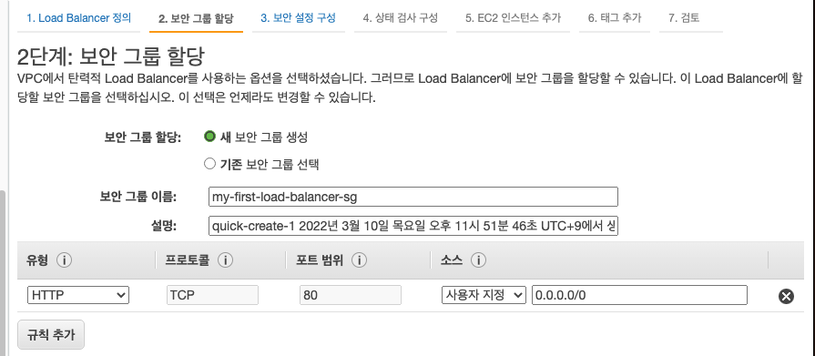
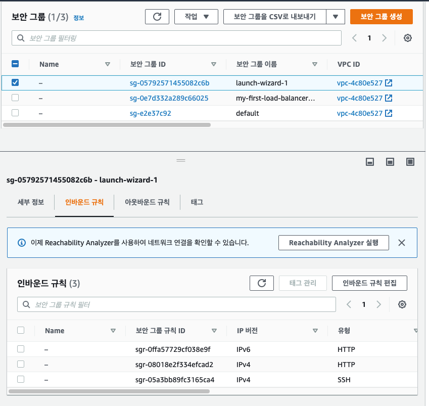

# Classic Load Balancer(CLB)

CLB 는 TCP (4 계층), HTTP & HTTPS (7 계층) 프로토콜을 지원한다.

헬스 체크 또한 TCP 또는 HTTP 프로토콜 기반이다.

클래식 로드 밸런서는 호스트명이 고정되어 있다는 것이다. ex) XXX.region.elb.amazonaws.com 

HTTP listener 로 클래식 로드 밸런서에 연결하는 클라이언트와 CLB 를 통해 인스턴스에 트래픽을 리다이렉션하는 작업을 진행할 것이다.


클래식 로드 밸런서를 만들기 전에 인스턴스를 생성한다.

사용자 데이터에는 아래 처럼 작성한다.

```bash
#!/bin/bash
sudo yum update -y
sudo yum install -y httpd
sudo systemctl start httpd
sudo systemctl enable httpd
echo "<h1>hello world $(hostname -f)</h1>" > /var/www/html/index.html
```
로드 밸런서 콘솔로 이동하고, 로드 밸런서 생성 버튼을 클릭한다.

총 4가지 로드 밸런서가 존재하는데 Classic Load Balancer 로 생성한다.

이름은 my-demo-clb 로 짓는다. 로드 밸런서를 생성할 VPC 는 기본 VPC 를 사용한다.

옵션을 사용하여 내부 로드 밸런서로도 만들 수 있지만 여기서는 선택하지 않는다.'

고급 VPC 구성 활성화도 선택하지 않는다.

클래식 로드 밸런서는 80 번 포트의 HTTP 프로토콜로 오는 트래픽을 허용하기를 원하기 때문에 리스너 구성은 그대로 놔둔다.

또한 80 번 포트를 사용하여 EC2 인스턴스로 트래픽을 보낸다.


다음으로는 CLB 에 대한 새로운 보안 그룹을 생성해야 한다.

이름은 my-first-load-balancer-sg 라고 명명한다.

보안 그룹 설명은 그대로 놔두고, 모든 HTTP 트래픽을 받아들일 수 있게 열어놔야 한다.

즉, 80 번 포트에 HTTP 프로토콜로 오는 모든 IP 주소를 열어 놓아야 한다!! 



다음으로 넘어가면 HTTPS 나 SSL 을 사용하지 않아서 나오는 경고문이 나온다.

여기서는 일단 무시하고 넘어간다.

다음으로는 헬스 체크 설정 부분인데, 80번 포트(HTTP)로 EC2 인스턴스의 /index.html 에 리퀘스트를 보낼 것이다. 

사용자 데이터에서 index.html 파일을 만들었기 때문에 리스폰스로 200 을 보낼 것이고, 만약 404 Not found 같이 오류가 발생하면 그에 해당하는 리스폰스를 로드 밸런서로 보내 줄 것이다.

헬스 체크의 고급 세부 정보로 리스폰스 시간 초과를 구성할 수 있고, 몇 초 간격으로 체크를 할 것인지,

EC2 인스턴스를 비정상으로 선언하기 전까지 발생하는 연속적 상태 검사 실패 횟수를 정할 수 있다. 총 몇 번의 헬스 체크를 실패해야 비정상이라고 알려주는지 횟수를 정해주는 곳이다.

EC2 인스턴스를 정상으로 선언하기 전까지 발생하는 연속적 상태 검사 성공 횟수를 설정할 수 있다. 총 몇 번의 헬스 체크를 성공해야 정상이라고 알려주는지 횟수를 정해주는 곳이다.

아래 사진 처럼 구성했다.


다음으로는 EC2 인스턴스를 추가해줄 수 있다.

방금 생성한 인스턴스를 추가해준다.


태그는 생략하고 검토 부분은 요약본이 나온다. 생성 버튼을 눌러 로드 밸런서를 생성한다.

로드 밸런서가 생성되고 난 후, 생성된 로드 밸런서를 클릭하고 DNS 이름을 복사한 뒤 주소창에 붙여 넣으면 EC2 인스턴스의 index.html 파일이 나온다.

EC2 인스턴스의 public IPv4 주소로 연 화면과 동일한 화면이 나온다.

이 말은 클래식 로드 밸런서가 작동한다는 뜻이다. 만약 DNS 이름으로 접속했는데 인스턴스의 public IPv4 주소로 접속한 화면이 나오지 않는다면 보안 그룹 때문에 생기는 문제일 것이다.

로드 밸런서에서 인스턴스 연결에 실패했을 경우 어떤 식으로 헬스 체킹이 되는지 확인하기 위해 EC2 인스턴스에 연결된 보안 그룹으로 들어가서 HTTP 인바운드 룰을 모두 지워보자



일단 인바운드 룰로 SSH 타입만 남아있기 때문에 HTTP 프로토콜을 이용해서 인스턴스에 연결을 할 수 없는 상황이다.


로드 밸런서 콘솔로 들어가서 인스턴스 탭을 클릭하면 현재 인스턴스의 상태가 OutOfService(서비스 불가 상태) 로 된 것을 확인할 수 있다.

로드 밸런서가 헬스 체크로 보내는 리퀘스트(/index.html 로 보낸다.)에 대한 리스폰스가 제대로 오지 않았기 때문에 생기는 것.

다시 보안 그룹으로 돌아가서 원래 상태로 변경하자.

인스턴스 상태가 InService 로 변경된 것을 확인할 수 있다.


EC2 인스턴스의 보안은 현재 모든 IP 주소에 열려 있는 상태로 로드 밸런서에서 오는 트래픽만 허용해야 한다.

이 때 EC2 인스턴스에 부착된 보안 그룹에 변경 사항이 생긴다.

80번 포트로 들어오는 트래픽 중에 출처가 로드 밸런서 보안 그룹으로부터 온 트래픽인 녀석들만 받게 수정한다..

ELB 에서 오는 트래픽이 EC2 인스턴스에 접근할 수 있게 방화벽을 열어준 것이다.

이 방식이 AWS 에서는 매우 매우 일반적인 패턴이다.


이제 인스턴스 여러개를 생성하여 로드 밸런서에 설정해보자

위와 동일하게 인스턴스 두 개를 생성해준다. 사용자 데이터도 똑같이 작성해준다.

보안 그룹은 방금 위에서 수정된 보안 그룹을 갖도록 한다.

총 3개의 인스턴스가 생성된 상태이다.

이제 이 3개의 인스턴스들을 로드 밸런서에 추가해준다.

단 가용 영역을 기존의 로드 밸런서와는 다르게 설정해준다.

로드 밸런서 콘솔에서 로드 밸런서를 클릭하고 우클릭을 눌러 인스턴스 편집을 클릭한다.

아래와 같은 화면이 나올 것이고 모든 인스턴스를 추가해주고 저장 버튼을 클릭한다.

그러면 로드 밸런서에 3개의 인스턴스가 추가된 것이다.


로드 밸런서 DNS 이름 주소를 새로고침하면 하나의 인스턴스에만 접속하는 것이 아닌 세 개의 인스턴스에 각각 접속하게 된다.


이 말인즉슨, 로드 밸런서가 제대로 작동하고 있다는 뜻이다!!!

로드 밸런서는 사용하지 않는다면 꼭 삭제하자 요금 잡아먹는 도둑이다.