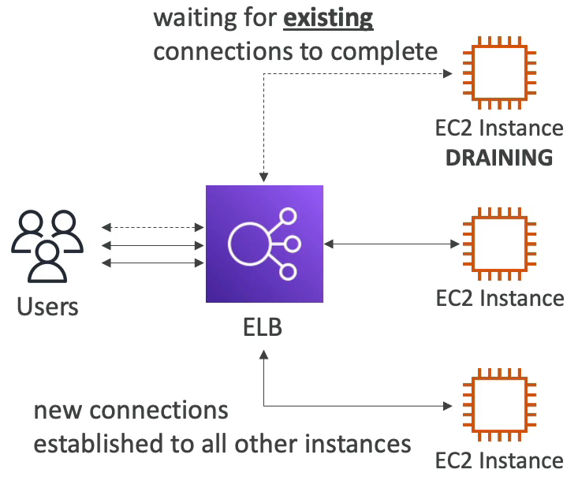
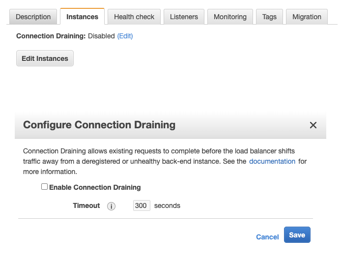
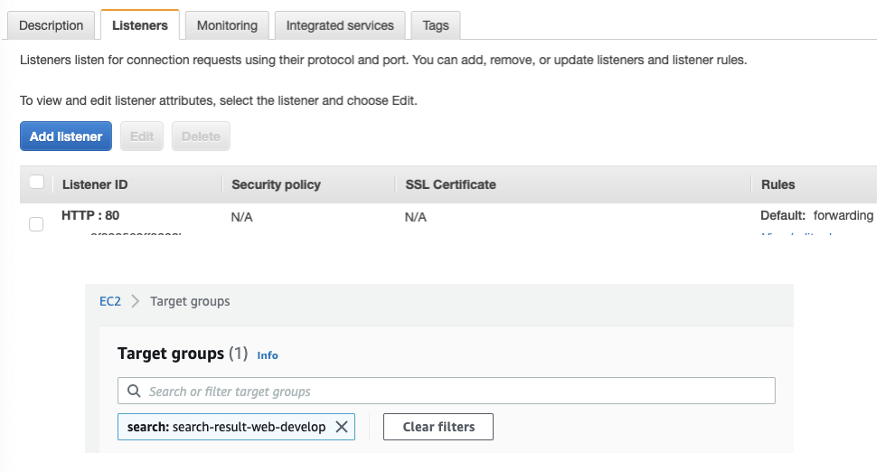

# Connection Draining

한 기술 회사에서 운영하는 서비스는 ELB(Elastic Load Balancer)뒤에 EC2 인스턴스를 두고 부하를 분산하는 방식을 사용하고 있다. 

이때, EC2가 health check 에 실패하여 unhealthy 상태로 들어가게 되면 진행중이던 in-flight Request 가 끊어지는 이슈가 발생하게 된다. 

이를테면, 특정 EC2 인스턴스로부터 수십초가 걸리는 파일 다운로드를 수행중이라고 했을 때, 파일을 다운로드받는 도중, 해당 인스턴스가 unhealthy상태로 바뀌게 되면 커넥션이 끊어지면서 파일 다운로드에 실패하게 되는 것이다. 

이러한 상황을 막기 위해 취할 수 있는 방법으로 Connection Draining 을 사용한다.

Connection Draining 은 특정 인스턴스가 unhealthy 상태로 바뀌었더라도, 해당 시점에 인스턴스가 처리하고 있는 in-flight Request 가 있다면, 해당 Request 가 처리될 때까지 커넥션을 유지한다.

해당 Connection 을 유지하는 최대 시간(maximum timeout)을 명시적으로 설정할 수 있으며, maximum timeout 을 초과할 경우에는 인스턴스가 해당 커넥션을 강제 종료한다.

아래 그림처럼 인스턴스 콘솔창에서 설정할 수 있다.

또 다른 방법으로는 로드 밸런서 뒤에 EC2 인스턴스를 바로 연결하는 것이 아니라, 타겟 그룹을 생성하고 해당 타겟 그룹으로 포워딩 하는 방법이다.

타겟 그룹을 사용하면 오토 스케일링을 구성하는데 용이하며 기본적으로 Connection Draining 을 지원하므로 별도의 설정이 필요 없다는 장점이 있다.

