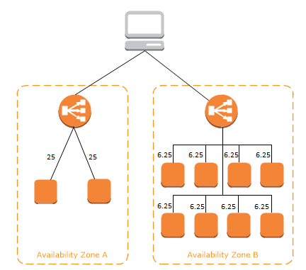

# Cross Zone Load Balancer

교차 영역 로드 밸런싱 (Cross Zone Load Balancer) 는 가용 영역별로 사용하는 EC2 인스턴스 개수에 차이가 있는 경우 사용하면 좋은 기능이다.

로드 밸런서 노드는 가용 영역마다 하나씩 존재하여, 가용 영역에 있는 부하 분산 대상(EC2 등..)에 요청을 전달한다. 로드 밸런서는 노드 자신이 소속된 가용 영역에 있는 부하 분산 대상들을 책임진다.

즉, VPC 에서 ELB 를 바라볼 땐 로드 밸런서 노드와 EC2 의 집합으로 보이며, 이는 각각 리스너(로드 밸런서), 대상 그룹(EC2 의 집합)에 해당한다.

위 그림을 보면 각각 가용 영역이 존재하고 로드 밸런서가 EC2 인스턴스들로 부하를 분산시키고 있다.

인스턴스들 위에 있는 숫자는 해당 인스턴스에 할당된 요청의 비율로 높을수록 부하가 높다는 뜻이다.

누가봐도 A 가용 영역에 있는 인스턴스들에 더 많은 부하가 가해진다는 것을 알 수 있다.

이를 보완하기 위한 기능이 교차 영역 로드 밸런싱이다. 위의 그림처럼 가용 영역 별 부하 분산 대상(EC2 인스턴스들)의 숫자가 균형을 이루지 않는 경우,

교차 영역 로드 밸런싱을 활성화하면 가용 영역을 가리지 않고 고르게 부하를 분산한다. 

그래서 아래 그림과 같은 결과가 나오게 된다. 

ALB 는 기본적으로 Cross Zone Load Balancing 기능이 On 되어 있고 NLB 와 CLB 는 기본적으로 Off 되어 있다.

ALB 는 기본 옵션으로 교차 영역 로드 밸런싱을 사용하기 때문에 별다른 요금을 지불하지 않는다.

그래서 NLB 를 사용할 때 교차 영역 로드 밸런싱을 활성화하면 가용 영역 사이에서 이뤄지는 데이터들의 전송에 대해 요금을 지불해야 한다.

CLB 는 교차 영역 로드 밸런싱을 활성화해도 요금을 지불하지 않는다.

교차 영역 로드 밸런싱을 활성화하거나 비활성화 하고 싶으면 로드 밸런서 콘솔창에서 맨아래로 스크롤을 내리면 교차 영역 로드 밸런싱에 대한 항목이 존재한다.

CLB 여서 비활성화(disabled) 상태로 되어 있다.

활성화하고 싶으면 버튼을 클릭하여 활성화 시키면 된다.

