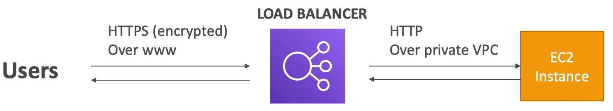
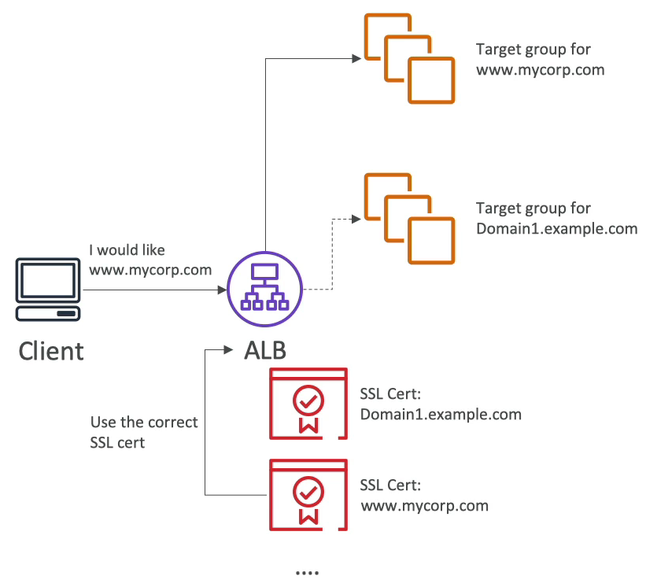
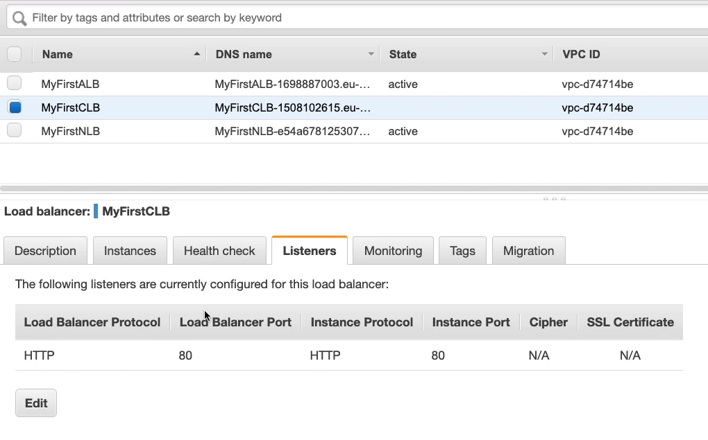
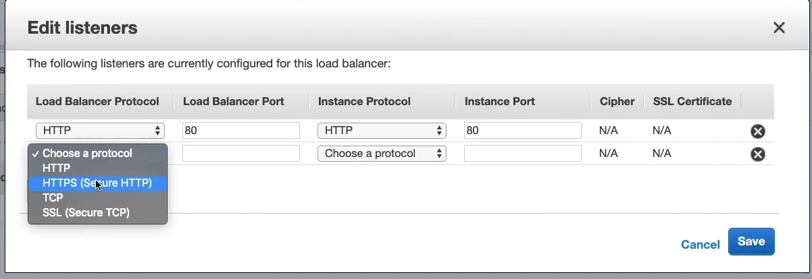
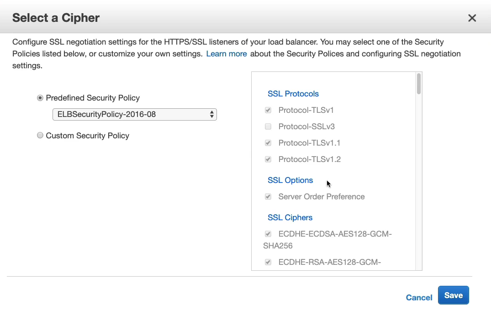
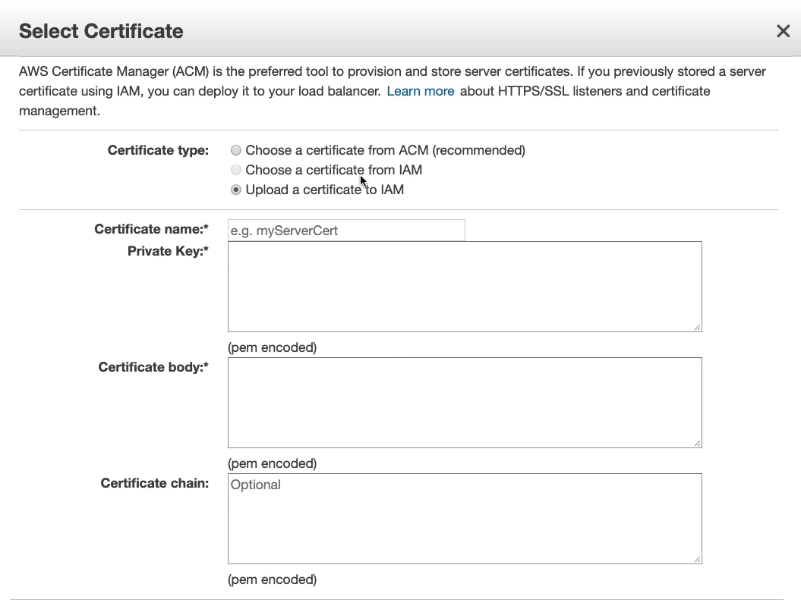
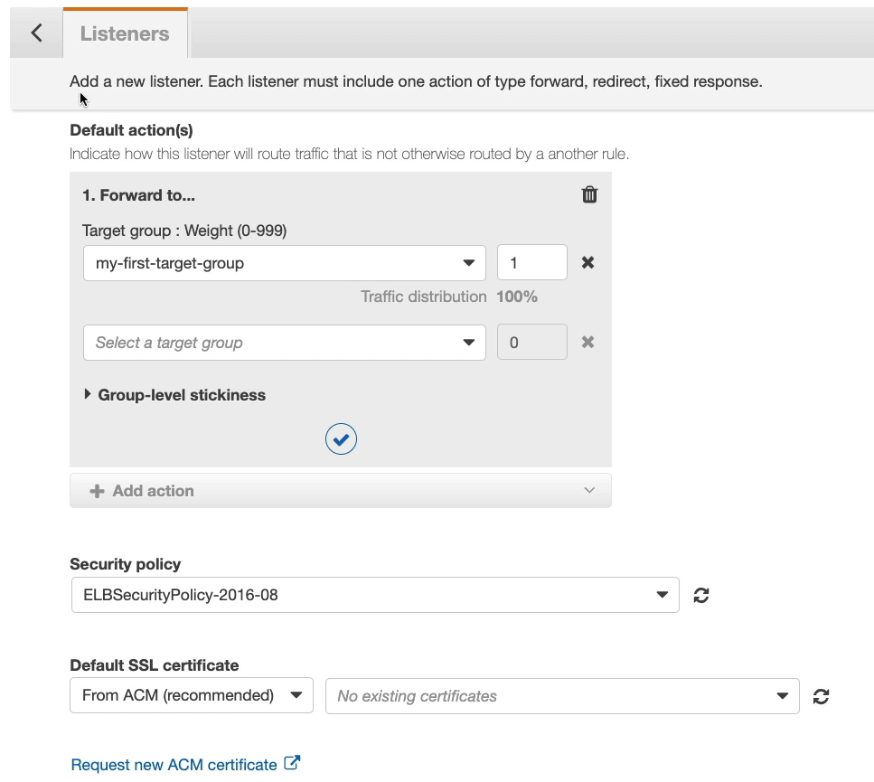

# Elastic Load Balancer - SSL 인증서

SSL 인증은 클라이언트와 로드 밸런서 사이에 오가는 트래픽들이 암호화되어 전송되도록 한다.

즉, 데이터는 송신자와 수신자에 의해 해독될 수 있다는 뜻이다.

SSL 은 Secure Sockets 계층을 나타내고 송신자와 수신자의 연결을 암호화하는데 사용한다.

TLS 는 SSL 의 가장 최신 버전으로 전송 계층 보안이다. 요즘에는 SSL 보다 TLS 인증서를 주로 사용한다.

공공 SSL 인증서는 Comodo, Symantec, GoDaddy, GlobalSing 등 CA 에서 발급할 수 있다.

공공 SSL 인증서를 로드 밸런서에 연동하면 클라이언트와 로드 밸런서 사이의 데이터 통신을 암호화할 수 있게 된다.

트래픽이 암호화 되어 있지 않으면 신용 카드 정보나 로그인 정보 등 어떠한 개인 정보도 안전하지 않기 때문에 보안 상 위험하다.

SSL 인증서는 만료 일자가 존재하고 정기적으로 만료 일자를 갱신해줘야 한다.

클라이언트는 HTTPS 를 통해 로드 밸런서에 요청을 보내고 로드 밸런서는 내부 VPC 망에 존재하는 EC2 인스턴스들에게 HTTP 를 이용하여 트래픽을 분산시킨다.

HTTP 를 사용하여 트래픽이 암호화 되지 않았지만 VPC 이기 때문에 보안 상 크게 문제될 여지가 없으며, 로드 밸런서는 SSL/TLS 서버 인증서라 불리는 X509 인증서를 사용한다.

또한, AWS 에서 제공하는 AWS Certificate Manager(ACM) 을 사용하여 SSL/TLS 인증서를 로드 밸런서로 가져오거나 요청할 수 있다.

다시 말하자면, 클라이언트와 로드 밸런서는 HTTPS 를 통해 통신하고 로드 밸런서는 클라이언트와 통신하기 위해 반드시 SSL/TLS 인증서가 있어야 한다.

ACM 을 통해 공공 SSL/TLS 인증서를 구입하거나 가져올 수 있고 ELB 에 SSL Listener 를 생성한 후 ELB Security group 설정을 해야 SSL/TLS 가 최종적으로 적용된다.

### SNI

하나의 웹서버에 여러개의 SSL 인증서를 불러오는 방법이 있을까?

서버 이름 표시 (SNI) 라는 기능을 사용하면 된다.

SNI 는 ALB 와 NLB 를 사용할 때만 작동한다. 로드 밸런서에 여러 SSL/TLS 인증서가 표시될 때 마다 ALB 혹은 NLB 를 사용중 인 것을 알 수 있다.

단일 로드 밸런서 뒤에서 각각 자체 SSL/TLS 인증서를 갖는 다수의 애플리케이션으로 호스팅 할 수 있게 해주는 기능이 SNI 이다.

아래 그림을 보면 이해가 될 것이다.

클라이언트가 www.mycorp.com 도메인을 로드 밸런서에 요청했다.

당연히 HTTPS 로 통신을 하기 때문에 로드 밸런서는 현재 가지고 있는 인증서 중에 도메인에 맞는 인증서를 갖고 해당 도메인이 있는 목표 그룹으로 라우팅 시킨다.

이 과정을 굉장히 단순화해서 설명한 것으로 새로운 방식의 프로토콜이고, SSL 핸드 쉐이크 등의 과정 등이 생략됐다.

CLB 는 하나의 SSL 인증서만 사용할 수 있고, Multiple hostname 을 가진 여러 SSL 인증서를 원한다면 multiple CLB 를 사용하면 된다.

ALB 는 다중 SSL 인증서를 사용할 수 있고, SNI 를 사용하여 단일 로드 밸런서 뒤에서 각각 자체 SSL/TLS 인증서를 갖는 다수의 애플리케이션으로 호스팅 할 수 있게 해준다.

NLB 도 ALB 와 동일하다.

로드 밸런서 콘솔창에서 클래식 로드 밸런서를 선택하고 리스너 탭을 클릭하면 리스너를 설정할 수 있다.

HTTPS 리스너를 선택하고 암호(Cipher)를 설정해야 하고 SSL 인증서를 설정해야 한다.

손으로 일일이 하나하나 다 치는 방법도 있고 ACM 을 통해 인증서를 만들어서 설정하거나 이미 만들어 놓은 인증서를 가져와서 사용할 수 있다.

클래식 로드 밸런서여서 SSL 인증서는 단 하나만 지원한다.

ALB 나 NLB 는 각각의 타겟 그룹에 다중 SSL/TLS 인증서를 갖도록 할 수 있고 이를 지원하는 방식이 바로 SNI 이다.

