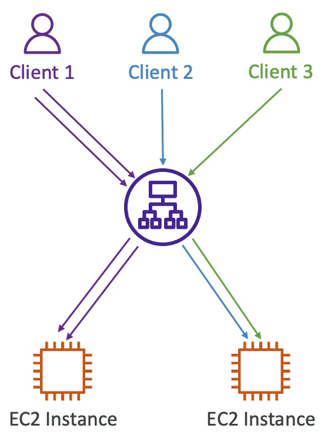
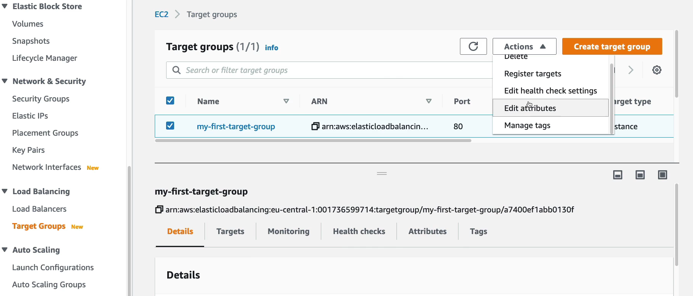
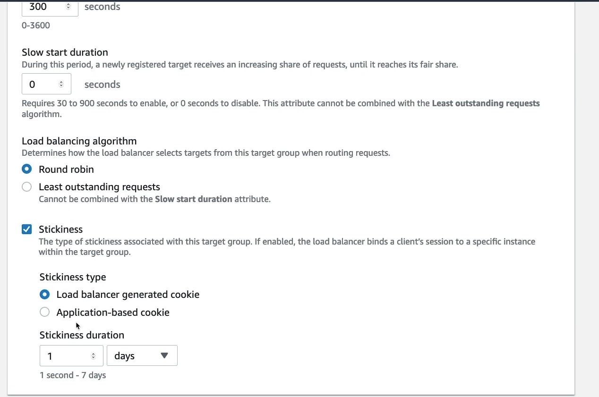
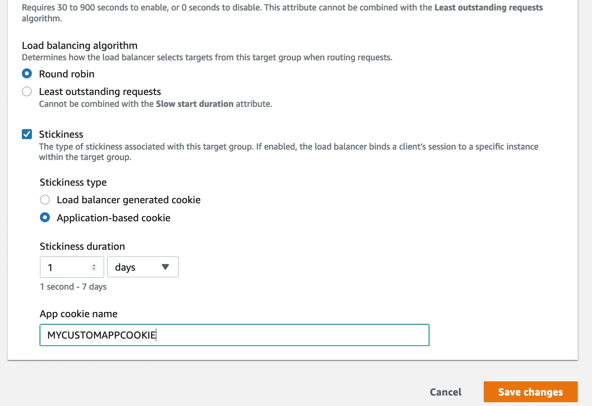
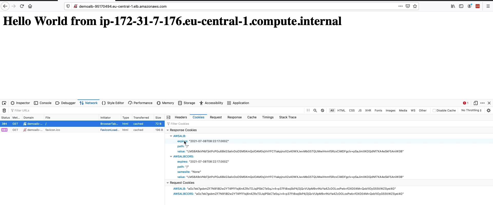

### Sticky Sessions (Session Affinity)

하나의 백엔드 서버 인스턴스를 복사하여 여러개의 인스턴스로 띄웠을 때 AWS 로드 밸런서는 traffic 에 따라서 인스턴스에 http request 를 분산하여 전달하기 때문에 A 서버는 session 정보를 가지고 있지만 B 서버는 가지고 있지 않을 수 있는 상황이 발생한다.

즉, 로그인을 하고 난 다음 새로고침을 했더니 로그아웃이 될 수도 있다는 뜻이다.

다중 서버 구성 시에 발생하는 문제로 AWS ELB 를 사용하고 있다면 Sticky Session 이라는 간단한 설정으로 해결할 수 있다.

다시 말해서 sticky 하게 해결한다는 것, A 라는 사용자가 X 라는 서버에서 응답을 받았다면 X 라는 서버에서 사용자에게 계속 응답을 주도록 하는 것이다.(통신을 끊지 않고 계속해서 연결 상태로 두는 것)

하지만 로드 밸런서의 장점이 상쇄되기 때문(인스턴스에 부하가 온다.)에 아쉬운 방법이라고 할 수 있다.

### 예시

똑같은 백엔드 서버를 갖는 두개의 인스턴스가 있고 이 두 인스턴스들은 ALB 의 타겟 그룹으로 묶여있다.

클라이언트 1~3 이 ALB 를 통해 EC2 인스턴스들에 접근을 하고 있다.

각 각 2번, 1번, 1번의 요청을 보냈고 클라이언트 1의 요청은 모두 첫번째 인스턴스로 클라이언트 2, 3의 요청은 두번째 인스턴스로 갔다.

클라이언트 1이 ALB 로 보내는 요청에는 쿠키나 세션과 같이 잃으면 귀찮아지는 데이터들이 존재하는데 ALB 에 의해 두번째 인스턴스로 라우팅 되면 해당 인스턴스에는 쿠키나 세션 데이터가 존재하지 않아 모두 다시 설정해줘야 하는 경우가 발생한다.

이런 귀찮은 경우가 발생하는 것을 막고자 Sticky session 옵션을 사용하여 똑같은 인스턴스로 계속해서 라우팅시켜주는 것이다.

백엔드 인스턴스에 부하를 줄 수 있어서 로드 밸런서의 장점이 상쇄되는 단점이 존재한다.

Sticky session 에는 두 가지 유형의 쿠키가 존재한다.

첫번째는 애플리케이션 기반 쿠키(Application-based Cookies)이다.

앱 기반 쿠키는 애플리케이션을 타겟으로 만들어진 쿠키로 타겟이 된 애플리케이션에 필요한 모든 속성값들을 포함할 수 있다.

또한, 쿠키 이름은 각각의 타겟 그룹에 따라 특화되어야만 하고, AWSALB, AWSALBAPP, AWSALBTG 은 ELB 에서 사용하기로 예약된 이름이기 때문에 사용하면 안된다.

두번째는 기간 기반 쿠키(Duration-based Cookies)이다.

앱 기반 쿠키와 동일하게 로드 밸런서에 의해 생성된 쿠키이며, 쿠키 이름은 ALB 에서 생성되었다면 AWSALB 이고 CLB 에서 생성되었다면 AWSELB 가 된다.

해당 쿠키들은 특정 기간에 만료되는 특징을 가진다.

### 실습

목표 그룹 콘솔창을 열고 타겟 그룹을 선택 우측 상단에서 목표 그룹 속성 수정을 클릭 

스크롤을 내려서 맨 아래로 내려오면 Stickiness 활성화 버튼이 존재한다.

클릭하면 두가지 종류의 Stickiness type 을 설정할 수 있다.

Load Balancer generated cookie 로 설정하면 쿠키 만료기간을 1초 ~ 7일 사이의 범위로 지정해줄 수 있다.

Application-based cookie 로 설정하면 만료 기간을 지정하는 것은 동일하고 쿠키 이름을 지정해줘야 한다.

여기서는 MYCUSTOMAPPCOOKIE 로 이름을 지정했다.

이렇게 설정하면 로드 밸런서에서 쿠키를 생성하고 클라이언트에게 같은 인스턴스로 라우팅을 시켜줄 수 있게 된다.

로드 밸런서 콘솔 창에서 로드 밸런서를 선택하고 DNS 네임을 복사 붙여넣은 후에 새로고침을 하면 이전과는 다르게 동일한 인스턴스가 라우팅 된 것을 확인할 수 있다.

f12 를 눌러서 검사 모드로 들어간 후 네트워크 탭을 클릭하면 로드 밸런서에서 만든 쿠키를 확인할 수 있다. 만료일은 1일로 된 것을 확인할 수 있다.

이 브라우저에 로드 밸런서가 준 쿠키가 있기 때문에 동일한 인스턴스로 라우팅이 되는 것이다.

