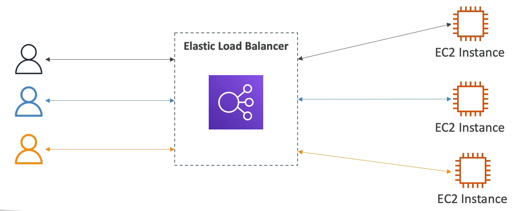
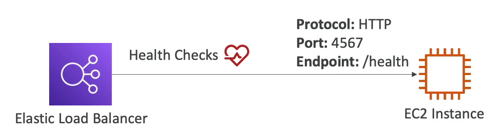
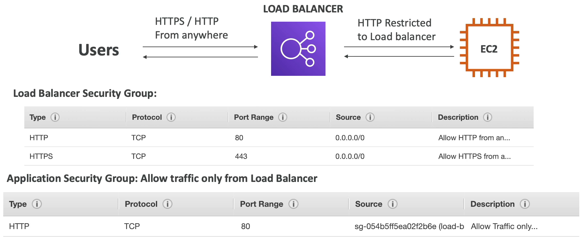

# Elastic Load Balancing

로드 밸런싱이 도대체 뭘까?

로드 밸런서는 여러 백엔드 서버나 다운 스트림된 EC2 인스턴스나 수신된 트래픽을 전달하는 서버가 하나로 묶여서 ELB 에 연결된다.

그러면 Elastic Load Balancer 는 사용자가 몰려서 트래픽이 엄청나게 많이 발생할 경우 하나의 인스턴스에 트래픽이 몰리지 않게 각각의 인스턴스로 트래픽을 균형있게 분산시켜 준다.

이게 로드 밸런서가 하는 역할이다!!!

로드 밸런서는 여러 다운 스트림 인스턴스들에 대해 트래픽을 분산시켜 주고, DNS 를 앱(인스턴스)과 연결시켜 로드밸런서와 연결시켜준다.

또한, SSL 인증서를 제공해줘서 HTTPS 를 사용중인 웹 사이트와 연결할 수 있다.

여러 가용 영역에 걸쳐서 사용되기 때문에 고가용성을 보장하고, public, private IPv4 으로 오는 모든 트래픽들을 분산시켜 줄 수 있다.

Elastic Load Balancer 는 AWS 에 의해 관리되는 로드 밸런서로, AWS 가 주기적으로 업그레이드, 유지 관리 등을 해준다. 또한 AWS 는 ELB 에 대한 구성 노브를 제공해준다.

일반적인 로드 밸런서를 셋팅하는 것보다 ELB 를 사용하면 비용적으로도 시간적으로도 매우 효율적이다. 만약 로드 밸런서를 직접 관리한다면 확장성 측면에서 지옥과도 같은 일들이 벌어질 것이다.

ELB 를 사용하면 좋은 점은 AWS 에서 제공하는 많은 서비스들과 통합하여 사용할 수 있다는 점이다. 스케일링 그룹을 보면 Amazon ECS, Certificate Manager, CloudWatch, Route 53, WAF Global Accelerator 등.. 다양한 서비스에서 통합하여 사용할 수 있다.

ELB 가 잘 작동하고 있는지 알 수 있는 Health Checks(상태 확인)에 대해서도 잘 알아야 한다.

만약 로드 밸런서가 작동을 하고 있지 않다면 트래픽 자체를 인스턴스로 보내지 않을 것이기 때문이다.. 그래서 ELB 설정도 중요하지만 그만큼 Health Checks(상태 확인)도 중요하다.

상태 확인을 위해 port와 route를 사용한다.

예를 들어 HTTP 프로토콜을 사용하고 4567 port 를 사용하며, 엔드 포인트가 /health 인 인스턴스가 있다.

만약 해당 EC2 인스턴스에 리퀘스트를 보냈을 때 리스폰스로 200 status 가 온다면 해당 인스턴스로 로드 밸런서가 트래픽을 보내지 않았다는 뜻이다.

AWS 로드 밸런서는 총 4가지가 존재한다.

### Classic Load Balancer(V1 - old generation) - 2009 - CLB

2009 년에 나온 연식이 좀 된 로드 밸런서로 보통 CLB 로 부른다.

HTTP, HTTPS, TCP, SSL(Secure TCP) 프로토콜과 호환 되고, AWS 에서는 이 CLB 를 사용하는 것을 권장하지 않는다.

로드 밸런서 콘솔에서는 더 이상 사용할 수 없다고 나타나지만 사실 사용할 수 있다.

### Application Load Balancer (V2 - new generation) - 2016 - ALB

2016 년에 나온 차세대 로드 밸런서로 CLB 로 부른다.

HTTP, HTTPS, 웹 소켓 프로토콜을 지원한다.

### Network Load Balancer (V2 - new generation) - 2017 - NLB

2017 년에 나온 차세대 로드 밸런서로 NLB 로 부른다.

TCP, TLS (Secure TCP), UDP 프로토콜을 지원한다.

### Gateway Load Balancer - 2020 - GWLB

2020 년에 나온 로드 밸런서로, GWLB 로 부른다.

GWLB 는 네트워크 계층인 IP 프로토콜에서 작동한다.

-----

전반적으로는 차세대 로드 밸런서를 사용하면 더 많은 기능을 제공해줘서 좋다. 

또한 일부 로드 밸런서는 내부 설정 즉, private IPv4 설정이 가능하고 또는 외부 설정 즉, public IPv4 설정이 가능하다.

마지막으로 로드 밸런서에 대한 보안을 알아야 한다.

사용자들은 HTTP, HTTPS 프로토콜을 사용하여 어디에서나 로드 밸런서에 접근할 수 있다.

즉, 로드 밸런서의 보안 그룹을 보면 인바운드 룰로는 80 번 포트 (HTTP), 443 번 포트 (HTTPS) 이 모두 열려 있어서 해당 포트로 어떤 ip 주소로 접근하든 접근이 가능하다는 것이다. 

그리고 로드 밸런서와 연결된 EC2 인스턴스들은 다른 외부에서 오는 트래픽들은 방화벽에서 걸러지고 오직 로드 밸런서에서 오는 트래픽만 허용한다.

그래서 EC2 인스턴스의 보안 그룹을 보면 인바운드 룰이 로드 밸런서와는 다른 것을 알 수 있다.

80 번 포트 (HTTP) 만 허락하고 해당 트래픽의 출처가 IP 범위가 되는 것이 아니라 보안 그룹이 된다.

해당 보안 그룹은 로드 밸런서의 보안 그룹으로 로드 밸런서로부터 오는 트래픽만 허용하게 된다.

이렇게 하면 유저, 로드 밸런서, EC2 인스턴스 간에 설정이 가능하고 불필요한 트래픽은 거른채 로드 밸런서에서 오는 트래픽만 인스턴스가 받을 수 있게 한다.

이제는 로드 밸런서에 대한 보안 설정만 잘해주면 된다.

