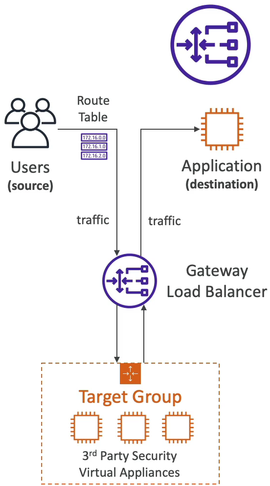

### Gateway Load Balancer

- AWS 에서 서드 파티 제품이나 가상 어플라이언스를 관리할 때 사용한다. 예를 들어 방화벽을 설정할 때, 심층 패킷 검사 시스템이나, 페이로드를 수정해야 하는 경우에 게이트웨이 로드 밸런서를 사용한다.

사용자들이 있고 내 애플리케이션에서 접근을 하는 경우로 예를 들어보자.

사용자들이 ALB 나 CLB 같은 로드 밸런서를 통해 내 앱으로 접근을 할 수 있다. 로드 밸런서가 트래픽을 적절히 분산시키며 내 애플리케이션으로 트래픽을 보내준다.

하지만 내 애플리케이션으로 오기 전에 트래픽에 대해 어떤 검사나 중간 처리를 하고 싶은 경우가 있을 것이다.

이런 경우에는 외부에서 제공해주는 서드 파티 앱을 사용해야 하는데 게이트웨이 로드 밸런서가 없이 처리를 하려면 꽤나 복잡해진다.

사용자들의 모든 트래픽을 CLB 나 ALB 로드 밸런서로 보내는 것이 아니라 라우팅 테이블을 수정해서 게이트웨이 로드 밸런서로 트래픽을 몽땅 보낸다.

게이트웨이 로드 밸런서가 해당 트래픽들을 서드 파티 앱으로 구성된 타겟 그룹으로 라우팅 시켜준다.

서드 파티 앱에서는 해당 트래픽들로 중간 처리를 한 후에 다시 게이트웨이 로드 밸런서로 트래픽을 보내준다.

게이트웨이 로드 밸런서는 받은 트래픽을 내 애플리케이션으로 라우팅 시켜준다.

즉, 게이트웨이 로드 밸런서의 쓰임새는 외부 서드 파티 앱을 간단하게 사용하기 위해서 쓴다고 생각하면 된다.

모든 트래픽은 게이트웨이 로드 밸런서를 통과하고 서드 파티 앱들은 GLB 로부터 받은 패킷들을 받아 후처리를 거친 다음 다시 GLB 로 트래픽을 보내주고 GLB 는 내 애플리케이션으로 트래픽을 보내준다.

서드 파티 앱으로는 위에서 말했던 다양한 작업들을 할 수 있는 앱들이 존재한다.

GLB 는 모든 로드 밸런서보다 낮은 3계층에서 작동한다. IP 패킷을 위한 네트워크 레이어 기반에서 작동한다고 보면 된다.

GLB 는 단일 입구와 단일 출구를 가지기 때문에 모든 입출력은 GLB 에서 일어난다.

GLB 는 6081 포트의 GENEVE 프로토콜을 사용한다.

