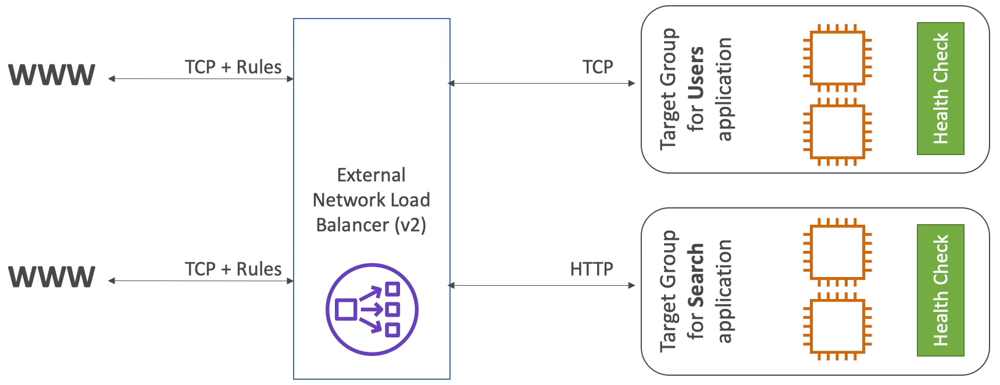
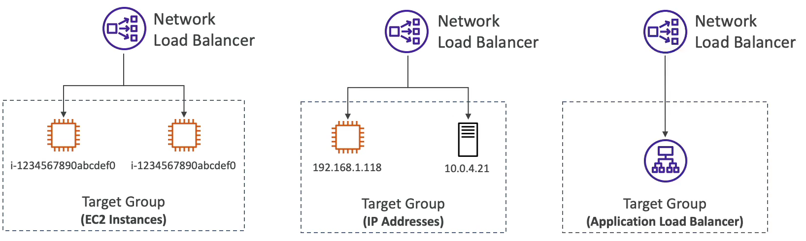

### Network Load Balancer

- 4계층 로드 밸런서로 TCP 나 UDP 트래픽을 인스턴스로 라우팅한다.
- 초당 수백만개의 요청을 처리할 수 있고, ALB 보다 레이턴시(대기시간)가 짧다.
- NLB 는 가용 영역 당 하나의 고정 IP 를 가지며, 탄력적 IP 할당을 지원한다. 즉 애플리케이션을 위한 전용 IP 구성을 할 수 있다는 뜻이다.
- NLB 를 사용할 때는 진짜 엄청난 성능을 원할 경우 사용한다. 즉, TCP 나 UDP 레벨의 트래픽을 원할 경우
- NLB 는 프리티어를 지원하지 않는다.

### 네트워크 로드 밸런서는 4계층 즉, TCP 기반의 트래픽을 분산시킨다.

ALB 처럼 타겟 그룹을 가질 수 있고, 특정 타겟 그룹으로 리다이렉션하는 기능들이 존재한다.

타겟 그룹으로는 EC2 인스턴스, private IP 주소, Application Load Balancer 를 가질 수 있다.

ALB 를 타겟 그룹으로 잡는 이유는 아마도 NLB 의 기능 중 하나인 고정 IP 주소를 갖기 위해서다.

