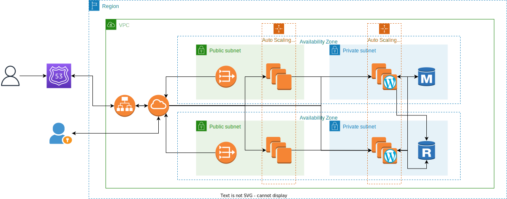
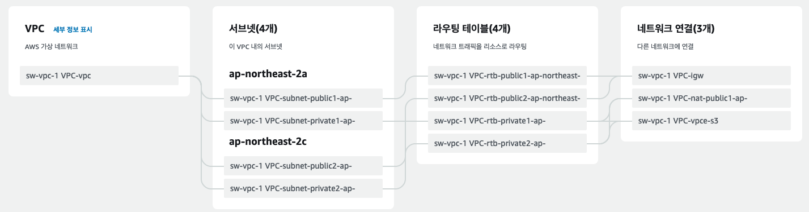

# 미니 프로젝트

## 구성도



## 사용한 AWS 서비스

- VPC
- EC2
- RDS
- ASG
- Load Balancer
- Route 53
- EFS

## VPC 생성

VPC 마법사를 사용해서 서울 리전에 다음과 같은 sw-vpc-1 VPC 를 생성했다.

ap-northeast-2a, 2b 두 개의 가용 영역을 사용하고 각 가용 영역 마다 public, private 서브넷을 하나씩 갖는다.

각 가용 영역의 private subnet 은 하나의 nat gateway 와 연결되어 있고 public sunet 은 internet gateway 와 연결돼 있다.



## Bastion Host 생성

private subnet 의 인스턴스로 접근하기 위한 EC2 인스턴스를 생성한다.

public subnet 에 존재하여 public IP 를 갖는다.


ap-northeast-2a 가용 영역의 public subnet 을 사용했다.


Name 태그를 Bastion Host 로 설정해줬다.


내 아이피로 SSH 로 접속할 수 있게 보안 그룹을 설정했다.


기존 키 페어를 사용해서 ssh 접속을 할 수 있게 설정


Bastion Host 에 접속이 된 것을 확인할 수 있다.


로컬 환경에서 scp 명령어를 사용해서 키 파일을 Bastion host 로 업로드했다.


해당 키로 private subnet 의 인스턴스에 접근을 할 수 있게 설정할 것이다.

## RDS 생성


DB 보안 그룹부터 생성한다. 이름과 설명을 설정하고 어느 VPC 에 적용할 보안 그룹인지 설정해준다.


wordpress-allow 보안 그룹에서 오는 녀석들을 허용하도록 설정했다.


그 후에, DB 서브넷 그룹을 생성한다. 만드려는 DB 가 어디 VPC 의 어느 서브넷에서 만들어질지 정해주는 부분이다.


해당 VPC 의 가용 영역을 선택해준다. 우리는 private subnet 에 RDS 가 생성되길 원하기 때문에 public subnet 을 제외한다.


이제 MariaDB 를 사용해서 DB 를 생성한다. 읽기 전용 복제본 기능을 사용하지 않을 것이기 때문에 프리티어를 사용했다.


DB 인스턴스의 이름과 DB 마스터 사용자 이름과 암호를 설정한다.


인스턴스 유형을 설정한다. 가장 값이 싼 t2.micro 를 선택했다.


EBS 스토리지 유형을 정하고 해당 스토리지 용량을 설정한다. 또한, 용량이 부족할 경우 자동으로 스토리지 용량을 늘려주는 임계값을 설정해준다.


해당 디비가 어디 VPC 에서 작동할 것인지 설정하고 어떤 서브넷에서 작동할 것인지 설정하는데 이전에 만든 DB 서브넷  그룹을 선택한다.


DB 인스턴스의 보안 그룹을 설정하는데 이전에 생성한 보안 그룹을 지정해준다.


DB 인스턴스의 초기 데이터베이스 이름을 설정해준다. 후에 워드프레스에서 사용할 데이터베이스이기 때문에 wordpress 로 설정해줬다.


위 사진처럼 데이터베이스가 만들어진다. 엔드포인트를 wordpress 설정할 때 호스트 이름으로 사용할 것이다.

## EFS


엑세스 포인트는 보안 그룹에 허용하기 위한 주소 생성으로 이름만 설정하고 어떤 설정도  건드리지 않고 생성한다. 


위와 같은 EFS 보안 그룹을 생성한다. wordpress-allow 보안 그룹에 대해 EFS 로 접근을 허용한다.


네트워크에서 NFS 파일 시스템이 어디 네트워크에 접속이 가능하게 할 것인지 정한다.

네트워크 엑세스에서 해당 가용 영역의 어떤 보안 그룹을 갖는 녀석들이 NFS 로 접속할 수 있게 할 지 셋팅한다.

## 워드 프레스 및 웹서버 생성 시작템플릿 만들기


VPC 와 서브넷을 설정해줘야 하는데, 해당 인스턴스에서 워드 프레스와 웹서버가 돌아가기 때문에 미리 만들어 둔 sw-vpc 를 사용하고 private subnet 에서 인스턴스가 작동하도록 설정했다.

```bash
#cloud-config
package_update: true
package_upgrade: true
runcmd:
- yum install -y httpd
- yum install -y mysql
- amazon-linux-extras install -y lamp-mariadb10.2-php7.2 php7.2
- systemctl start httpd
- systemctl enable httpd
- yum install -y amazon-efs-utils
- apt-get -y install amazon-efs-utils
- yum install -y nfs-utils
- apt-get -y install nfs-common
- file_system_id_1=fs-02fce9ec674e8d324
- efs_mount_point_1=/var/www/html
- mkdir -p "${efs_mount_point_1}"
- test -f "/sbin/mount.efs" && printf "\n${file_system_id_1}:/ ${efs_mount_point_1} efs tls,_netdev\n" >> /etc/fstab || printf "\n${file_system_id_1}.efs.ap-northeast-2.amazonaws.com:/ ${efs_mount_point_1} nfs4 nfsvers=4.1,rsize=1048576,wsize=1048576,hard,timeo=600,retrans=2,noresvport,_netdev 0 0\n" >> /etc/fstab
- test -f "/sbin/mount.efs" && grep -ozP 'client-info]\nsource' '/etc/amazon/efs/efs-utils.conf'; if [[ $? == 1 ]]; then printf "\n[client-info]\nsource=liw\n" >> /etc/amazon/efs/efs-utils.conf; fi;
- retryCnt=15; waitTime=30; while true; do mount -a -t efs,nfs4 defaults; if [ $? = 0 ] || [ $retryCnt -lt 1 ]; then echo File system mounted successfully; break; fi; echo File system not available, retrying to mount.; ((retryCnt--)); sleep $waitTime; done;
- systemctl restart httpd
```

https://cloudinit.readthedocs.io/en/latest/ 에서 cloud-config 예제문을 확인할 수 있고, cloud-config 형식 + #!/bin/bash 형식을 합친 멀티 파트 user data 를 작성할 수 있다.

user data 스크립트 작성을 해야 하는데 EC2 생성할 때 파일 시스템을 추가해주면 기본적으로 user data 가 생성되는데 runcmd 에 내가 필요로 하는 커맨드들을 추가해준다.

여기서는 아래 명령어들을 추가해줬다.

```bash
- yum install -y httpd
- yum install -y mysql
- amazon-linux-extras install -y lamp-mariadb10.2-php7.2 php7.2
- systemctl start httpd
- systemctl enable httpd
- systemctl restart httpd
```


보안 그룹 작성을 작성해줬다. Bastion Host  의 보안 그룹 이름이 ssh-allow 이다. 그래서 ssh-allow 보안 그룹에서 ssh 로 인스턴스에 접근하면 허용하도록 설정했다.


Bastion Host 에서 ssh 로 private subnet 에 있는 인스턴스에 접속했다.


httpd 패키지가 설치되어 실행 중인 것을 확인할 수 있다.


php 패키지가 설치되어 실행 중인 것을 확인할 수 있다.


wordpress 를 잘 다운 받아서 /var/www/html 디렉토리로 옮긴 것을 확인, efs 에 마운트된 폴더이기 때문에 다른 인스턴스에서 접속해도 똑같은 파일들을 갖는다.


mariadb 도 잘 다운 받은 것을 확인할 수 있다.


wp-config-sample.php 를 복사하여 wp-config.php 파일을 생성한다. 해당 파일에는 데이터베이스에 접속하기 위한 설정을 할 수 있다.


이전 RDS 를 생성할 때 만들었던 값들을 채워주면 된다.

DB_NAME 은 초기 데이터베이스 이름으로 나는 wordpress 로 만들었기 때문에 wordpress 를 적었다. 

DB_USER, DB_PASSWORD 는 DB 마스터 사용자 이름과 비밀번호를 입력해주면 된다. DB_HOST 는 DB 의 엔드포인트를 적어주면 된다. 

만약 DB 도 같은 서버에서 돌리는 경우라면 localhost 를 적어주자.

:wq 로 설정을 저장하고 나오자.


현재 wordpress 서버는 private 서브넷에 존재하여 공인 IP 가 없다. 

해당 인스턴스에 접속하기 위해서는 Bastion Host 를 통해 접속을 해야 하는데 이번에는 로드 밸런서에 해당 인스턴스를 맵핑해줘서 로드 밸런서에 접속하면 자동으로 인스턴스의 워드 프레스 사이트로 이동하도록 설정할 것이다.


오토 스케일링 그룹을 만들기 위해 생성된 인스턴스로 템플릿을 만든다.

## 오토 스케일링 그룹 생성


로드 밸런서 보안 그룹을 먼저 생성한다. 인터넷에서 HTTP 와 HTTPS 모든 요청을 허용하도록 설정했다.


오토 스케일링 그룹 이름을 설정해준다. 시작 템플릿은 이전에 만든 시작 템플릿으로 만들어준다.


오토 스케일링 그룹에서 생성된 인스턴스가 어떤 서브넷에 생성될 것인지 설정해주는 부분으로 이전에 만든 VPC 를 선택하고 private subnet 에서 인스턴스가 생성되도록 설정한다.


로드 밸런서를 만들어서 오토 스케일링 그룹을 맵핑해준다.


HTTP 를 분산시켜 주는 역할이기 때문에 ALB 를 선택하고, 이름을 설정해준다.

인터넷에서 들어오는 트래픽을 분산시켜주는 역할이기 때문에 Internet-facing 을 선택한다.

가용 영역으로는 private subnet 을 선택하면 안된다. 

로드 밸런서 가용 영역이란 우리가 알고 있는 AZ가 아닌 로드밸런서가 접근할 수 있는 subnet 을 의미한다. 그래서 오토 스케일링 그룹에서 로드  밸런서를 생성할 때 가용 영역을 public subnet 으로 설정해줘야 한다. 그러면 로드 밸런서가 public subnet 을 통해서 private subnet 의 인스턴스로 접근할 수 있게 된다.

라우팅 되는 대상 그룹은 생성 버튼을 클릭하면 자동으로 생성된다. 여기서 대상 그룹이란 로드 밸런서가 부하를 분산시켜주는 도착지이다.


기본적으로 오토 스케일링 그룹은 헬스 체키 기능이 존재한다. 30초 동안 상태가 비정상적이면 unhealthy 상태로 판단하여 해당 인스턴스로 부하를 분산시키지 않도록 한다.

또한, 클라우드 워치에서 metric 을 수집하도록 설정할 수 있다.


오토 스케일링 그룹에서 스케일 아웃을 통해 몇 개의 인스턴스를 최소로 가져야 하고 내가 원하는 인스턴스의 갯수와 최대로 가질 수 있는 인스턴스 갯수를 설정할 수 있다.


오토 스케일링 그룹의 조정 정책을 사용하면 오토 스케일링 그룹의 사이즈를 동적으로 설정할 수 있다. 여기서는 평균 CPU 사용률이 80 프로 이상이면 자동으로 스케일 아웃을 해서 인스턴스를 추가하도록 설정했다. 

또한 워밍업 시간이라는 것이 있는데 CPU 사용률이 80프로가 넘은 후 XX초 동안 기다린 후 그 때도 사용률이 80프로가 넘으면 스케일 아웃한다는 뜻이다.

## Route 53 에 도메인 등록

1. Route 53 호스팅 영역을 클릭
2. 호스팅 영역 생성 버튼 클릭
3. 도메인 판매 사이트(가비아 등..)에서 도메인 구매 후 도메인 이름을 작성한다. 나는 seongwoo.shop 도메인을 구매하였다.


1. 아래 그림처럼 호스팅 영역이 생성된다. 참고로 버플릭 호스팅 영역과 프라이빗 호스팅 영역의 차이는 쉽게 말해서 인터넷과 통신을 할 수 있냐 없냐의 차이(VPC 망 내부인지 외부인지 차이 정도..?) 로 생각하면 된다.


1. 가비아에 도메인 관리 들어가서 생성된 NS 레코드 타입의 value 들을 적어준다. 원래라면 NS, SOA 유형의 레코드 이름만 보일 것이다. 여기서 CNAME 유형의 레코드들은 안보이는 것이 정상이다.


## Route 53 레코드 등록


Route 53 에서 생성된 호스팅 존을 클릭하여 레코드 생성 버튼을 클릭한다.

dev.seongwoo.shop 와 로드 밸런서를 CANME 레코드 타입을 사용하여 맵핑해준다.

값 부분에 로드 밸런서의 DNS 이름을 설정해주면 dev.seongwoo.shop 으로 접근을 하면 로드 밸런서로 이동시켜 준다. 

라우팅 정책은 가중치, 지리 근접 등 여러가지가 있는데 단순 라우팅 정책을 선택했다. TTL 은 Time To Live 의 줄임말로 클라이언트가 같은 호스트 명으로 DNS 에 또 다시 쿼리를 보내지 않아도 300 초 동안은 해당 호스트 명의 IP 주소를 기억하고 있어서 바로 이동할 수 있다는 뜻이다. 

## dev.seongwoo.shop 접속해보기


잘 접속되는 것을 확인할 수 있다!

## 오류

- 로드 밸런서 가용 영역 문제
    1. 사용자는 Public DNS 를 통해 ALB 에 접근을 하고, ALB 트래픽은 IGW 를 통해 VPC 내로 들어온다.
    2. 트래픽은 활성화 된 로드 밸런서 가용 영역 subnet 만 참조하게 된다.
    3. 만약 로드 밸런서에 활성화 된 가용 영역이 private 일 경우, private subnet 안에 있는 로드 밸런싱 대상의 인스턴스는 public 주소 또는 탄력적 ip 가 없다. 
    4. public ip 또는 탄력적 ip 없이는 외부와 통신을 할 수 없다.
    5. 로드 밸런서는 계속해서 활성화 된 로드 밸런서 가용 영역 서브넷으로 브로드캐스트 주소로 패킷을 전송하다 타임 아웃 오류를 발생시킨다.
    
    해결 방법 : 로드 밸런서 가용 영역이란 우리가 알고 있는 AZ가 아닌 로드밸런서가 접근할 수 있는 subnet 을 의미한다. 그래서 오토 스케일링 그룹에서 로드  밸런서를 생성할 때 가용 영역을 public subnet 으로 설정해줘야 한다. 그러면 로드 밸런서가 public subnet 을 통해서 private subnet 의 인스턴스로 접근할 수 있게 된다.
    
- 오토 스케일링 그룹으로 로드 밸런서를 생성할 경우 보안 그룹이 기본으로 잡혀있다. 로드 밸런서 보안 그룹을 내가 설정한 보안 그룹으로 변경해줘야 한다.
- 오토 스케일링 그룹으로 생성된 각각의 인스턴스들은 데이터를 공유하지 않는다. 그래서 한 개의 인스턴스에는 워드 프레스가 설치되어 있지만 스케일 아웃으로 생성된 인스턴스에는 워드 프레스가 설치되지 않아서 재설치를 하거나, 로그아웃이 되는 등의 문제가 발생한다.
    
    해결 방법 : sticky session 을 사용하거나 NFS 를 사용하여 파일을 모두 공유해야 한다. NFS 를 사용해서 파일을 공유하도록 설정하였다. 스티키 세션을 사용하지 않은 이유는 로드 밸런서의 이점을 죽이는 것 같다고 생각했기 때문이다.
    
- Mixed Content 오류 발생 : HTTP 요청과 HTTPS 요청이 섞여서 발생하는 오류라고 한다. 오류를 읽어보면 https://dev.seongwoo.shop/wp-admin/ 은 security connection 을 해서 가져왔지만 http://dev.seongwoo.shop/wp-admin/post.php 도 security connection 으로 가져와야 된다고 한다.
    
    해결 방법 : apache 의 rewrite 엔진을 사용하여 해결
    


## 개선할 점

- S3 에 이미지나 동영상들을 저장하고 CloudFront 에 연결하는 방식으로 재구성하는 방식을 찾아서 도전하고 싶었지만 끊임없이 발생하는 오류 때문에 후순위로 밀려났다.
- 웹서버와 wordpress 서버를 따로 두고 내부 로드 밸런서를 만들어서 연결해주는 방식으로 재구성해보는 것은 어떨지 생각해봤다.
- Mixed Content 오류를 해결해서 HTTP → HTTPS 로 리다이렉트 되지 않았던 문제를 해결해보고 싶다.
- 돈이 조금 들지만 RDS 읽기 전용 복제본을 만들어서 가용성과 성능을 높이는 방식을 사용해서 재구성해보고 싶다.