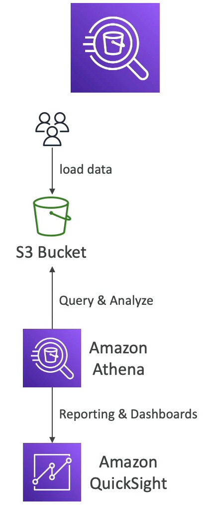

# Amazon Athena

- Amazon Athena 는 아마존 S3 에 저장된 객체에 대해 분석을 수행하는 서버리스 쿼리 서비스이다.
- 즉, SQL 언어로 파일들에 쿼리문을 날리지만 내 로컬 환경으로 굳이 로드할 필요는 없다. 파일은 S3 에 있고 쿼리한 데이터들을 Amazon Athena 가 알아서 처리 해준다.
- CSV, JSON, ORC, Avro, Parquet 등 다양한 포맷 형식을 갖는다.
- Athena 는 Presto 엔진 기반이다.
- 사용자들이 데이터들을 아마존 S3에 로드하면 Amazon Athena 는 객체에 쿼리문을 날리고 분석한다.
- 리포팅과 대시보드로 Amazon Athena 를 편하게 살펴보고 싶다면 Amazon QuickSight 서비스를 사용하면 된다.
- 쿼리문으로 찾은 데이터 TB 당 5달러를 지불한다.
- 압축되거나 컬럼형으로 저장된 데이터를 사용할 경우 비용을 절감할 수 있다. 왜냐하면 데이터를 스캔하는 양이 적어지기 때문이다.
- Athena 는 비즈니스 인텔리전스 분석, 보고 VPC 나 ELB 로그의 Flow Logs 분석 CloudTrail 로그, 플랫폼 로그 등의 AWS 의 로그 기능을 사용할 때 아주 유용하다.
- SQL 을 사용하여 데이터 분석, 서버리스 등의 키워드가 나온다면 Amazon Athena 를 생각하면 된다.