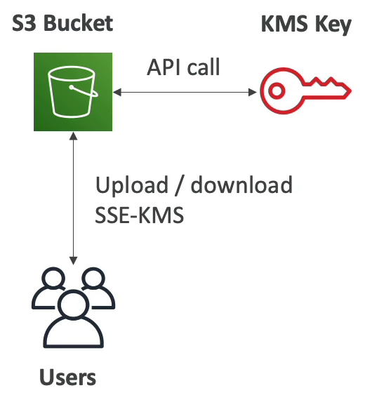
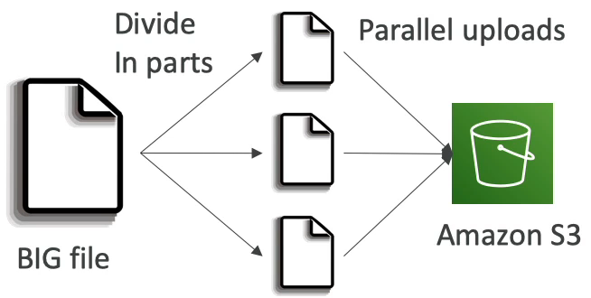
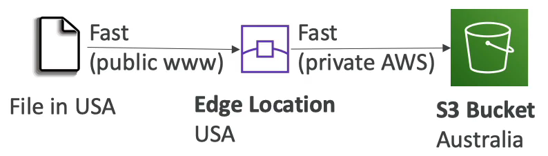

# S3 Baseline Performance

- Amazon S3 는 아주 많은 수의 요청을 처리하기 위해 자동으로 스케일링을 하며, 지연율이 100~200ms 로 매우 짧다.
- prefix 는 초당 3,500 개 정도의 PUT/COPY/POST/DELETE 요청을 처리하고 prefix 초당 5,500 개의 및 GET/HEAD 요청을 버킷 내에서 처리한다.
- prefix 는 bucket 과 file 둘 다 될 수 있다.
  - 예를 들어, bucket/folder1/sub1/file 이 존재할 때 여기서 prefix 는 /folder1/sub1 이 된다. 해당 프리픽스는 초당 3,500 개의 PUT 과 GET 요청을 처리할 수 있다.
  - bucket/folder1/sub2/file 일 경우 prefix 는 folder1/sub2 가 prefix 가 된다.
  - 만약 bucket/1/file, bucket/2/file 일 경우 각각 prefix 는 /1/, /2/ 가 되는 것이다.
  - 디렉토리 전체 경로라고 생각하면 편할 듯 싶다.
- 4개의 prefix 에 읽기 작업을 균등하게 분산시키면 초당 22,000개의 HEAD 와 GET 요청을 처리할 수 있게 된다.

### S3 - KMS Limitation

S3 의 성능을 제한하는 KMS Limitation 에 대해 알아보자.

- SSE-KMS 를 사용해 객체를 암호화하하여 업로드 하는 경우 KMS limits 가 S3 에서 GeneratedDataKey KMS API 를 호출하고 다운로드 하는 경우에는 SSE-KMS 를 통해 S3 파일을 다운로드하는 경우 Decrypt KMS-API 를 호출하게 된다.
- 예를 들어, 사용자들이 S3 버킷에 연결하여 SSE-KMS 암호화 방식을 사용해서 업로드와 다운로드를 하려 한다. S3 버킷이 API 를 호출하고 키를 생성하여 업로드하거나 KMS 키를 사용해 업로드 된 객체를 디코드하여 사용자가 다운로드할 수 있게 한다.
- KMS 는 기본적으로 초당 요청에 대한 할당량을 가지고 있고 리전에 따라 요청이 초당 5,500개 또는 10,000개 혹은 30,000개 일 수도 있다. 이보다 더 많은 요청이 필요한 경우 서비스 할당량 콘솔을 통해 할당량 증가를 요청할 수 있다.
- 즉, 초당 5,500 개를 처리할 수 있는 리전에서 초당 10,000개 이상의 요청이 발생하면 요청이 지나치게 많이 몰리지 않도록 KMS 에서 리전에 몰리는 트래픽을 줄일 수 있다.

### S3 Performance

1. Multi-Part upload(분할 업로드)

   - 최적화를 위한 분할 업로드 방식이다.
   - 100MB 가 넘는 파일들은 분할 업로드가 권장되며 5GB 가 넘는다면 분할 업로드는 필수 사항이다.
   - 분할 업로드는 병렬화를 통해 전송 속도를 높이고 대역폭을 극대화한다.
   - 예를 들어 Amazon S3에 업로드하고자 하는 큰 파일이 있고, 이 파일을 여러 개의 작은 덩어리들로 나눠서 각 파일을 Amazon S3 에 병렬 업로드한다.
   - Amazon S3 에서는 모든 파트가 업로드되면 이들을 다시 모아 큰 파일로 합쳐준다.
2. S3 Transfer Acceleration

   - 업로드와 다운로드를 위한 성능 향상법으로 전송 속도를 높일 수 있다.
   - 파일을 AWS 의 엣지 로케이션으로 전송함으로써 전송 속도를 높이는 방식이다.
   - 엣지 로케이션에서는 데이터를 대상 리전의 S3 버킷으로 보내준다. 리전보다 엣지 로케이션의 수가 200 개 정도로 더 많다.
   - Multi-Part upload 와 호환된다.
   - Transfer Acceleration 이라고 불리는 이유는 공용 인터넷을 최소한으로 거치고 최대한 사설 AWS 네트워크를 사용하여 파일을 전송하기 때문이다.
   - 예를 들어, 미국에 파일이 있는 상태인데 해당 파일을 호주에 있는 S3 버킷에 업로드하려고 한다. 이럴 때, 파일을 미국에 있는 엣지 로케이션에 업로드를 한다. 그러면 해당 엣지 로케이션에서 호주의 Amazon S3 버킷으로 private AWS 네트워크를 통해 파일이 전송된다.
3. S3 Byte-Range Fetches
   - 다운로드 속도를 높이는 방식이다.
   - 예를 들어 S3 에 아주 큰 파일이 있는데, 파일의 처음 몇 바이트에 해당하는 부분을 요청한다. 그리고 두 번째 파트에 이어 마지막 파트까지 존재한다. 
   - 이 모든 파트들을 특정 바이트 range 로 가져오도록 요청한다. Byte-Range 라고 불리는 건 파일의 특정 범위만을 요청할 것이기 때문이다.
   - 이 요청들은 모두 병렬적으로 이루어진다. GET 요청을 병렬화해서 다운로드를 가속화하는 원리인 것이다.