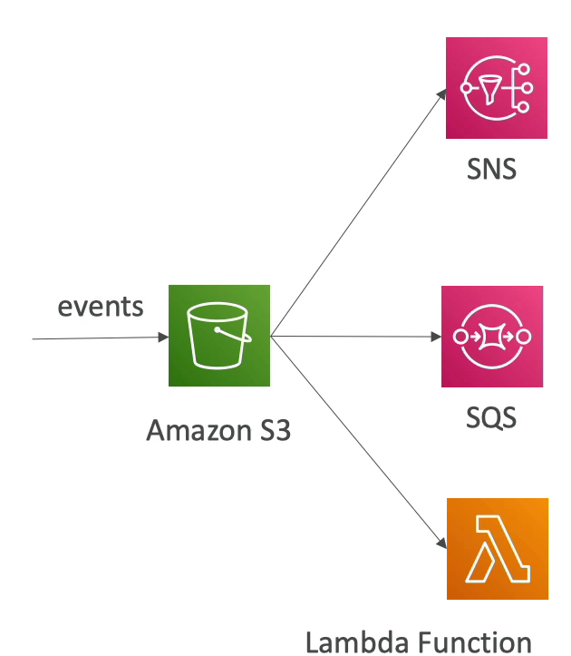

# S3 Event Notifications

- S3 버킷 내에서 새로우 객체가 생성되거나(S3:ObjectCreated) 제거되거나(S3:ObjectRemoved) 복원되거나(S3:ObjectRestore) 복제(S3:Replication)되는 등.. 이런 경우 이벤트가 발생했다고 한다.
- 버킷 내에서 발생하는 모든 이벤트들에 리액트할 수 있다. 
- 또한, 특정 파일에만 리액트할 수 있도록 이벤트 알림 규칙을 지정할 수도 있다.
- 예를 들어, jpeg 파일에서 일어나는 이벤트들만 알림으로 설정할 수도 있다는 것이다.
- 주로 Amazon S3 에 업로드 된 사진의 썸네일을 생성할 때 주로 사용한다.
- S3 이벤트는 원하는 수만큼 생성할 수 있다. 보통 몇 초안에 알람이 전달이 되지만 1분 이상 소요될 수도 있다.
- 이벤트에 대한 알람이 전달되기 위해서는 버킷의 버저닝 기능을 활성화해야 한다.
- 이벤트 알림 대상으로 가능한 대상으로는 3가지가 있다.
  - SNS
  - 메세지를 대기열에 추가해주는 큐 서비스인 SQS
  - 커스텀 코드를 작성하여 실행하는 Lambda Function 이 있다.