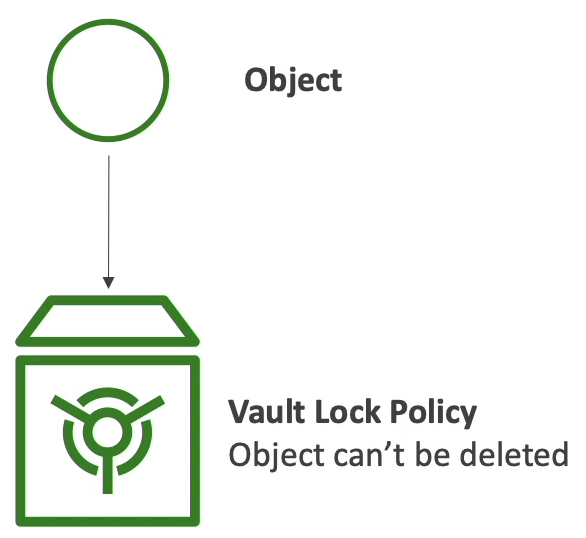

# Glacier Vault Lock

- WORM(Write One Read Many) 모델을 적용하기 위한 기능이다.
- 편집 정책을 아예 잠금으로써 더 이상 변경될 수 없도록 하는 것이다.
- 규정 준수와 데이터 보존을 위해 사용한다.
- 객체가 Glacier 볼트로 가면 그 후에 볼트 잠금 정책을 추가하여 객체가 지워지거나 정책 자체가 지워지는 것을 방지한다.
- 누군가가 감사를 할 때 누군가가 '데이터가 수정되거나 지워지지 않았다는 것을 어떻게 확신하죠?' 라고 물어본다면 'Glacier 볼트에 볼트 잠금 정책을 사용했습니다.' 라고 대답하면 된다. 왜냐하면 해당 정책을 사용하면 나를 포함한 그 누구도 객체를 수정할 수 없다는 것을 AWS 가 보증하기 때문이다.

### S3 Object Lock(versioning must be enabled)

- Glacier Vault Lock 과 비슷한 기능이 S3 에 있다. S3 객체 잠금 기능이다.
- 동일하게 WORM 모델을 적용하기 위해서 사용하고 이를 위해서는 버전 관리 기능이 활성화 돼 있어야 한다.
- 특정 시간 동안의 객체 버전 삭제를 막아준다.
- 객체 보존을 위한 두 가지 기능이 있다. 
  - Retention Period : 특정 기간 동안 객체를 잠가준다.
  - Legal Hold : 위와 동일한 기능을 해주지만 객체 보존 만료일이 정해지지 않아 계속해서 객체를 잠가준다.
- S3 객체의 잠금 모드 측면에도 두 가지 기능이 있다.
  - Governance mode : 사용자에게 특별한 권한이 부여되지 않았다면 객체 버전을 무효화, 삭제, 잠금 설정을 변경할 수 없도록 하는 모드이다.
  - Compliance mode : AWS 계정의 루트 사용자를 포함한 어떤 사용자도 보호된 객체 버전을 무효화, 삭제할 수 없도록 하는 모드이다.