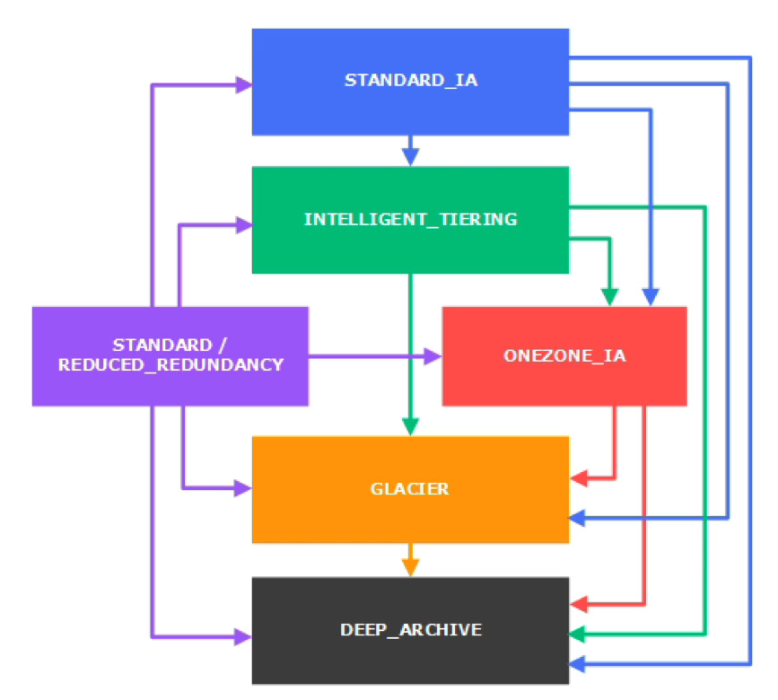

# S3 Lifecycle Rules

스토리지 클래스 간 객체의 전환이 가능하다.

Standard-IA 유형에서 Intelligent-Tiering과 OneZone-IA, Glacier, Deep-Archive 유형으로 전환이 가능하다.

Glacier 유형은 Standard-IA 로 돌아갈 수 없고 원하시는 경우에는 객체를 복원하고 복원된 사본을 IA 로 복사해야 한다.

드물게 액세스하는 객체의 경우에는 Standard-IA 로 보내고 실시간으로 데이터가 필요하지 않은 객체는 Glacier 나 Glacier Deep-Archive 로 보내진다.

객체의 클래스 간 이동은 수동으로 할 수 있지만 수명 주기 구성을 사용해 자동으로 할 수도 있다.

### S3 Lifecycle Rules(수명 주기 규칙)

- 수명 주기 규칙이란 객체를 한 스토리지 클래스에서 다른 스토리지 클래스로 전환하는 데에 도움을 주는 작업이다.
- 만약 객체를 생성하고 60일 후에 Standard-IA 클래스로 보내고 6개월 후에는 아카이빙을 위해 Glacier 로 옮긴다고 하면 간단하고 자연스러운 과정이다. 
- 만료 작업이란 일정 기간이 지난 후 객체를 삭제하는 것이다.
- 예를 들어, 액세스 로그 파일들이 일 년이 지나서 더 이상 필요가 없어지면 파일들이 전부 일 년이 넘었으니 만료, 삭제해 달라고 요청하는 식이다.
- 파일의 오래된 버전을 삭제하는 데에도 사용된다. 
- 버저닝을 허용해 계속해서 새로운 파일을 덮어쓰기하고 있는데 60일 이상 지난 버전이 필요가 없다면 만료 작업을 구성해서 60일이 지난 버전의 파일이나 객체를 만료시킨다.
- 특정 접두어에 규칙을 적용할 수도 있다. 만약 모든 MP3 파일들이 'MP3' 폴더에 있거나 'MP3' 접두어를 가지고 있다면 수명 주기 규칙을 해당 접두어에만 걸어줄 수 있다.
- 특정 객체 태그에 대한 수명 주기 규칙을 생성할 수 있다. 예를 들어, 'Department: Finance' 로 태그된 객체에 수명 주기 규칙을 걸어줄 수도 있다.

### S3 Lifecycle Rules - 시나리오 1

프로필 사진이 Amazon S3 에 업로드된 후 EC2 인스턴스에서 애플리케이션이 썸네일을 생성한다.

이 썸네일들은 손쉽게 재생성할 수 있으며 45일간만 보관된다. 45일 동안은 원본 사진 파일을 즉시 회수할 수 있으며 그 이후에는 사진을 다운로드 받을 때 유저가 최대 6시간까지 기다릴 수 있다.

이 솔루션을 어떻게 설계할 수 있을까?

- S3 원본 사진은 Standard 클래스에 두고 수명 주기 규칙을 설정해 45일 후에는 Glacier 로 보내면 된다. 아카이브에 저장되서 회수를 위해 6시간까지도 기다리게 될 수 있다.
- 썸네일은 OneZone-IA 에 두면 되는데 재생성이 가능하기 때문이다. 수명 주기 구성을 통해 45일 후 만료 혹은 삭제를 시킬 수도 있다. 왜냐하면 45일 후에는 썸네일이 필요없기 때문이다.
- 원본 사진을 Glacier 로 보내고 썸네일은 OneZone-IA 에 저장된다. 비용이 절감된다.
- AWS 에서 전체 AZ 를 잃을 상황에 대비해 원본 사진으로부터 쉽게 썸네일을 재생성할 수 있다.
- 이 방벙은 S3 버킷에 대한 비용 효율이 가장 높은 솔루션이다.

### S3 Lifecycle Rules - 시나리오 2

실제로 이런 식으로 사용하지는 않지만 생성된지 15일 동안은 삭제된 S3 객체를 즉시 복구할 수 있는 규칙이 있다고 가정한다.

그리고 그 이후, 최대 1년까지는 삭제한 객체를 48시간 내에 복구할 수 있다.

이를 경제적으로 설계하려면 어떻게 해야 할까?

- 파일을 삭제를 하되 복구시키를 원하는 상황이기 때문에 S3 버저닝을 허용해야 한다.
- S3 버저닝으로 객체 버전을 가질 수 있으며 삭제된 객체는 삭제 마커를 가져 쉽게 복구할 수 있기 때문이다.
- 객체의 오래된 버전들은 S3-IA 로 전환을 시킨다. 오래된 버전에 액세스할 일은 아주 드물겠지만 만약 액세스하는 경우 즉시 복구를 해야 하기 때문이다.
- 오래된 버전들을 복구할 수 있는 15일의 기간이 지나면 이 아카이브들을 Deep-Archive 로 전환시켜서 100일이나 365일 동안 보관한다. 아키이브되어 48시간 내에 복구가 가능하다.
- Glacier 를 사용하지 않는 이유로는 비용이 조금 더 비싸고 48시간이라는 시간이 주어졌기 때문이다.