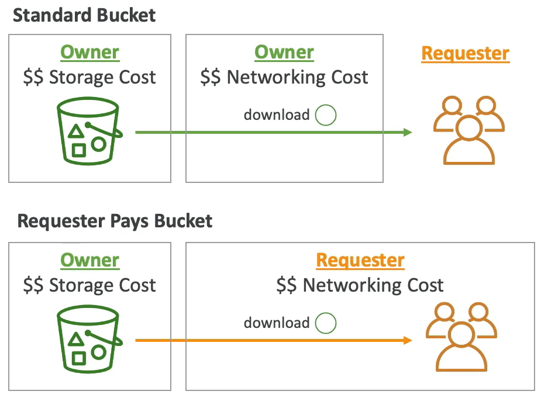

# S3 Requester Pays

- 일반적으로 버킷 소유자가 버킷과 관련된 모든 Amazon S3 스토리지 및 전송 비용을 지불한다.
- 예를 들어 버킷 세 개가 있고 그 안에 객체를 보관하고 있다. 그리고 사용자가 버킷으로부터 파일을 다운로드 한다. 그러면 네트워킹 비용 역시 버킷을 만든 사람에게 청구된다.
- 그러나 Requester Pays 기능을 활성화시키면 버킷을 생성한 사람이 아니라 사용자가 다운로드 비용을 지불한다.
- 버킷을 생성한 사람은 버킷의 객체 스토리지 비용은 지불하지만 사용자가 다운로드와 관련된 네트워킹 비용을 지불하게 된다.
- 대량의 데이터 셋을 다른 계정과 공유하려고 할 때 매우 유용하다.