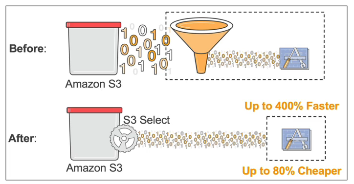
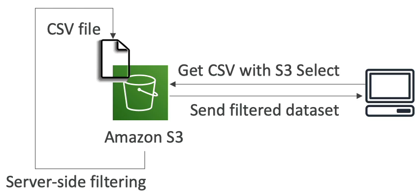

# S3 Select & Glacier Select

- AWS s3 / Glacier 에 저장된 데이터에 쿼리를 날려서, 필요한 데이터만 다운받을 수 있게 해주는 기능이다.
- 기존에는 Amazon S3 에서 모든 데이터를 애플리케이션으로 전송한 후에 애플리케이션에서 필터링을 하여 원하는 레코드를 찾는 형태였지만 S3 Select 를 사용해서 필요한 데이터를 쿼리할 수 있게 됐다.
- GROUP BY, ORDER BY 같은 집계용 쿼리는 지원하지 않는다.
- SCAN, 데이터 조회량 만큼 과금된다.
- 네트워크를 거치는 트래픽의 양이 적고 필터링이 서버에서 일어나기 때문에 사용하면 속도를 높이고 비용을 절약할 수 있다. 400% 빠르고 80% 정도 저렴하다.
- 예를 들어, 클라이언트가 S3 Select 를 통해 CSV 파일에서 일부 행과 열을 요청할 때, Amazon S3 는 서버 측에서 CSV 파일을 필터링한 레코드를 클라이언트에게 보내준다. 네트워크와 CPU 사용률이 줄고 속도가 빨라진다!

S3 에서 서버 측 데이터 필터링을 줄이려면 S3 Select 와 S3 Glacier Select 를 떠올리면 된다.