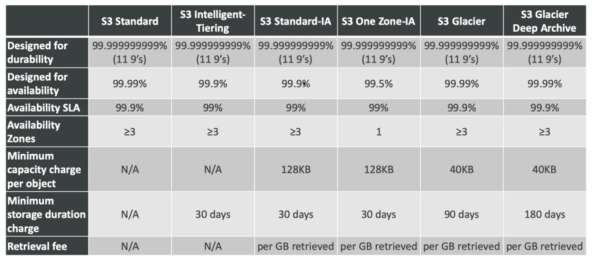

# S3 Storage Classes and Glacier

시험 대비를 위해서는 모든 S3 스토리지 클래스에 대해 알고 있어야 한다.

각 상황에 가장 적합한 클래스를 숙지해야 한다.

- Amazon S3 Standard : 범용적으로 사용되는 스토리지이다.
- Amazon S3 Standard-Infrequent Access(IA) : 자주 액세스하지 않는 파일에 적합한 스토리지이다.
- Amazon S3 One Zone-Infrequent Access(IA) : 데이터를 재생산할 수 있는 스토리지이다.
- Amazon S3 Intelligent Tiering : 스토리지 클래스들 간에 데이터를 효율적으로 이동할 수 있게 해주는 스토리지이다.
- Amazon Glacier : 아카이브를 위한 스토리지이다.
- Amazon Glacier Deep Archive : 지금 당장 필요하지 않고 언젠가 사용할 수도 있는 아카이브를 위한 스토리지이다.
- Amazon S3 Reduced Redundancy Storage : 현재는 잘 사용하지 않는 스토리지이다. 자세히 다루지는 않고 이런 스토리지가 있다는 것만 알자.

### S3 Standard

- 내구성이 아주 좋아서 일레븐 나인이라고 부른다. 다중 AZ 를 사용해서 객체의 내구성이 99.999999999% 라는 뜻이다.
- 따라서 S3 Standard 에 10,000,000 개의 객체를 저장하면 평균적으로 10,000 년에 한 번 한 개의 객체가 손실될 것이다.
- 다시 말해서, S3 Standard 에서는 객체 손실이 발생하지 않는다는 뜻이다.
- 연평균 가용성이 99.99% 이다.
- 기능 장애를 동시에 두 개를 버틸 수 있어 재해에 대한 내성이 굉장히 강하다.
- 주로 빅데이터 분석이나 모바일, 게임 애플리케이션 컨텐츠를 배포할 때 사용한다.

### S3 Standard Infrequent-Access(IA)

- 이름 그대로 자주 액세스하지는 않지만 필요한 경우 빠르게 액세스해야 하는 데이터를 저장할 때 사용한다.
- 다중 AZ 로 구성하여 높은 내구성을 가지고 있지만 텐나인으로 범용 S3 에 비해 9가 하나 빠진다.
- S3 Standard 에 비해 비용이 적게 든다. 즉, 객체에 액세스 하는 일이 적으면 많은 비용이 들지 않는다.
- 두 개의 기능 장애를 동시에 버틸 수 있다.
- 주로 재해 복구나, 백업 또는 자주 액세스하지 않을 것으로 예상되는 파일들을 저장하는 데이터 스토리지로 사용한다.

### S3 One Zone Infrequent-Access(IA)

- 기존 IA 와 동일하지만 데이터를 단일 가용 영역에 저장하는 방식이다.
- 가용 영역이 다운되더라도 데이터를 사용할 수 있도록 하기 위해 사용한다.
- 단일 AZ 는 내구성이 높지만 해당 AZ 에 문제가 생기면 데이터를 잃게 된다.
- 가용성은 99.5% 로 좀 더 낮지만 지연 시간이 짧고 높은 처리량을 보여준다.
- 비교적 저렴하며 SSL 암호화 방식을 지원한다.
- IA 대비 20% 정도 비용이 줄어든다.
- 주로 온프레미스 데이터를 2차적으로 백업하거나 재생성(recreate) 가능한 데이터를 저장하는데 사용한다.
- 재성성(recreate) 가능한 데이터란 어떤 데이터를 사용해서 만들어진 데이터를 뜻한다. 즉, 하나의 이미지를 사용해서 썸네일을 만드는 경우 썸네일은 재생성됐다고 생각하면 된다.
- 이미지는 S3 Standard 에 저장하고 썸네일은 S3 One Zone Infrequent-Access 에 저장하는 방식으로 사용한다.
- 만약 썸네일을 재생성해야 하는 경우 메인 이미지에서 손쉽게 생성할 수 있다.

### S3 Intelligent Tiering

- S3 Standard 와 마찬가지로 지연 시간이 짧고 처리량이 높지만 원간 모니터링 비용과 자동 티어 비용이 발생한다.
- 범용 S3 와 S3 IA 사이에서 객체를 이동시켜 주는 기능을 한다. 객체의 액세스 빈도를 파악해 자동으로 IA 로 옮겨주거나 IA 에서 S3 로 옮겨주는 것이다.
- Intelligent Tiering 이 모니터링을 통해 자주 사용되지 않는 녀석들을 이동시켜 주는 대가로 약간의 비용이 청구되는 것이다.
- 내구성은 일레븐나인이고 가용성은 99.9% 이다.

### S3 Amazon Glacier

- 일종의 콜드 아카이브이다.
- 저렴한 비용의 객체 스토리지로 아카이빙과 백업을 위해 존재한다.
- 데이터는 장기간(수십 년) 보관된다.
- 내구성은 나인일레븐이라 객체 손실이 없고 스토리지 당 비용이 아주 저렴한 대신 데이터를 회수할 때 GB 당 $0.004 로 회수 비용이 추가된다
- Glacier 내의 모든 항목은 객체가 아니라 아카이브라고 불리며 각 아카이브의 크기는 40TB 까지 가질 수 있다.

### S3 Amazon Glacier & Glacier Deep Archive

- Amazon Glacier : 3가지의 회수 옵션이 존재한다.
  - Expedited : 파일을 요청하면 1~5 분 정도의 시간이 걸린다.
  - Standard : 파일을 요청하면 3~5 시간이 걸린다.
  - Bulk : 한 번에 여러 파일을 동시에 회수하는 방식으로 파일을 받는데 5~12 시간이 걸린다.
  - Amazon Glacier 는 파일의 회수가 급하지 않은 경우 사용되고, 급하게 파일을 가져와야 하는 경우 Expedited 를 사용할 수 있는데 비용이 다른 옵션에 비해 훨씬 비싸다.
  - Glacier 에 데이터를 저장하면 최소 90일 동안은 저장해야 한다. Glacier 는 파일을 장기간 보관할 때 사용하기 때문이다.
- Amazon Glacier Deep Archive : 아주 아주 오랫동안 저장을 할 때 사용하는 스토리지이다.
  - Standard : 파일을 가져오는데 12 시간이 걸린다.
  - Bulk : 파일을 가져오는데 48 시간이 걸리지만 비용은 훨씬 저렴하다.
  - Deep Archive 는 파일을 급하게 회수할 필요가 없을 때 적합한 스토리지이고 최소 저장 기간은 180일이다.

### 정리

