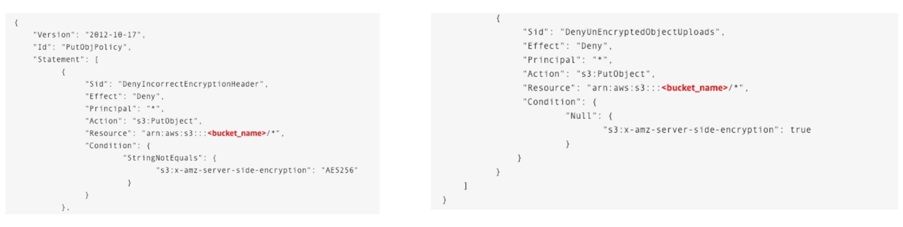

# S3 기본 암호화

- S3 버킷에 객체를 푸시하고 객체가 암호화되도록 하기 위해서는 버킷 정책을 사용해서 객체 암호화를 강제할 수 있다.
- 암호화에 대한 버킷 정책을 사용할 시 헤더에 암호화에 대한 설정값이 없으면 Amazon S3 가 객체를 저장하지 않는다.
- 위와 같은 방식말고도 Amazon S3 의 기본 암호화 옵션을 사용하는 방법도 존재한다. 암호화되지 않은 객체를 S3 버킷에 업로드하면 기본 암호화 옵션을 통해 암호화가 이뤄지는 방식이다.
- 기본 암호화 방식을 사용할 때, 똑같은 객체를 업로드 할 때 재암호화가 되지는 않는다.
- 기본 암호화 방식을 사용할 때는 버킷 정책을 설정하지 않아도 SSE-S3 나, AES256, SSE-KMS 등 을 사용하여 객체를 암호화 한 후에 업로드 할 수 있다.(버킷 정책이랑 상관 없이 기본 암호화 방식이 활성화 돼 있다면 객체를 암호화하여 업로드 할 수 있다는 뜻이다.)