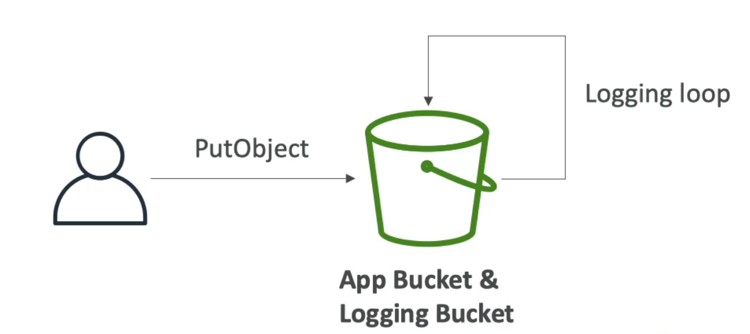

# S3 액세스 로그

- 감시 목적으로 S3 버킷에 모든 액세스를 버킷에 로깅하는 경우 Amazon S3 로 보내지는 모든 요청은 계정과 승인 여부에 상관 없이 다른 S3 버킷에 로깅되어 이후에 분석이 가능하다.
- 데이터 분석 도구를 이용해서 분석하거나 Amazon Athena 를 사용해 분석할 수도 있다.

사용자가 버킷에 요청을 보낸다. 이 버킷에는 다른 버킷 즉, 로깅이 활성화 되어 있는 로깅 버킷이다.

따라서 S3 액세스 로그를 활성화하면 로깅 버킷으로 모든 요청이 로깅될 것이다.

### S3 Access Logs : Warning

- 모니터링 중인 버킷을 로깅 버킷으로 설정하면 절대 안된다.
- 만약, 모니터링 버킷을 로깅 버킷으로 사용하게 되면 로깅 루프가 발생하고 버킷의 크기가 기하급수적으로 커진다.

예를 들어, 애플리케이션 버킷이면서 모든 로그를 수신하는 로깅 버킷이기도 한 버킷이 있다.

사용자가 객체를 버킷에 넣을 때 마다 버킷이 자기 내부에 로깅함으로써 로깅 루프가 발생하고 새 객체에 로깅될 새 객체를 생성하고 또 새 객체에 로깅이 되는 무한 로깅 루프가 발생한다.

그래서 버킷 크기가 기하급수적으로 커지게 된다.

이런 작은 실수로 인해 많은 비용을 지불하게 된다.

애플리케이션 버킷과 로깅 버킷은 반드시 분리해야 한다.