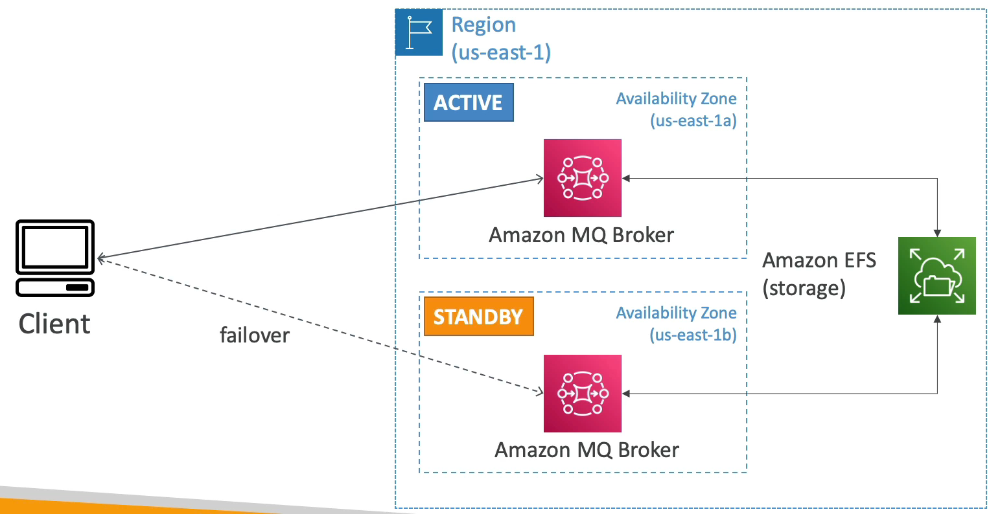

# Amazon MQ

- 온프레미스에서 클라우드로 SQS 나 SNS 를 사용하는 애플리케이션을 마이그레이션 할 때 아키텍쳐를 재설계하지 않고 옮길 때 Amazon MQ 를 사용한다.
- Amazon MQ 는 클라우드에서 Apache Active MQ 를 관리한다.
- SQS 나 SNS 만큼 확장성이 좋지는 않다. 프로비저닝이 필요하고 전용 머신에서 실행된다.
- 장애 조치에 대해 고가용성을 설정할 수 있다.
- Amazon MQ 는 SQS 대기열 기능이 있고, SNS Topic 기능도 있다. 그래서 온프레미스에서 클라우드로 애플리케이션을 마이그레이션할 때 그 앱이 MQTT 나 MQP 같은 표준 프로토콜을 사용한다면 Amazon MQ 를 사용하여 마이그레이션할 수 있다.

### Amazon MQ - High Availability

예를 들어, us-east-1 리전에서 us-east-1a, us-east-1b 가용영역을 사용한다고 가정한다.

1a 는 활성화시키고 1b 는 standby(대기) 상태로 설정한다.

각각의 가용영역에 Amazon MQ Broker 가 실행되고 1b는 대기, 1a 는 활성화 시킨다.

장애 조치를 취하기 위해서 백엔드 스토리지로는 Amazon EFS 를 사용해야 한다.

클라이언트는 1a 의 활성화 된 MQ Broker 와 통신을 하고 해당 가용 영역에 장애가 발생하면 스탠바이 상태에 있는 MQ Broker 가 활성화되며 작동한다.