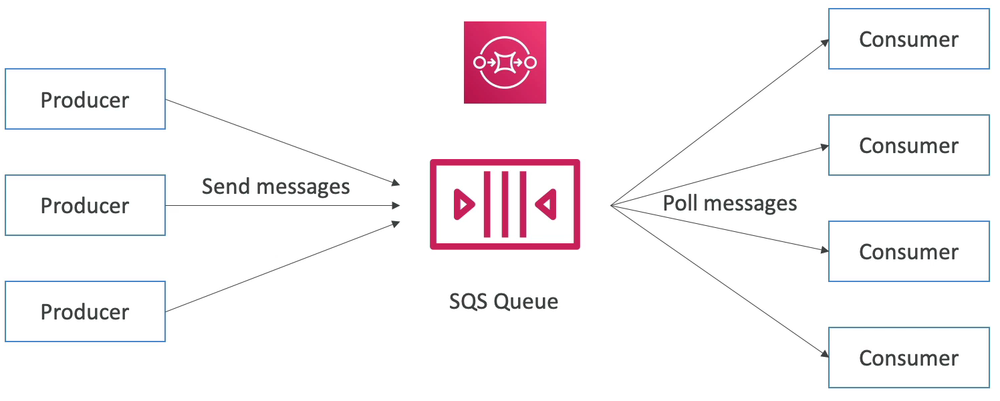
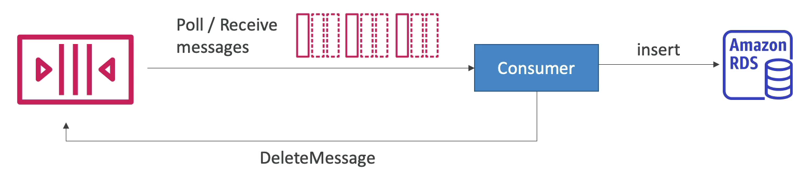
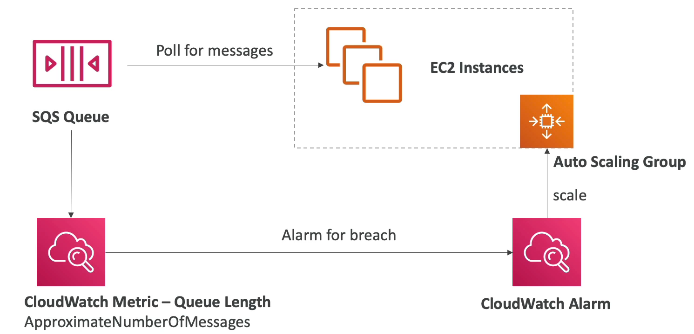
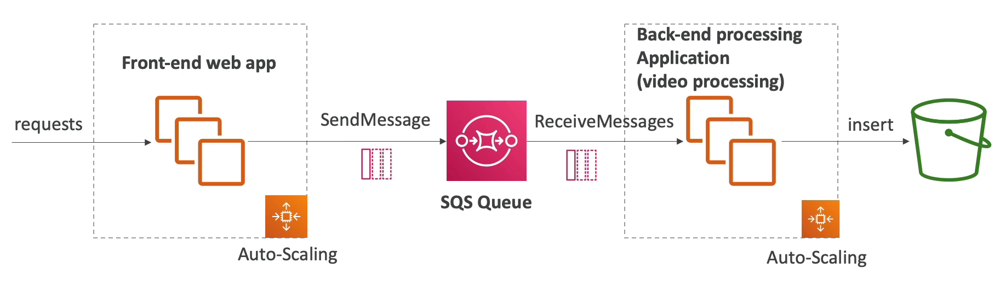

# Amazon SQS

- SQS 의 핵심은 대기열로, SQS 는 간단한 대기 서비스이다.
- SQS 대기열에는 메시지를 갖는다.
- SQS 대기열에 메시지를 보내는 주체를 Producer 라고 한다. producer 는 한 개일 수도 그 이상일 수도 있다.
- 여러 producer 가 보낸 여러 개의 메시지를 SQS 대기열에 보낼 수 있다.
- 메시지로 어떤 것이 오든 상관 없다.
- 대기열에서 메시지를 처리하고 수신하는 대상을 Consumer 라고 부른다.
- consumer 는 대기열에서 메시지를 폴링하고 메시지가 있으면 메시지를 얻는다. 그 메시지의 내용대로 처리를 하고 대기열에서 메시지를 삭제한다.
- 여러 consumer 가 SQS 대기열에서 메시지를 소비할 수도 있다.
- SQS Queue 는 producer 와 consumer 사이를 분리하는 버퍼 역할을 한다.

### Amazon SQS - Standard Queue

- AWS 의 첫번째 서비스 중 하나이다.
- 완전 관리형 서비스이며 애플리케이션을 분리하는데 사용된다.
- 처리량이 무한하다.
  - 즉, 초당 원하는 만큼 메시지를 보낼 수 있고 대기열에도 원하는 만큼 메시지를 포함시킬 수 있다.
  - 처리량에 제한이 없고 대기열에 있는 메시지 수에도 제한이 없다.
- 각 메시지는 4일에서 최대 14일 동안 대기열에 남아있을 수 있다. 즉, 대기열에서 보관되는 기간 동안 consumer 가 메시지를 처리해야 한다. 
- 지연 시간이 짧아서 SQS 는 메시지를 보내거나 SQS 에서 메시지를 읽을 때 10ms 이내로 응답을 해준다.
- SQS 에 보내지는 메시지의 크기는 건당 256kb 미만이어야 한다.
- 메시지가 중복되서 보내질 수 있다.

### SQS - Producing Message

- 최대 256kb 크기를 갖는 메시지가 producer 에 의해 전송된다.
- producer 는 SDK 를 사용하여 SQS 에 메시지를 보낸다. SQS 에 메시지를 보내는 API 를 SendMessage API 라고 한다.
- 메시지가 작성되서 대기열에 위치하면 consumer 가 해당 메시지를 읽고 삭제할 때 까지 SQS 대기열에 유지된다. 메시지가 삭제됐다는 것은 메시지를 읽었거나 보존 기간이 지났거나 둘 중 하나다.
- 예를 들어, 메시지 내용으로 주문 id, 고객 id, 원하는 속성 등의 정보를 포함하여 SQS 대기열로 보내면 consumer 에서 메시지를 처리한다.
- SQS 는 처리량이 무한하다.

### SQS - Consuming Message

- consumer 는 보통 애플리케이션이 되고, 앱들은 대게 EC2 인스턴스 상에서 돌아가거나 온프레미스의 서버이거나 AWS Lambda 함수에서 실행할 수도 있다.
- SQS 대기열에 메시지가 들어있고 consumer 가 메시지를 폴링한다. 즉, consumer 가 대기열에 내 앞으로 온 메시지가 있는지를 묻는 작업을 진행하는 것이다.
- consumer 는 최대 10개의 메시지를 받고, 메시지를 처리해야할 책임이 있다.
- 예를 들어, 애플리케이션에서 주문을 하는 경우를 생각해보자. 해당 주문 내역들이 메시지로 SQS 대기열에 들어온다. 해당 메시지를 처리해야 하는 consumer 는 Amazon RDS 이다. 그러면 그 메시지들을 Amazon RDS 에서 처리를 해줘야 한다. 즉 데이터베이스에 메시지에 적힌 주문들을 알맞게 처리하여 저장해준다. 그 후 consumer 가 메시지를 삭제한다.

### SQS - Multiple EC2 Instances Consumers

- SQS 대기열은 메시지를 동시에 여러개 수신할 수 있고 메시지를 처리하는 consumer 를 여러개 가질 수 있다.
- 예를 들어, EC2 인스턴스 세개가 있고 각 consumer 들은 poll 함수를 호출하여 다른 메시지들을 수신한다. 만일 메시지가 consumer 에 의해 적절한 속도로 처리되지 않으면 다른 consumer 가 메시지를 수신하게 된다. 그래서 적어도 한 번은 consumer 들에게 메시지가 송신이 된다.
- SQS 대기열에 메시지가 엄청나게 많이 쌓여 있다면 consumer 들을 추가하고 수평적인 확장을 진행하여 처리량을 개선할 수 있다. ASG 와 비슷하다.

### SQS with Auto Scaling Group

- consumer 는 ASG 에서 실행되는 인스턴스들이고 해당 인스턴스들이 SQS 대기열에서 메시지를 폴링한다.
- ASG 는 cpu 처리량이나 트래픽양 같은 일정 지표에 따라 스케일링이 되는데 SQS 대기열에서 사용할 지표로는 CloudWatch 지표를 사용할 것이다.
- 대기열의 길이가 특정 수준을 넘어가면 CloudWatch 의 알람을 설정하여 알람이 울리게 할 수 있다.
- 웹사이트에 주문이 밀려있는 상황일 경우 오토 스케일링 그룹이 EC2 인스턴스들을 스케일링해주면 메시지들을 더 빠르게 처리할 수 있다.

### SQS to decouple between application tiers

- SQS 는 애플리케이션 계층 간에 분리를 위해 사용된다.
- 예를 들어, 비디오를 처리하는 애플리케이션이 있다. 프론트엔드에서 어떤 요청을 받으면 비디오를 업로드하거나 다운로드 할 수 있어야 하는데 S3 버킷에 데이터를 올리고 다운로드 하는 처리 시간이 매우 오래 걸릴 수 있고 프론트엔드에서 이를 처리하면 웹사이트의 속도가 느려질 수도 있다는 것이다. 대신 애플리케이션을 분리하여 파일 처리 요청과 실제 파일 처리가 다른 애플리케이션에서 발생하도록 분리할 수 있다. SQS 대기열로 메시지를 전송하여 비디오를 처리해달라고 메시지를 전송하면 속도가 느려질 일도 없고 아무 문제가 없다.
- 즉, 백엔드 애플리케이션과 프론트엔드 애플리케이션으로 분리를 하고 프론트엔드에서 SQS queue 로 메시지를 전송하고 ASG 에 속한 백엔드 인스턴스들이 메시지를 처리하여 비디오를 S3 버킷에 업로드하거나 다운로드를 하는 식의 동작을 한다.

### Amazon SQS - Security

- 보안 
  - 전송 중에 HTTPS 를 사용하여 암호화 한다.
  - KMS 키를 사용하여 미사용 데이터 암호화한다.(at-rest encryption)
  - 클라이언트 측에서 자체적으로 암호화 및 복호화를 하여 클라이언트 측 암호화를 할 수도 있다. SQS 에서 기본적으로 지원하지는 않는다.
- 액세스 컨트롤을 위해 IAM 정책을 사용하여 SQS API 에 대한 액세스를 통제할 수 있다.
- S3 버킷 정책과 비슷한 SQS 액세스 정책이 있다.
  - SQS 대기열에 대해 교차 계정 액세스를 수행하려는 경우나 SNS 혹은 Amazon S3 같은 다른 서비스가 SQS 대기열에 S3 이벤트 같은 것을 쓸 수 있도록 허용하려는 경우 유용하다.