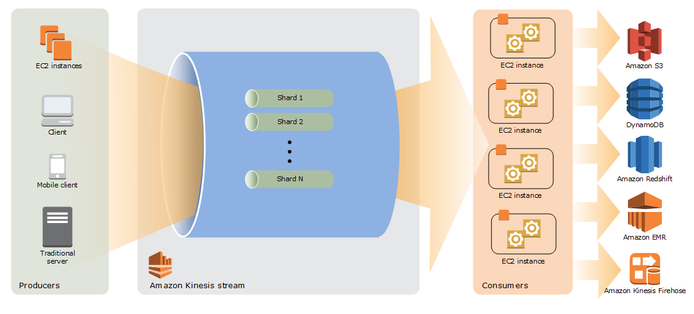
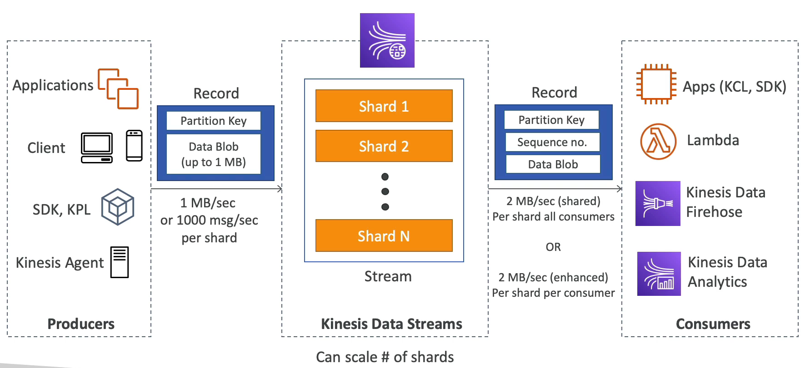
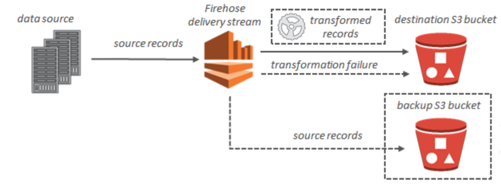
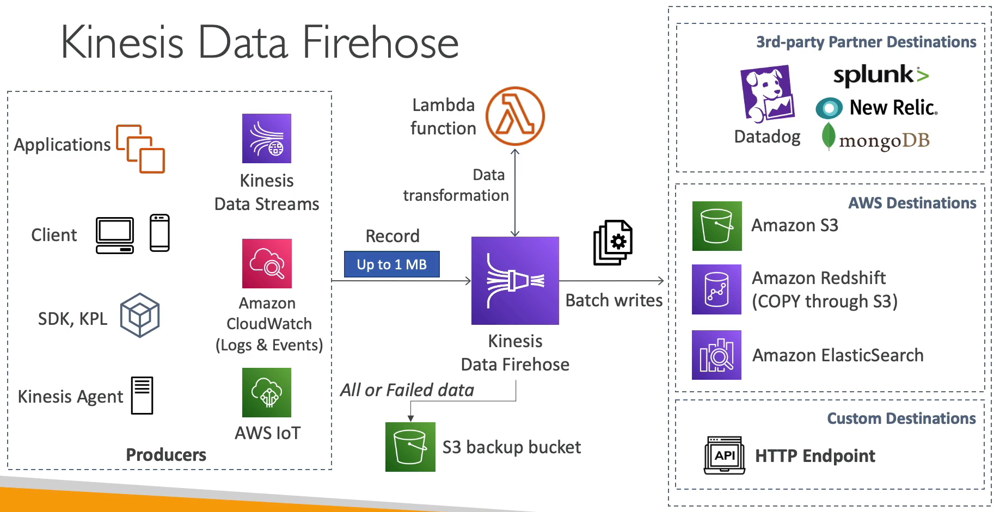

# Kinesis

- Kinesis 를 통해 스트리밍 데이터를 실시간으로 쉽게 수집, 처리, 분석할 수 있다.
- 주로 애플리케이션 로그, metrics, 웹사이트 스트림, IoT 데이터 등을 처리할 때 사용한다.
- Kinesis Data Streams: 데이터 스트림으로 스트리밍 데이터를 수집한다.
- Kinesis Data Firehose: 데이터 전송 스트림으로 스트리밍 데이터를 처리 및 전송한다.
- Kinesis Data Analytics: 데이터 분석 애플리케이션을 사용하여 스트리밍 데이터를 분석한다.
- Kinesis Video Streams: 동영상 스트림을 수집, 처리, 저장한다.

### Kinesis Data Streams

대량의 데이터를 실시간으로 수집, 처리하는 서비스로 내부적으로 샤드로 구성되어 있으며 이를 동적으로 증가/감소시킬 수 있고 샤드 수에 따른 보장된 전송 시간을 제공하기 때문에 이점이 많다. 

주로 연속적으로 생산되는 대량의 데이터 소스(1MB 이하)를 처리해야하는 파이프라인에 사용하기 좋다.

이와 비슷한 서비스로 Kafka, RabbitMQ 등이 있으며 이와 구별되는 Kinesis Stream 의 특징은 아래와 같다.

- Kinesis Data Stream 은 샤드로 구성되고 샤드의 개수가 많을수록 해당 스트림의 처리량이 늘어난다.
- 생산자(Producer)는 매우 다양하다. Kinesis API 를 사용하는 모바일이나 데스크톱 클라이언트가 될 수도 있고, 애플리케이션이 될 수도 있다.  
- 생산자가 실시간으로 레코드를 스트림으로 보낸다. 레코드는 파티션 키로 구성되어 있고 최대 1MB 의 데이터가 저장될 수 있다.
- 소비자(Consumer)는 Kinesis Data Stream 에서 데이터를 가져와 사용한다. Kinesis API 를 사용하는 애플리케이션이 될 수도 있고, Lambda 함수 일 수도, Kinesis Data Firehouse 나 Kinesis Data Analytics 일 수도 있다.
- 소비자가 받게 되는 레코드에는 소비자 측에서 보낸 동일한 파티션 키와 시퀀스 번호가 있고 생산자가 보낸 데이터도 존재한다.
- 위와 같은 패턴을 Kinesis Data Stream 의 Pub/Sub 패턴이라고 부른다.
- AWS 클라우드 서비스로 제공되어 서버 관리가 필요없다.
- AWS 보안을 사용하기 때문에 보안성이 좋다.
- 이미 AWS 클라우드 서비스를 사용하고 있다면 도입이 간편하다.
- 수집/처리하는 데이터양을 지금 당장 몰라도 손쉽게 변경/유지관리가 가능하다.

### Kinesis Data Stream 개념 설명

- 데이터 레코드: 데이터 레코드는 저장되는 데이터의 단위이다. 데이터 레코드는 시퀀스 번호, 파티션 키 및 데이터가 있고 데이터는 최대 1MB 이다.
- 보존 기관: 보존 기관은 데이터 레코드를 스트림에 추가한 후 데이터 레코드에 액세스할 수 있는 시간의 길이이다. 스트림 보존 기간은 기본적으로 생성 후 24시간으로 설정된다. 이 기간은 추가적으로 더 늘릴 수 있으나 그에 할당하는 추가 요금이 적용된다. 디폴트는 24시간이다.
- Produce: 생산자는 Amazon Kinesis Data Stream 으로 데이터를 입력하는 주체이며 웹서버, 디바이스 등이 생산자가 된다.
- Consumer: 소비자는 Amazon Kinesis Data Stream 으로부터 데이터를 가져와 사용하는 주체이며, 기본적으로 Kinesis Data Firehouse 를 바로 연결하여 처리한다.
- Shard: 샤드는 스트림에서 고유하게 식별되는 데이터 레코드 시퀀스이다. 스트림은 하나 이상의 샤드로 구성되며 각 샤드는 고정된 용량 단위를 제공한다. 각 샤드는 읽기에 대해 초당 최대 5개의 트랜잭션, 최대 총 데이터 읽기 속도(초당 2MB), 초당 최대 1,000개의 레코드를 지원할 수 있다. 스트림의 데이터 용량은 스트림에 지정하는 샤드 수의 함수이다. 스트림의 총 용량은 해당 샤드의 용량의 합계이다. 이러한 샤드를 구축한 후에도 언제든지 변경 가능하여 데이터 속도, 용량에 대한 대비가 가능하다.
- 파티션 키: 파티션 키는 스트림 내에서 샤드별로 데이터를 그룹화하는데 사용된다. Kinesis Data Streams 스트림에 속한 데이터 레코드를 여러 샤드로 나눈다. 각 데이터 레코드와 연결된 파티션 키를 사용하여 해당 데이터 레코드가 속한 샤드를 확인한다. 파티션 키는 각 키에 대한 최대 길이 제한이 256자인 유니코드 문자열이다. 파티션 키를 128비트 정수 값에 매핑하고 샤드의 해시 키 범위를 사용하여 연결된 데이터 레코드를 샤드에 매핑하기 위해 MD5 해시 함수가 사용된다. 애플리케이션이 데이터를 스트림에 넣을 때는 파티션 키를 지정해야 한다.
- 시퀀스 번회: Kinesis Data Streams 에서 내부적으로 할당되는 시퀀스 번호이다.

### Kinesis Data Firehouse

실시간 스트리밍 데이터를 제공하기 위한 완전 관리형(서버리스) 서비스이다. 생산자(Producer) - Kinesis Data Firehouse - 소비자(Consumer) 와 같이 Kinesis Data Stream 과 동일한 입출력 개념으로 사용되며 

전송 과정에서 데이터 변환이 가능하며 AWS 의 S3, RDS 등을 소비자로 사용하기에 간편하게 구성되어 있다.

- Kinesis Data Stream 으로부터 Firehouse 가 레코드를 읽는다. Firehouse 에 Lambda 함수를 사용하여 해당 데이터를 원하는대로 가공할 수 있다.
- Firehouse 는 읽어들인 데이터를 목적지에 write 를 시도하는데 효율적으로 쓰기 위해 배치 파일을 만들어서 한 번에 일괄적으로 write 한다.
- 보통 Firehouse 의 목적지는 크게 3가지로 분류할 수 있다.
  1. 서드 파티 destination: Datadog, mongoDB, Splunk, New Relic 등으로 읽어들인 데이터를 배치 파일로 만들어 일괄적으로 write 한다.
  2. AWS destination: Amazon S3, Amazon Redshift, Amazon ElasticSearch 로 읽어들인 데이터를 배치 파일로 만들어 일괄적으로 write 한다.
  3. 커스텀한 destination: 사용자가 직접 유효한 목적지를 지정할 수 있다. 즉 읽어들인 데이터를 배치 파일로 만들어 일괄적으로 write 할 수 있게 API 를 만들었다면 말이다.
- 만약에 목적지에 데이터를 write 하는데 실패하는 경우 S3 백업 버킷으로 읽어들인 데이터를 저장할 수 있다.

### Kinesis Data Firehouse 개념 설명

- 기록: 데이터 생산자(Producer)가 Kinesis Data Firehouse 전송 스트림으로 보내는 관심 데이터이다. 레코드의 최대 크기는 1MB 이다.
- 데이터 생산자(Produce): 생산자는 레코드를 Kinesis Data Firehouse 전송 스트림으로 보낸다. 예를 들어 로그 데이터를 전송 스트림으로 보내는 웹 서버는 데이터 생산자이다. 또한 기존 Kinesis Data Stream 에서 데이터를 자동으로 읽고 대상으로 로드하도록 Kinesis Data Firehouse 전송 스트림을 구성할 수 있다.
- 버퍼 크기 및 버퍼 간격: Kinesis Data Firehouse 는 수신 스트리밍 데이터를 특정 크기로 또는 특정 기간 동안 버퍼링하여 대상으로 전달한다. 버퍼 크기는 MB 단위이고 버퍼 간격은 초 단위이다.

### Kinesis Data Analytics (SQL application)

- Kinesis Data Streams 에서 SQL 을 이용하여 실시간으로 데이터를 분석한다.
- 완전 관리형(서버리스) 서비스라서 프로비저닝할 서버가 필요 없고 스케일링이 자동화되어 있다.
- Kinesis Data Analytics 를 통과하는 실제 데이터 흐름에 따라 비용이 청구되므로 온디맨드 형식이라고 보면 된다.
- 실시간 쿼리에서 스트림을 생성할 수도 있다.
- 주로 시계열 분석, 실시간 대시보드, 실시간 지표를 분석할 때 사용한다.