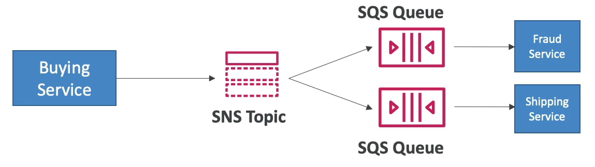
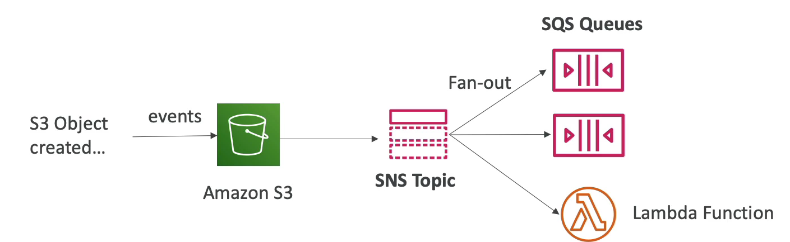
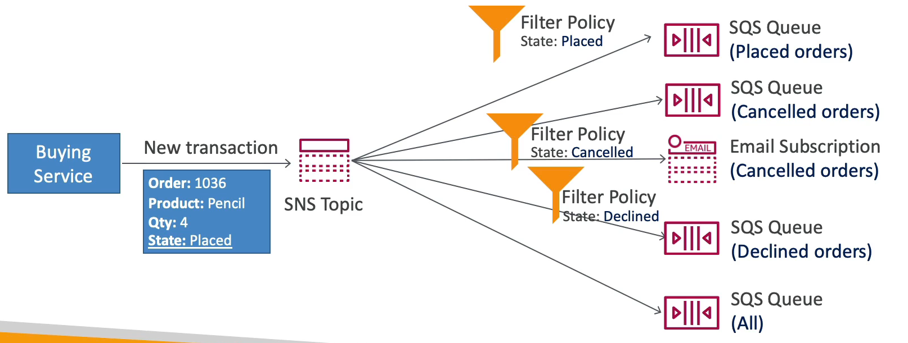

# SNS + SQS: Fan Out

- 여러 SQS 대기열에 메시지를 보내고 싶을 때 모든 SQS 대기열에 개별적으로 메시지를 전송하면 문제가 발생한다.
- 애플리케이션에서 충돌이 발생하여 전송이 실패될 수도 있는 등 문제가 있기 때문이다.
- 즉, 여러 대기열에 메시지를 보내고 싶을 때는 Fan Out 패턴을 사용하면 좋다.
- Fan Out 패턴은 SNS 토픽으로 메시지를 전송하면 해당 토픽을 구독하고 있는 SQS 대기열로 메시지를 전송하게 하는 패턴이다. 

예를 들어, 어떤 물건을 구매했을 때 두 개의 대기열로 메시지를 전송하고 싶은 상황이다.

각각의 대기열에 메시지를 전송하지 말고 SNS Topic 에 메시지를 전송하고 해당 Topic 을 메시지를 전달하고자 하는 두개의 대기열이 구독하게 하면

메시지 하나를 SNS Topic 에 전송하면 자동으로 구독하고 있는 두개의 대기열에 메시지가 전송된다.

완벽하게 분리된 모델이고, 데이터 손실이 전혀 없다.

이러한 Fan Out 패턴을 사용하면 쉽게 SQS 대기열로 메시지를 전송할 수 있고 데이터 지속성, 지연 처리, 작업 재시도 등의 효과를 얻을 수 있다.

단 이런 패턴을 가지기 위해서는 SQS 대기열 접근 정책을 잘 설정해놔야 한다.

### Application: S3 Events to multiple queues

- S3 이벤트를 여러 개의 대기열로 보내야 하는 상황이라고 가정한다.
- S3 이벤트 규칙에는 제한이 있다. 예를 들어, 객체가 생성되고 객체의 접두사가 images/ 처럼 이벤트 형식이 조합될 경우 오직 한 개의 이벤트 규칙만 존재할 수 있다.
- 만약 여러 개의 대기열로 동일한 S3 이벤트 알림을 보내고 싶다면 어떻게 해야 할까?
- 이 경우에도 Fan Out 패턴을 사용해야 한다.
- 예를 들어, S3 버킷에 객체가 생성되어 이벤트가 발생했을 때 해당 이벤트를 SNS Topic 으로 전송하고 여러 개의 대기열이 SNS Topic 에 Fan Out 패턴으로 구독하게 하면 된다.
- 이런 Fan Out 형태를 사용하여 이메일이나 람다 함수 등 다른 형식의 애플리케이션도 SNS Topic 을 구독하여 서로 다른 목적지로 안전하게 메시지를 전송할 수 있다.

### Amazon SNS - FIFO Topic

- Fan Out 패턴은 FIFO Topic 에도 적용할 수 있다.
- Amazon SNS 에는 FIFO 기능이 있다. SQS FIFO 대기열과 동일하게 먼저 온 메시지들이 먼저 나가는 방식이다.
- 메시지 그룹 ID 를 사용하여 정렬할 수 있고, 중복 ID 를 제거하거나 동일한 내용일 경우에도 제거할 수 있다.
- SQS FIFO 대기열만 SNS FIFO Topic 을 구독할 수 있다. SQS FIFO 대기열과 동일한 처리량을 갖게 된다.

### SNS - Message Filtering

- Fan Out 패턴과 관련하여 정말 편리한 SNS 의 마지막 기능은 SNS 에서 메시지를 필터링할 수 있다는 것이다.
- 메시지 필터링이란, SNS Topic 을 구독한 다른 대기열로 메시지를 전송하기 전에 JSON 정책에 따라 메시지를 수정하여 전송하는 기능이다.
- 예를 들어, 연필을 구매했을 경우 SNS Topic 으로 판매 완료라는 상태와 4개라는 수량이 메시지로 담겨져서 보내진다.
- 1번 대기열에서는 판매 완료된 녀석들만 메시지를 받기를 원한다. 이 경우에 SNS Topic 에서 메시지 필터링을 사용하여 해당 대기열로 판매 완료된 상태의 메시지만 전송할 수 있도록 할 수 있다.
- 물품 취소 상태인 메시지만 받는 대기열이나 다른 subscribe 들이 있을 수도 있다.