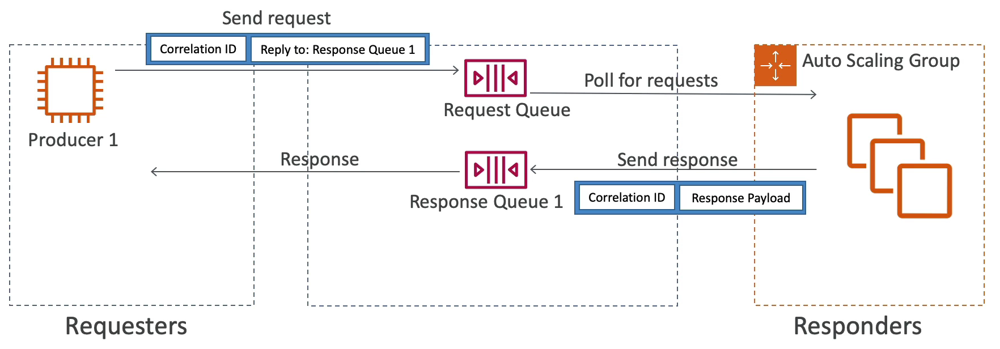
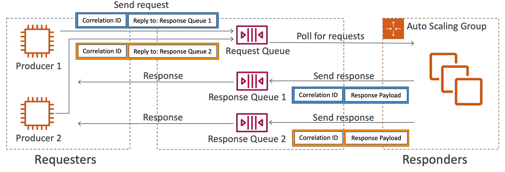

# Request-Response Systems

1. 먼저 requester 들이 있다. 해당 사용자들이 모든 요청을 대기열로 보낸다. 
2. producer 와 응답을 분리하고 중간에서 SQS 를 이용하는 방식으로 request 와 response 양을 스케일링할 수 있다.
3. 오토 스케일링 그룹에 consumer 들이 존재한다. 이 녀석들이 SQS 대기열에서 사용하고자 하는 애플리케이션들이다.
4. 여기서 핵심은 producer 가 메시지를 SQS 대기열에 넣을 때 correlation ID 와 응답할 대기열의 이름을 같이 넣는다.
5. 즉, '이 메시지를 받으면 대기열 1에서 응답할 수 있도록' 라는 것이다. 
6. 이제 consumer 는 대기열에서 request 를 읽고 처리한 후 response 를 만든다. 만약 response 를 만드려는데 대기열 1이 존재하지 않으면 대기열 1을 생성한다.
7. 즉, consumer 가 대기열 1로 response 를 넣으라고 했는데 대기열 1이 없으면 대기열 1을 만들고 response 를 보낸 후에 correlation ID 를 함께 전송한다. 
8. 이렇게 하면 consumer 는 각각의 response 가 어떤 request 와 대응되는지 알 수 있고 페이로드를 이해할 수 있게 된다.

이 아키텍쳐에서 중요한 것은 중간에 오토 스케일링 그룹이 존재하여 백엔드가 다양한 request 와 response 를 처리하면서도 시스템에 과부하를 주지 않는다는 점이다.

위와 같은 아키텍쳐 구조에서 producer 가 하나 더 추가됐다고 가정하자.

1. request 를 보내는 방식은 이전과 똑같지만 response 를 처리하는 방법이 달라진다.
2. producer 2 는 대기열 2에서 메시지를 처리하기를 원하기 때문에 response 는 대기열 2로 보내진다.
3. consumer 는 request 를 처리하고 대기열 2로 response 를 보낸다. producer 2는 대기열 2에 보내진 메시지들을 읽기 시작한다.
4. 이러한 아키텍쳐 구조를 request-response 시스템이라고 부른다. SQS 를 사용해서 만들 수 있는 가장 흔한 패턴이다.

