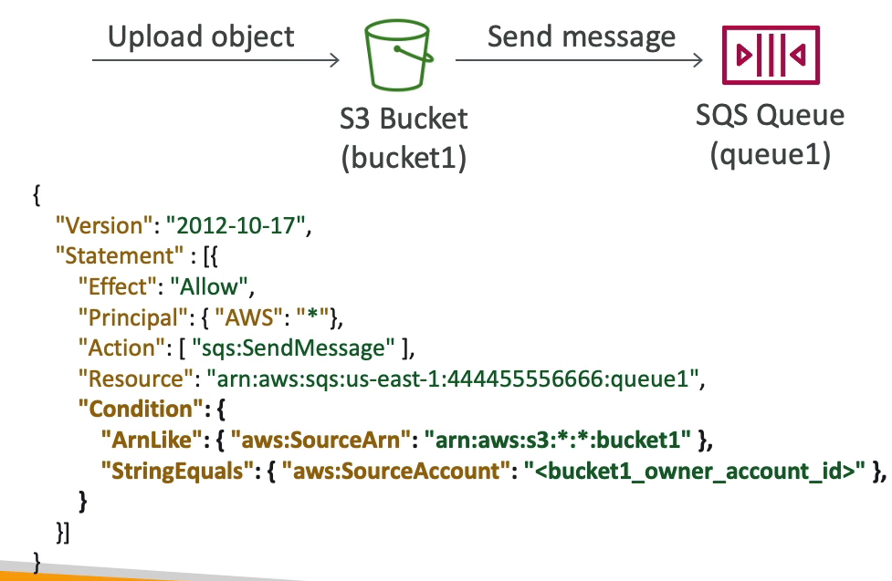

# SQS Queue Access Policy

- SQS 대기열 정책은 리소스 정책이라는 점에서 S3 버킷과 유사하다.

예시 1) 

교차 계정 액세스를 허용하고자 할 때, 어떤 계정에 SQS 대기열이 있고 다른 계정에서 그 대기열에 액세스해야 된다고 가정한다.

위 사진과 같이 생긴 대기열 액세스 정책을 생성하고 이 정책을 SQS 대기열에 입력해줘야 한다. 또한, Principal 을 보면 EC2 인스턴스가 SQS 대기열에 접근할 수 있도록 허가해준 것을 알 수 있다.

즉, SQS 대기열 액세스 정책은 EC2 인스턴스가 다른 계정의 SQS 대기열에 액세스하여 메시지를 폴링할 수 있도록 했다.

예시 2) 

S3 버킷에 객체를 업로드하면 SQS 대기열에 자동으로 메시지를 보내도록 설정할 수 있다.

SQS 대기열에서 액세스 정책을 생성해야 하고 자세한 정책은 위 사진과 같다.

S3 버킷이 SQS 대기열에 메시지를 작성할 수 있게 된다.