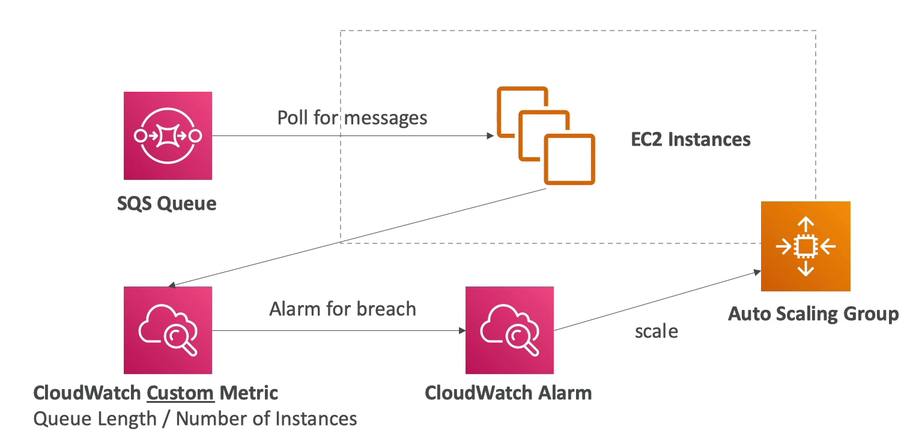
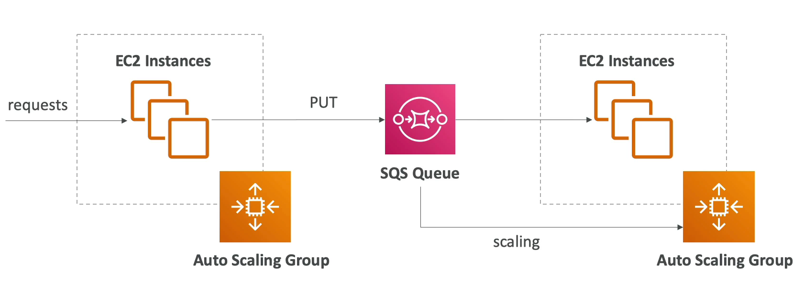

# SQS with Auto Scaling Group

- SQS 대기열에서 메시지를 폴링하는 오토 스케일링 그룹이 있다.
- 대기열의 메시지 양에 따라 인스턴스를 스케일링 할 수 있다.
- 대기열에 부하가 많이 걸려 있다면 오토 스케일링 그룹이 자동으로 인스턴스를 생성한다.
- 부하가 적을 경우에는 오토 스케일링 그룹이 자동으로 인스턴스를 종료시킨다.
- 즉, 오토 스케일링 그룹은 SQS queue 의 상태를 보고 스케일을 조정하는 것으로 queue 의 지표를 사용하여 스케일링을 하는 것임을 알 수 있다.
- 따라서 EC2 인스턴스는 CloudWatch 에서 커스텀한 지표(여기서는 큐의 부하 상태)로 특정한 임계값을 만들고 그 값에 따라 스케일링을 한다.
- 임계값을 넘어가는 순간 클라우드 워치가 알람을 보내고 오토 스케일링 그룹이 인스턴스를 자동으로 늘리게 한다.
- 임계값을 넘었을 떄 알람을 발생시키고, 임계값 아래로 내려갔을 때 알람을 발생시키는 등 알람을 여러개 생성할 수도 있다.
- 위와 같은 방식으로 스케일링 하기 위해서는 커스텀한 지표를 생성하여야 한다. 아마도 큐의 길이를 인스턴스의 갯수로 나눈 값이 될 것이다.

- 오토 스케일링 그룹에서 관리되는 인스턴스에 대량의 request 가 들어올 경우 해당 요청들을 처리하지 않고 바로 queue 에 넣는다고 가정하자.
- 큐에 있는 메시지들은 또 다른 오토 스케일링 그룹에서 관리되는 인스턴스들이 폴링한다.
- 완전히 분리된 아키텍쳐를 가짐으로써 확장성을 얻는다.

