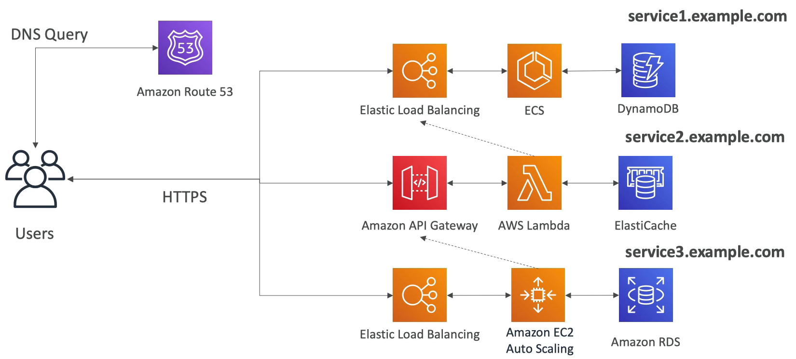

# 마이크로 서비스 아키텍쳐

### 요구 사항

- 마이크로서비스 아키텍처로 전환하고자 한다.
- REST API 를 사용하여 데이터를 교환한다.
- 서비스 개발 수명 주기를 줄이고자 마이크로 서비스 아키텍쳐 구조를 가져간다.

### Micro Services Environment

마이크로 서비스의 전체적인 구조는 다음과 같다.

Route 53 을 사용하여 DNS 서버를 두고 유저는 HTTPS 로 각각의 서비스와 통신을 한다. 

service1 은 앞단에 ELB 를 두고 뒷단에 ECS 와 DynamoDB 를 뒀다.

service2 는 전형적인 서버리스 서비스들을 사용하여 서비스를 만들었다.

service3 은 일반적으로 볼 수 있는 전형적인 아키텍쳐이다.

### Discussions on Micro Service

- 각각의 마이크로 서비스들은 원하는 대로 설계할 수 있다.
- 마이크로 서비스에는 두 가지 패턴이 있다.
  - Synchronous patterns(동기식 패턴): API Gateway 와 로드 밸런서는 다른 마이크로 서비스에 HTTPS request 를 전송하기에 적합하다.
  - Asynchronous patterns(비동기식 패턴): SQS, Kinesis, SNS, Lambda triggers 를 사용하여 마이크로 서비스를 구성할 수도 있다. 비동기식 패턴은 응답을 언제 받을지 어떤 내용이 올지 전혀 모르기 때문에 무한정 대기해야 한다.
- 마이크로 서비스의 문제점은 새로운 마이크로 서비스를 만들 때 마다 오버헤드가 발생한다.
- 서버 밀도나 사용류을 최적화하는 데 어려움을 겪는다. 또한 여러 마이크로 서비스를 동시에 작동하려면 매우 복잡하다.
- 여러 서비스와 통합하려 하다 보면 클라이언트의 코드 요구 사항이 급증한다.
- 이런 문제점을 해결하기 위해 API Gateway 나 Lambda 를 사용한다. 이것들은 자동으로 확장되고 사용량만큼 돈을 내면 되기 때문에 서버 사용률을 걱정할 필요가 없다. 
- API Gateway 에서 API 를 쉽게 복제하고 재생산하고 API Gateway 를 위한 Swagger 를 사용하여 클라이언트에게 SDK 를 생성해줄 수 있다.
