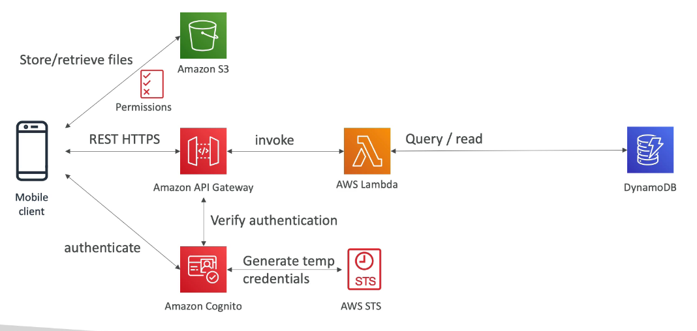
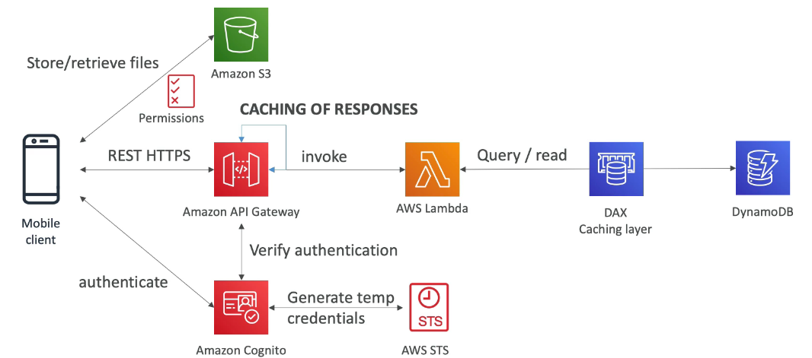

# 모바일 앱: MyTodoList

### 요구 사항

- MyTodoList 라는 모바일 앱을 만든다.
- HTTPS 엔드 포인트가 있는 REST API 를 사용
- 서버리스 아키텍쳐
- 사용자가 직접 S3 에 있는 폴더와 상호작용할 수 있다.
- 사용자가 서버리스 서비스로 인증을 할 수 있다.
- 읽기와 쓰기를 모두 할 수 있지만 읽기 작업을 더 많이 할 것 이기 때문에 읽기 관련하여 성능을 높이면 좋다.
- 데이터베이스는 스케일할 수 있도록 구축해야 하고, 읽기 처리량이 높아야 한다.

### REST API Layer

REST HTTPS 를 사용하기 위해 API Gateway 를 사용한다.

일반적인 서버리스 API 를 사용하는 방식으로 API 게이트웨이가 람다 함수를 호출해서 스케일링이 가능하며 람다 함수는 데이터베이스에 데이터를 저장하거나 읽게 해야 한다.

서버리스 서비스이면서 스케일링이 잘 되는 데이터베이스는 DynamoDB 이기 때문에 DynamoDB 를 사용한다.

사용자 인증을 위해 Cognito 를 사용하여 API 게이트웨이와 통합해준다. 

S3 버킷에 액세스할 수 있도록 액세스 권한을 사용자에게 줘야 한다. 

Cognito 는 AWS STS 를 통해 임시 자격 증명을 제공할 수 있다. S3 에서 파일을 저장하고 읽을 수 있는 자격 증명을 사용자에게 반환해 주면 사용자는 임시적으로 자격 증명을 얻어서 S3 버킷에 액세스할 수 있게 된다.

정리하면, Amazon Cognito 와 AWS STS 를 사용하여 S3 에 액세스할 수 있는 임시 자격 증명을 사용자에게 주면 된다.

### high read throughput static data

사용자가 늘어나기 시작하면 쓰기 처리량보다 읽기 처리량이 아주 많다는 것을 알 수 있게 된다.

읽기 처리량을 늘리면서 전체적인 비용을 감소시키기 위해서는 아키텍쳐 구조를 변경할 필요가 있다.

DynamoDB 에 접근하기 전에 DynamoDB DAX 를 구현해서 캐싱 계층을 갖춘다. 

읽기를 많이 하기 때문에 읽은 데이터들이 모두 DAX 캐시에 저장되어 DynamoDB RCU 가 많이 필요하지 않게 되며 확장이 용이하고 비용도 줄어든다.

이것말고도 request 캐싱을 할 수 있는데 이 때는 response 가 고정된 경우에 API Gateway 에서 캐싱을 진행할 수도 있다.

위와 같은 구조가 전형적인 서버리스 REST API 아키텍쳐이다. 임시 자격 증명을 생성하기 위해 STS 와 Cognito 를 사용했다.

DynamoDB 에서 읽은 내용들을 DAX 에 캐싱하여 성능을 개선하고 비용을 절감했다.

REST request 캐싱을 할 경우, response 가 고정된 경우에 API Gateway 에서 캐싱을 할 수 있다.

보안은 전부 Cognito 를 사용하여 처리가 가능하고 API Gateway 와 직접적으로 통합되어 있다.