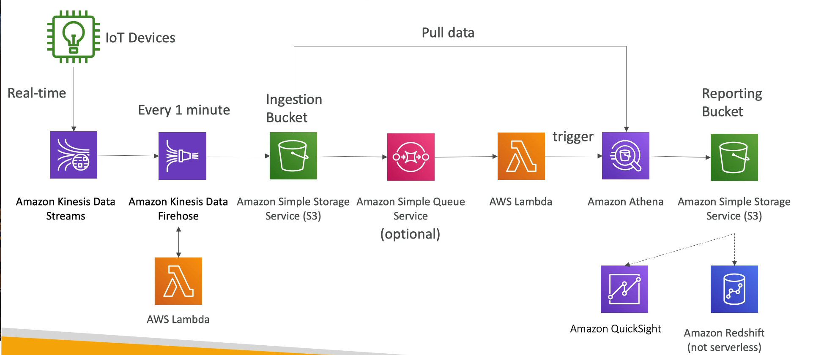

# 빅데이터 수집 파이프 라인

### 요구 사항

- 앱 로그를 수집하는 파이프라인이 서버리스 서비스이면 좋다.
- 실시간으로 데이터를 수집할 수 있어야 하고, 데이터 전처리와 SQL 을 사용하여 얻은 값을 S3 에 저장하고 싶다.
- 저장된 데이터를 데이터 웨어하우스에 등재하여 대시보드를 생성하고자 한다.

### Big Data Ingestion Pipeline

IoT Devices 에서 데이터를 수집한다. 

IoT Core 서비스를 사용하여 장치에서 실시간으로 전송받은 데이터를 Kinesis Data Stream 으로 전송한다.

Kinesis Data Firehose 는 Kinesis 와 통신하며 1분 마다 S3 버킷에 데이터를 write 하고 오프로드한다. 즉, 이 버킷은 데이터를 수집하는 버킷이다.

IoT Devices 에서 대용량의 데이터를 실시간으로 얻을 수 있는 데이터 파이프라인이 준비됐다.

Kinesis Firehose 에서 S3 버킷으로 데이터를 1분 마다 write 하는 것 뿐만 아니라 Lambda 서비스를 사용하여 매우 빠른 속도로 데이터를 정리하거나 전처리할 수 있다.

데이터를 수집하는 버킷에서 옵셔널하게 SQS 대기열을 사용하여 Lambda 서비스를 실행할 수 있다. 이 Lambda 서비스에서 Amazon Athena SQL 쿼리를 실행하면, Athena 쿼리는 버킷에서 데이터를 가져와서 SQL 쿼리를 생성한다. 물론 Athena 는 서버리스 서비스이다.

Athena 쿼리 결과값(데이터 분석한 결과)은 또 다른 버킷에 저장된다. 이 버킷에 저장된 데이터를 바탕으로 Amazon QuickSight 서비스를 사용해서 직접 시각화할 수 있다.

QuickSight 는 Amazon S3 버킷의 데이터를 시각화하거나 Amazon Redshift 같은 데이터 웨어하우스에 데이터를 입력해 분석할 수도 있다.

Amazon Redshift 는 서버리스 서비스가 아니고, Amazon Redshift 데이터 웨어하우스는 QuickSight 의 엔드 포인트로 작동한다.

### 핵심

- Kinesis 와 Lambda, Athena 를 사용하여 데이터 파이프 라인 구성과 실시간 데이터 전처리 등을 할 수 있다.
- QuickSight 서비스를 사용하여 분석한 데이터를 시각화할 수 있다.
- IoT Core 는 여러 IoT 장치들에서 데이터를 수집할 수 있도록 한다.
- Kinesis 는 실시간 데이터 수집에 아주 적합하고, Firehose 는 거의 실시간으로 S3 버킷에 데이터를 운반한다. 이 두개를 사용하여 데이터 파이프라인을 구축하는 것이다.
- Lambda 서비스를 사용하여 Firehose 에서 데이터를 전처리하고 이후에 S3 에서 트리거를 발동시켜 SQS, SNS, Lambda 에 알림을 보낸다.
- Lambda 는 SQS 를 구독할 수 있고 S3 를 Lambda 에 연결할 수도 있다.
- Athena 는 서버리스 SQL 서비스로 Athena 쿼리의 결과값은 S3 에 바로 저장된다. 이 버킷에 분석된 데이터들을 시각화하고 싶다면 QuickSight, Redshift 등의 reporting 툴들을 사용하면 된다.
