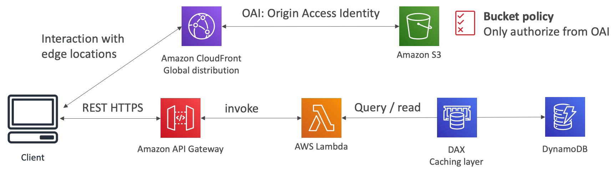
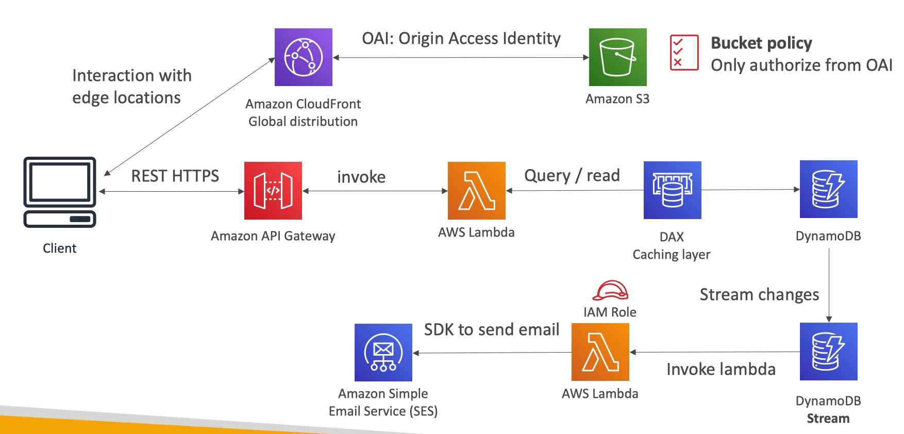
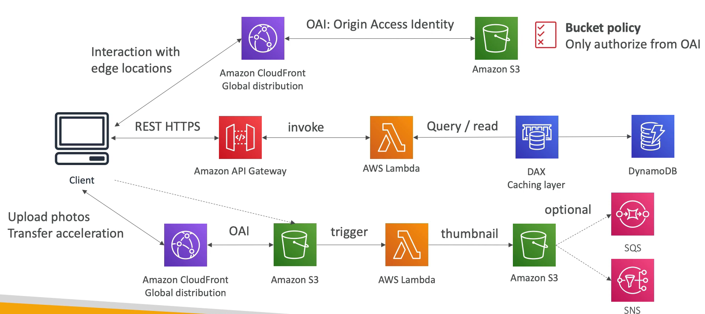

# 서버리스 웹사이트: MyBlog.com

### 요구 사항

- 웹사이트를 글로벌하게 확장해야 한다.
- 블로그는 쓰기 작업보다 읽기 작업이 더 많다.
- 웹사이트 대부분이 정적인 파일로 구성되어 있고 REST API 정도만 동적이기 때문에 가능하면 캐싱을 통해 비용을 절감하고 지연 시간을 줄여야 한다.
- 웹사이트나 블로그를 구독하는 신규 사용자에게 환영 인사를 담은 이메일을 보내고 싶은데 이를 서버리스 처리하고자 한다.
- 블로그에 업로드하는 모든 사진들이 섬네일이 자동으로 생성하고자 한다.

### Serving static content, globally

정적인 글로벌 컨텐츠를 제공해야 하는 상황이다.

정적 컨텐츠는 Amazon S3 에 저장된다. S3 버킷을 어떻게 노출해야 할까? 특정 리전에 위치하는 Amazon S3 버킷을 전세계에 노출하려면 Amazon CloudFront 를 사용한다.

아마존 클라우드 프론트는 글로벌하게 배포를 해주는 CDN 이라 클라이언트는 아마존 클라우드 프론트에서 엣지 로케이션과 통신을 하게 되고 아마존 S3 에서 오는 데이터는 캐시에 바로 저장된다.

클라이언트와 상호 작용하는 클라우드 프론트가 똑같이 글로벌하게 배포를 할 것인데 이때는 OAI 를 사용한다. 

OAI 는 클라우드 프론트에서 S3 로 가는 원본 액세스 ID 이다.

S3 버킷 정책에서는 OAI 권한을 부여해서 CloudFront 읽기만 가능하게 한다.

이제 클라이언트가 S3 버킷에 직접 접근해 컨텐츠를 얻을 수 없으므로 보안상 유리하다.

클라우드 프론트를 거쳐야 하기 때문에 인프라가 보호가 되는 것이다.

public REST API 는 어떻게 추가할까? REST HTTPS 와 Amazon API Gateway 가 통신을 할 수 있어야 하고 람다 함수를 호출하여 DynamoDB 에서 쿼리 작업을 실행한다.

읽기 작업을 더 많이 하기 때문에 캐시 계층으로 DAX 를 사용한다.

만약 글로벌하게 서비스하고 있다면 DynamoDB 글로벌 데이터베이스를 이용하여 일부 지역에서 발생할지 모르는 지연 시간을 줄일 수 있다.

### Use Welcome email flow

사용자가 회원가입을 했을 때 이메일을 보내고자 한다.

DynamoDB 에서 스트림을 활성화시킨다. 스트림이 생성되면 람다 함수를 호출할 것이다.

이 람다 함수는 Amazon SES 를 사용할 수 있도록 IAM 역할을 수행한다. Amazon SES 는 Simple Email Service 의 약자이다.

Amazon SES 는 이메일을 전송하는 AWS 서비스이다.

람다 함수가 AWS SDK 를 사용해서 Amazon SES 에서 이메일을 보내도록 해주면 서버리스 형태로 이메일을 보내는 플로우가 완성된다.

완전 서버리스이기 때문에 관리할 인프라가 없다. 알아서 스케일 아웃이 되고 잘 작동한다.

### Thumbnail Generation flow

CloudFront Global Distribution 에 OAI 를 사용하는 방식이 있다.

클라이언트가 클라우드 프론트로 사진을 보내면 해당 사진을 S3 버킷에 보낸다.

S3 에 파일이 추가될 때 마다 람다 함수가 작동한다. 이 람다 함수는 썸네일을 생성해서 S3 버킷에 담는다.

아마존 S3 에는 SQS 와 SNS 트리거도 있다. 즉, S3 는 람다 함수나 SQS, SNS 를 트리거를 통해 호출할 수 있다.

### 정리

- 클라우드 프론트와 S3 로 정적 컨텐츠를 배포할 수 있다.
- 서버리스 REST API 를 사용하여 인프라를 관리할 필요 없이 REST API 배포가 가능하다.
- 데이터를 글로벌하게 제공하기 위해서 DynamoDB 를 사용한다.
- DynamoDB 스트림을 활성화해서 람다 함수를 작동할 수 있고 이 때 람다 함수가 IAM 역할을 수행하여 SES 서비스를 사용해 이메일을 전송할 수 있다.
- S3 로 트리거가 작동하면 SQS, SNS, Lambda 를 호출할 수 있다.