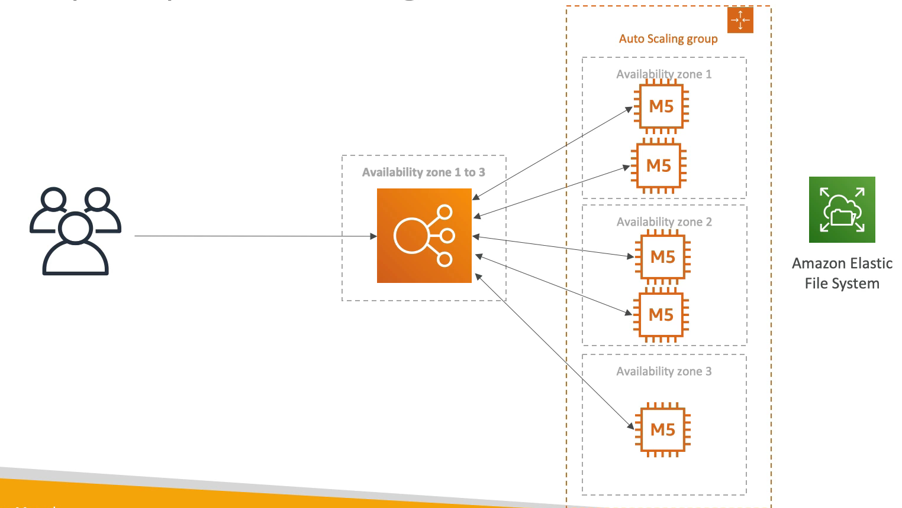

# 소프트웨어 업데이트 배포

### 요구 사항

- EC2 에서 동작하는 앱이 있다.
- 종종 앱을 업데이트한다.
- 앱을 업데이트 한 이후에 컨텐츠들이 다시 많은 클라이언트들에게 배포되고 비용이 많이 든다.
- 애플리케이션을 변경하거나 아키텍쳐를 변경하지 않고 비용과 CPU 사용률을 최적화하고 싶다.

### 현재 상황

ELB 에 ASG 가 뒷단에 걸려있는 상태이다. 

다중 AZ 에 걸쳐서 인스턴스가 동작한다. 모든 인스턴스들은 EFS 를 통해 파일을 공유한다.

### CloudFront 사용

CloudFront 를 최상단에 놓으면 아키텍쳐를 변경하지 않고 아주 간단하게 캐싱이 가능하다.

엣지에서 업데이트한 내역들이 모두 캐싱되기 때문에 CPU 사용률과 비용을 절감할 수 있다. 

업데이트하는 파일은 정적인 파일이기 때문에 새로 업데이트 하지 않는 한 절대 변할 일이 없다.

또한, CloudFront 는 서버리스 서비스이기 때문에 확장이 용이하고 ASG 를 많이 확장하지 않기 때문에 EC2, network, EFS 비용을 절감할 수 있고 가용성을 확보할 수 있다.