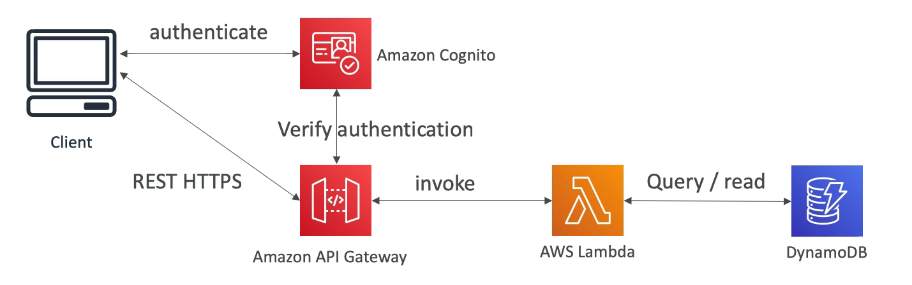
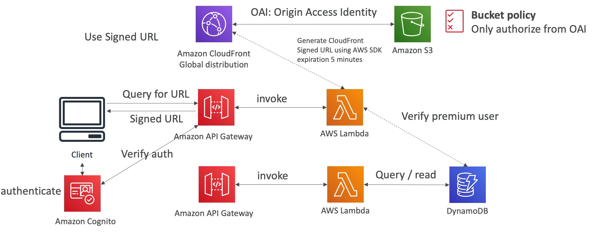

# 유료 컨텐츠 배포.md

### 요구 사항

- 온라인에서 영상을 판매할 것이다.
- 사용자들은 돈을 지불하고 영상을 구매한다.
- 돈을 지불한 프리미엄 사용자에게만 영상을 배포하려 한다.
- 프리미엄 사용자 데이터베이스를 생성하여 프리미엄 사용자에게 짧은 시간동안 사용 가능한 안전한 링크를 보내준다.
- 글로벌하게 사용하는 서버리스 애플리케이션으로 구성한다.

### 프리미엄 사용자 서비스 설계

클라이언트가 API Gateway 를 통해 REST API 를 얻는다.

API Gateway 는 람다 함수와 통신을 하고 람다 함수를 통해 DynamoDB 에 데이터를 저장하고 읽는다.

DB 테이블에는 사용자 테이블이 존재하여 프리미엄 사용자인지 확인할 수 있다.

인증은 Amazon Cognito 로 사용자 인증을 하고 API Gateway 로 검증을 진행한다.

### Distribute Globally and Secure

글로벌하게 S3 버킷에 배포를 해야 하기 때문에 CloudFront Global Distribution 을 사용한다. OAI 를 사용해서 버킷 정책이 있는 S3 버킷과 통신을 한다.

클라이언트가 CloudFront 와 통신을 하도록 권한 설정이 필요하고 CloudFront 에 프리미엄 사용자만 접근하도록 설정해야한다.

클라이언트는 Amazon Cognito 에서 인증을 받는다. Amazon API Gateway 를 통해 API 로 통신을 하고 Lambda 서비스를 통해 DynamoDB 에 쿼리를 날린다.

CloudFront 와 S3 를 사용하여 버킷의 액세스를 관리한다. 또한, CloudFront 에 있는 Signed URL 기능을 사용하여 프리미엄 혹은 유료 컨텐츠를 사용자에게 배포한다.

클라이언트는 API 를 통해 Signed URL 을 요청한다. API Gateway 에서 호출된 API 는 Signed URL 생성을 하기 전에 호출한 클라이언트가 프리미엄 사용자인지 DynamoDB 에 쿼리를 날려서 확인한다.

프리미엄 사용자가 맞다면 AWS SDK 를 사용하여 CloudFront API 를 사용, Signed URL 을 생성하고 TTL 을 셋팅한 후 사용자에게 반환해준다.

클라이언트는 Signed URL 을 통해 CloudFront 글로벌 배포에 액세스할 수 있게 된다.