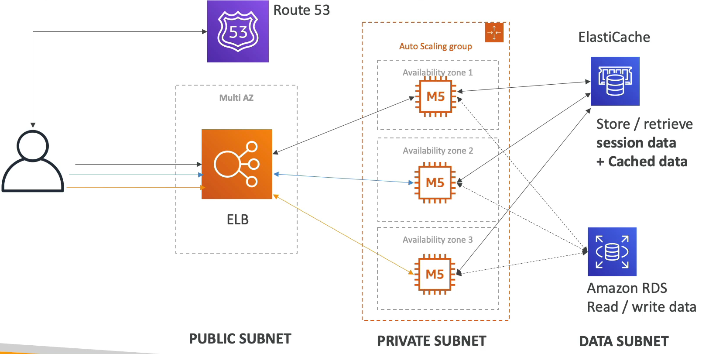
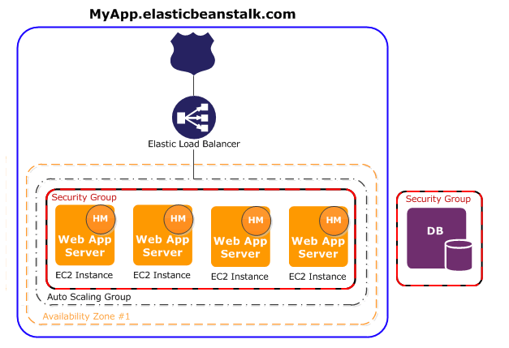
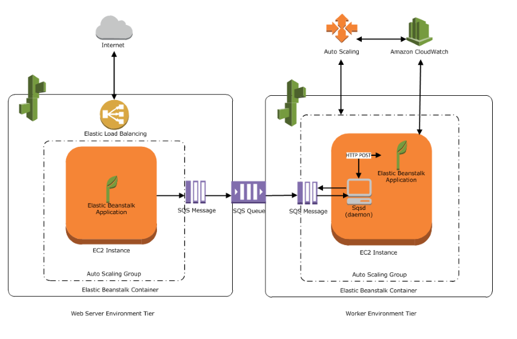

# Beanstalk 개요

위 그림처럼 환경 설정과 아키텍쳐 구축이 모두 끝난 아키텍쳐가 있다.

동일한 아키텍쳐를 계속해서 만드는 것은 귀찮은 일이다.

로드 밸런서 설정, 서브넷 설정, Route 53 설정 등..동일한 인프라를 또 생성하는 것은 말도 안되는 일이다.

이 때 필요한 것이 Beanstalk 이다.

Elastic Beanstalk 는 이러한 절차를 모두 자동으로 만들어주며 수정도 손쉽게 할 수 있는 환경을 제공한다.

한마디로 Elastic Beanstalk 는 웹 애플리케이션/웹 서비스를 배포하고, 확장하고, 관리하는 데 있어 쉽고 빠르게 할 수 있도록 돕는 완전 관리형 서비스이다.

Beanstalk 에선 각각의 구성 요소들을 컨트롤 할 수 있지만 하나의 인터페이스에 모든 구성 요소들이 통합되어 있다.

Beanstalk 자체는 무료이지만 Beanstalk 가 사용하는 인스턴스들이나 ASG, ELB 등에 대한 비용은 지불해야 한다.

### Elastic Beanstalk 의 구성 요소

- 애플리케이션 : Beanstalk 구성 요소(환경, 버전, 설정)들의 묶음
- 애플리케이션 버전 : 말 그대로 애플리케이션 버전
- 환경 :
  - 특정 애플리케이션 버전을 실행하는 리소스의 모음(하나의 애플리케이션 버전만 존재)
  - 작업자 환경과 웹서버 환경이 존재한다.
  - dev, test, prod 등 원하는 어떤 환경을 생성할 수 있다.
  - 어플리케이션을 생성 -> 버전을 업로드 -> 환경을 실행 -> 환경 수명 주기를 관리, 이런식으로 이뤄진다.

Elastic Beanstalk 는 하나의 "애플리케이션"안에 여러 개의 "환경"을 생성할 수 있다.

"환경" 이름에 맞게 "EC2"가 자동 생성되며

( ex - 환경 이름이 test-env 이면 EC2 이름도 test-env로 생성됨 )

자동 생성되는 것은 아래와 같다.

- Amazon Elastic Compute Cloud( Amazon EC2 ) : 선택한 플랫폼에서 웹 앱을 실행하도록 구성된 Amazon EC2 가상 머신이다.
- Amazon EC2 보안 그룹 : 포트 80에서 수신 트래픽을 허용하도록 구성된 Amazon EC2 보안 그룹이다. 이 리소스를 통해 로드 밸런서의 HTTP 트래픽이 웹 앱을 실행하는 EC2 인스턴스에 도달할 수 있다. 기본적으로 다른 포트에서는 트래픽이 허용되지 않는다.
- Amazon Simple Storage Service( Amazon S3 ) : Elastic Beanstalk 사용 시 생성된 소스 코드, 로그 및 기타 아티팩트가 저장되는 s3이다
- Amazon CloudWatch 경보 : 환경의 인스턴스에 대한 로드를 모니터링하는 두 개의 CloudWatch 경보로, 로드가 너무 높거나 너무 낮은 경우 트리거 된다. 경보가 트리거 되면 이에 대한 응답으로 *Auto Scaling 그룹이 확장 또는 축소된다.
- Auto Scaling : 로드가 많아지면 자동으로 서버를 늘려주고 로드가 적어지면 자동으로 서버를 줄여주는 환경
- AWS CloudFormation 스택 : Elastic Beanstalk 는 AWS CloudFormation 을 사용하여 환경의 리소스를 시작하고 구성 변경 사항을 전파한다.
- 도메인 이름 : subdomain.region.elasticbeaanstalk.com 형식으로 웹 앱으로 라우팅 되는 도메인 이름이다.

### 지원 플랫폼

빈스토크에서는 거의 모든 언어로 배포가 가능하다.

- Go
- Java
- Java with Tomcat
- .NET Core on Linux
- .NET on Windows Server
- Node.js
- PHP
- Python
- Ruby
- Packer Builder
- Single Container Docker
- Multi-Container Docker
- 사용자 지정 플랫폼

### 웹 서버 환경과 작업자 환경

위 그림은 웹 서버 환경과 구성 요소가 함께 작동하는 방법을 보여준다.

외부에서 요청이 들어오면 로드 밸런서가 적절히 내부의 web app server 에 전달을 해준다.

위 그림은 작업자 환경과 구성 요소가 함께 작동하는 방법을 보여준다.

작업자 환경의 경우 Amazon SQS 대기열이 아직 없으면 Elastic Beanstalk 가 이를 만들어 프로비저닝한다.

작업자 환경을 시작하면 Elastic Beanstalk 가 Auto Scaling 그룹의 각 EC2 인스턴스에 선택한 프로그래밍 언어에 필요한 지원 파일과 데몬을 설치한다.

데몬은 Amazon SQS 대기열로부터 메시지를 읽고, 처리를 위해 읽은 각 메시지의 데이터를 작업자 환경에서 실행 중인 웹 애플리케이션으로 보낸다.

작업자 환경에 인스턴스가 여러 개 있는 경우, 각 인스턴스에 고유의 데몬이 있으나 모두 동일한 Amazon SQS 대기열에서 메시지를 읽는다.