# MyClothes.com

### 예시

이전에는 stateless 형식의 웹 애플리케이션을 다뤘다.

단순히 시간을 알려주기만 했고 데이터베이스나 다른 정보들이 필요하지는 않았다.

이제는 stateful 형태의 웹 애플리케이션을 다뤄보자.

MyClothes.com 에는 장바구니가 있고 수백명의 사용자들이 웹사이트에 접속할 수 있다.

모든 사용자들이 웹사이트를 둘러볼 수 있다.

인스턴스를 확장할 수 있어야 하고, 수평 확장성을 유지하며 애플리케이션의 상태를 가능하면 stateless 상태로 두고 싶다.

장바구에 저장한 정보들을 잃어버리면 안되고 주소 같은 사용자 정보를 효과적으로 보관하도록 데이터베이스를 사용할 것이다.

### MyClothes.com

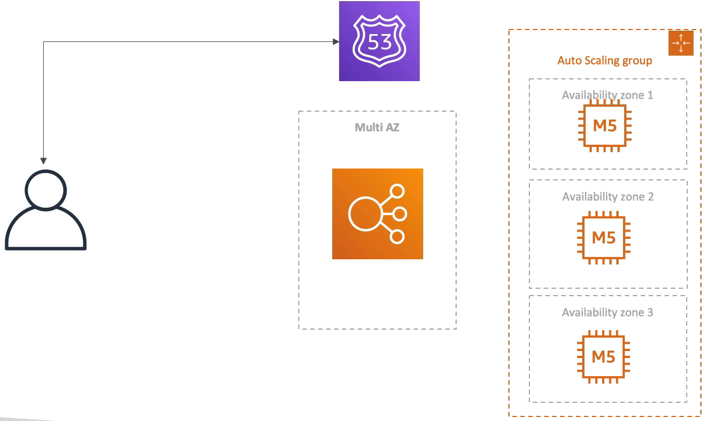

클라이언트가 있고 Route 53 과 ELB, ASG 가 있으며 Multi AZ 기능을 사용하고 있다.

트래픽이 ELB 에 접근하면 ELB 는 트래픽을 인스턴스로 라우팅시켜준다.

사용자가 장바구니에 뭔가를 담았고 잠시 홈화면으로 이동한 후에 다시 장바구니로 돌아왔을 때 장바구니에 담은 정보들이 모두 사라진 상태가 된다.

왜냐하면 stateless 한 상태이기 때문에 장바구니에 물건들이 담겨있는 인스턴스로 연결된 것이 아니라 아예 다른 인스턴스로 연결된 상태이기 때문이다.

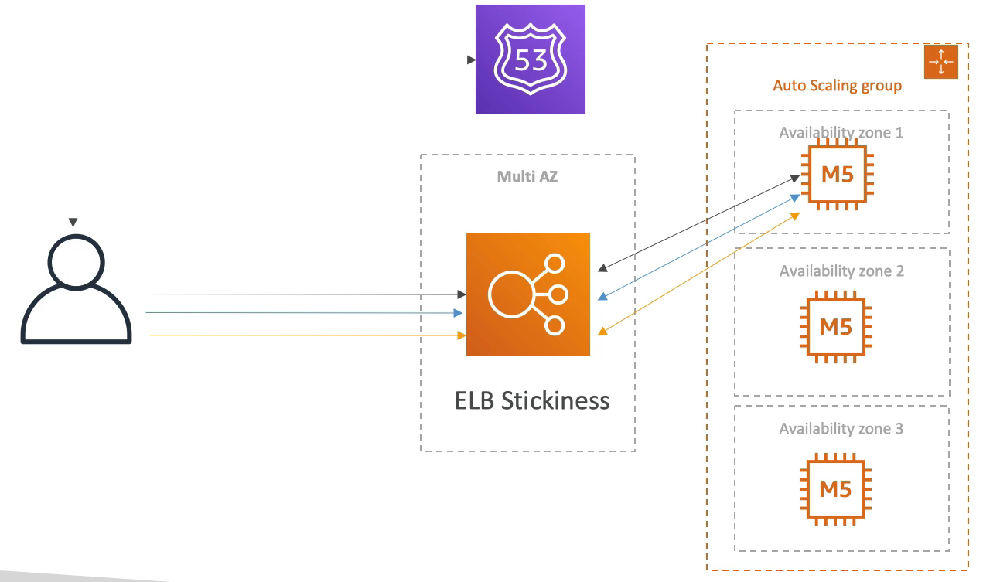

이걸 어떻게 고칠 수 있을까?

일단 sticky sessions 를 사용해서 고칠 수 있다.

ELB 의 stickiness 를 활성화하면 사용자가 똑같은 동일한 인스턴스에 계속해서 접근할 수 있게 된다. 또한, stateful 한 상태가 된다.

그래서 장바구니에 담은 정보들이 사라지지 않지만 어떠한 이유로 EC2 인스턴스가 종료되면 장바구니에 담은 정보들이 모두 사라지게 된다.

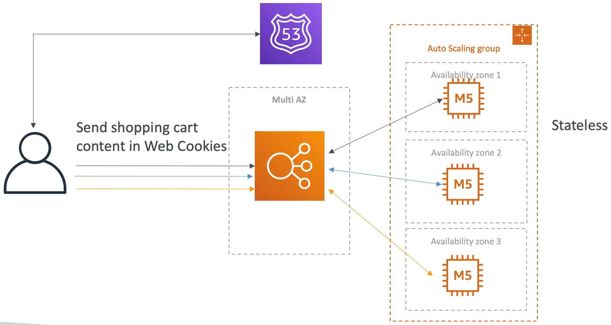

stickiness 를 사용하면 로드 밸런서를 사용하는 의미가 퇴색되기 때문에 다른 방법으로 문제를 해결해보자.

완전히 다른 접근 방법인 User Cookies 방법이 있다.

기본적으로 EC2 인스턴스가 장바구니의 내용을 저장하는 것이 아니라 사용자쪽에서 장바구니의 내용을 저장하도록 하는 방법이다.

그래서 사용자가 로드 밸런서에 접근할 때 마다 '내 장바구니에는 이런 것들이 있다.' 라는 정보를 알려준다.

웹 쿠키를 통해서 이루어지는 방식으로 어떤 인스턴스로 접근을 하더라도 사용자가 EC2 인스턴스로 장바구니 내용을 보내주기 때문에 

각각의 서버가 장바구니의 내용을 알 수 있게 된다. 현재 상태는 stateless 상태가 된다.

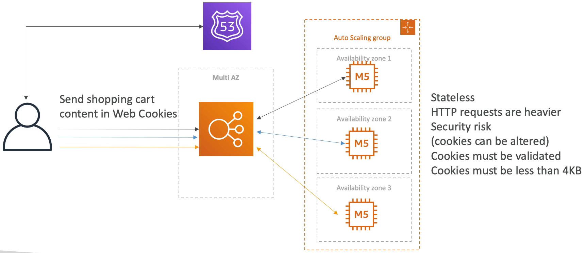

하지만 user cookies 방법을 사용하면 HTTP request 가 무거워지게 된다.

왜냐하면 장바구니에 뭔가를 추가할 때 마다 웹 쿠키에 그만큼 데이터가 쌓이기 때문이다.

또한, 쿠키가 해커나 불순한 의도를 가진 사람들에게 공격 당해 내용이 변경될 수도 있어서 사용자의 장바구니가 수정될 수도 있기 때문에 보안 위험도 존재한다.

그래서, EC2 인스턴스가 반드시 사용자 쿠키의 내용을 검증해야 한다. 또한 전체 쿠키의 크기는 4kb 이하만 가능해서 쿠키 내에는 적은 양의 데이터만 저장할 수 있다. 대량의 데이터셋은 저장할 수 없다.

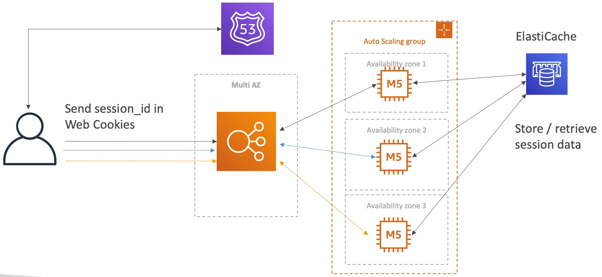

서버 세션 개념을 도입해서 사용해보자.

전체 장바구니를 웹 쿠키로 보내는 대신에 세션 ID 만 보내는 방식이다.

세션 ID 는 사용자에 대한 세션 ID 이고 백그라운드에 ElastiCache 가 존재한다.

세션 ID 를 보낼 때 EC2 인스턴스에게 '이 물건을 장바구니에 추가할 거야' 라고 말하면 EC2 인스턴스는 장바구니 안의 내용물들을 ElastiCache 에 추가하고 이 장바구니 내용은 접속한 사용자의 세션 ID 로만 읽을 수 있다.

그래서 사용자가 세션 ID 를 EC2 인스턴스로 보내야 하는 이유이다.

사용자가 다른 EC2 인스턴스로 접근하게 됐을 경우, 인스턴스는 사용자의 세션 ID 를 사용해 ElastiCache 에서 장바구니 내용을 찾아서 데이터를 불러올 수 있다.

또한, ElastiCache 를 사용해야 하는 이유로는 성능이 매우 매우 매우 빠르기 때문이다.

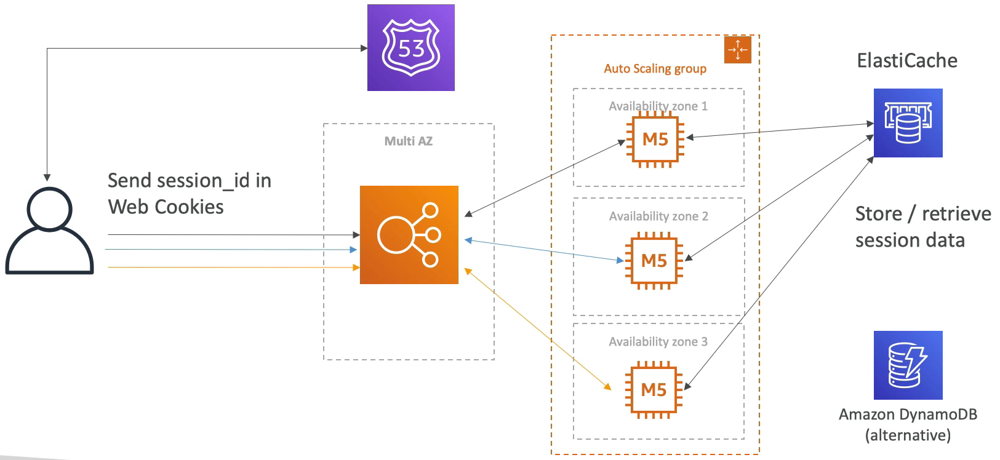

세션 데이터를 저장하는 또 다른 방식으로는 DynamoDB 가 있다.

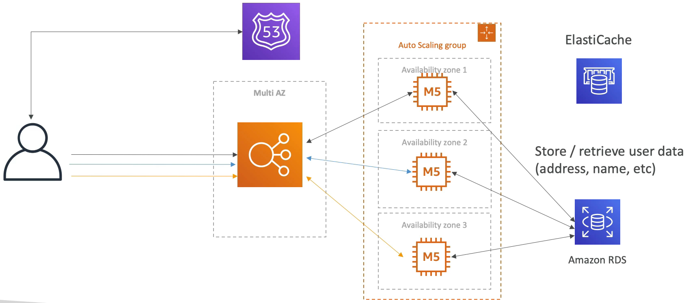

사용자의 데이터를 데이터베이스에 저장하고자 한다.

그래서 RDS 인스턴스와 통신을 해야 한다. 각각의 EC2 인스턴스가 RDS 인스턴스와 통신을 할 수 있다.

일종의 Multi AZ stateless 솔루션을 얻을 수 있다.

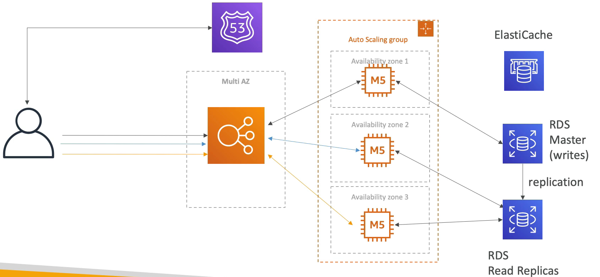

트래픽이 많아져도 웹사이트가 잘 운영되고 있다.

사용자들은 대부분 웹사이트를 둘러보기만 하고 있다. 즉, 읽기 작업이 주로 이뤄진다는 것이다.

이런 경우에는 읽기 작업이 많기 때문에 읽기 작업의 효율성을 늘려줘야 한다.

write 를 수행하는 RDS 마스터에서 읽기 전용 복제본을 생성한다.

즉, 앞으로 읽기 작업은 모두 읽기 전용 복제본에서 처리를 하게 되는 것이다.

RDS 에서 읽기 전용 복제본은 5개까지 가질 수 있다. 

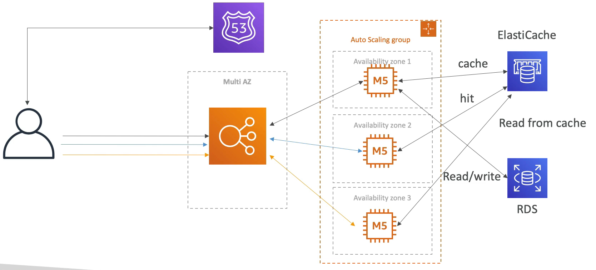

또 다른 패턴으로는 캐시를 사용하는 패턴도 존재한다.

사용자가 EC2 인스턴스와 통신하는데 '항공 점퍼' 를 찾는 쿼리를 날린다.

그러면 캐시를 확인하고 해당 데이터를 가지고 있지 않다면 RDS 로부터 쿼리문을 날려 데이터를 읽어들인다.

그리고 해당 데이터를 ElastiCache 에 집어 넣어 캐싱한다.

다른 EC2 인스턴스들도 같은 방식으로 작동을 하는데, '항공 점퍼' 데이터가 현재 캐시에 존재하기 때문에 ElastiCache 와 통신할 때 캐시 히트를 하게 되고 정보를 얻게 된다.

RDS 로 쿼리를 날리지 않는다. 캐싱이 됐기 때문에 즉시 사용자에게 응답을 날려준다.

이 패턴을 통해 RDS 상의 트래픽을 줄이고 성능을 향상 시킬 수 있다.

이제는 캐시를 사용하기 때문에 캐시 유지 보수가 필요하다.

어려운 일이고 애플리케이션을 개발하는 개발자 쪽에서 해결해야 하는 문제이다.

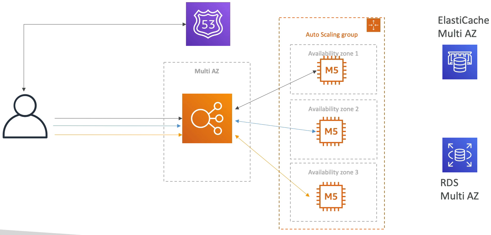

재해에 대비해야 한다. Multi AZ 기능을 사용해서 ELB 와 ASG 의 인스턴스들을 여러 가용 영역에 만들어줘야 한다.

그리고 RDS 역시 Multi AZ 기능을 사용할 수 있다.

Redis 를 사용하고 있다면 ElastiCache 에도 Multi AZ 기능을 사용할 수 있다.

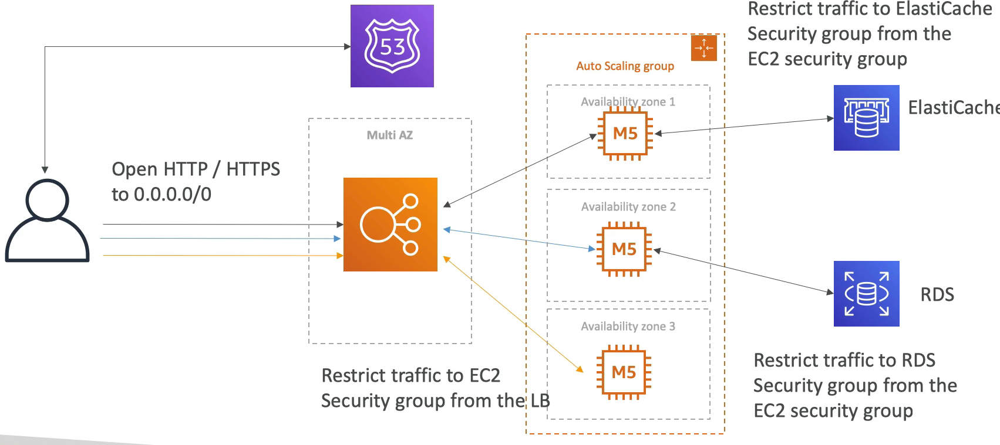

보안 그룹도 셋팅을 해줘야 한다.

ELB 에 HTTP, HTTPS 프로토콜로 오는 모든 트래픽을 열어두고, EC2 인스턴스는 ELB 에서만 오는 트래픽만 열어둬야 한다.(보안 그룹이나 ELB 의 탄력적 IP 를 인바운드 규칙에 추가)

ElastiCache 와 RDS 는 EC2 보안 그룹으로부터 오는 트래픽만 허용한다. 

***

### 정리

- ELB sticky sessions
- 쿠키 저장을 통해 stateless 상태로 만드는 법
- ElastiCache 를 위한 세션 ID 와 캐시의 사용
- 읽기 작업의 경우 캐싱을 위해 ElastiCache 를 사용
- 재해에 대비한 Multi AZ 사용
- 읽기 작업만 전용으로 하는 읽기 전용 복제본 or ElastiCache 사용
- 다른 보안 그룹을 참조하는 보안 그룹