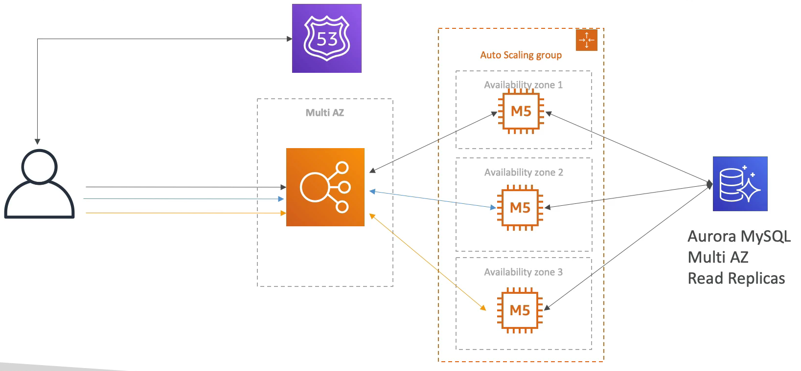
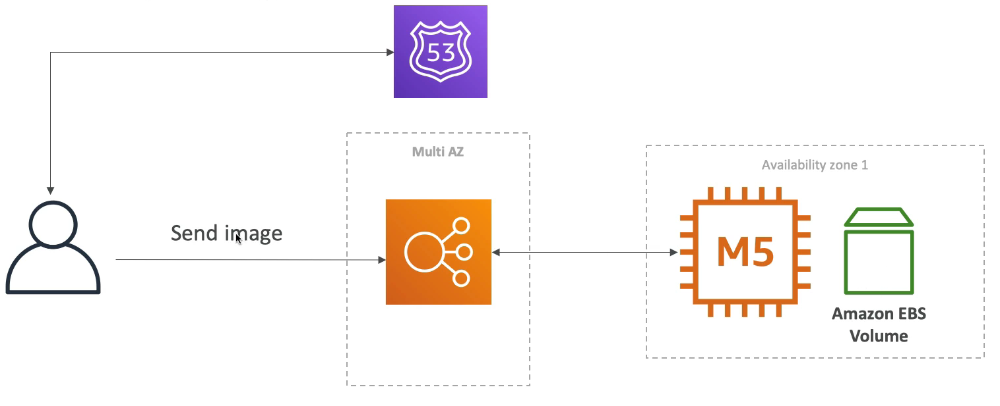
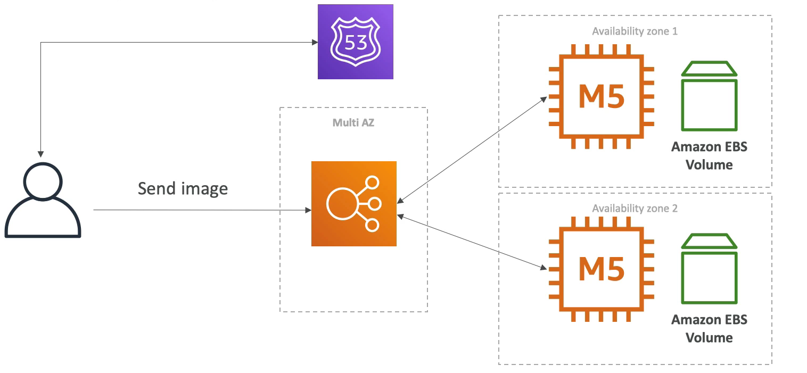
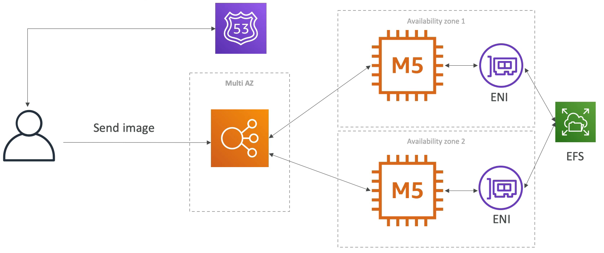

# MyWordPress.com

### 예시

stateful 한 웹 애플리케이션 MyWordPress 가 있다.

모든 EC2 인스턴스들이 데이터베이스에 접근 가능하다.

사용자 정보나 블로그 내용 등, 모든 정보들이 데이터베이스에 저장되야 한다.

글로벌하게 확장할 수 있어야 한다.

### MyWordPress.com

이전과 동일한 구성을 갖는다. Route 53, ELB, ASG 그리고 Multi AZ 를 사용하여 재해에 대비한다.

RDS 로는 MySQL 대신 Aurora 를 사용하여 글로벌하게 확장할 수 있도록 한다.

Aurora 를 사용하면 Multi AZ, 읽기 전용 복제본, 글로벌 데이터베이스 등등 여러 기능을 사용할 수 있다.

말 그대로 글로벌하게 확장 가능하다.

하나의 가용 영역 1에는 EC2 인스턴스와 그에 연결된 EBS 볼륨이 있다.
 
그리고 해당 인스턴스는 로드 밸런서에 연결되어 있다.

클라이언트는 로드 밸런서로 이미지를 보냈고 EBS 볼륨에 이미지가 저장됐다.

EC2 인스턴스가 하나일 때는 잘 작동을 한다. EBS 볼륨까지 바로 연결되고 아무런 문제도 발생하지 않는다.

이미지를 불러올 때도 EBS 볼륨으로부터 이미지를 읽어 들여서 사용자에게 보내준다. 이 과정에서 아무런 문제도 발생하지 않는다.

문제는 오토 스케일링을 하면서 발생한다.

두 개의 가용 영역에 인스턴스가 존재한다. 각각의 인스턴스에는 EBS 볼륨을 갖고 있다.

첫 번째 인스턴스로 이미지를 보내면 그에 연결된 EBS 볼륨에 이미지가 저장된다.

첫 번째 인스턴스에 연결된 상태라면 이미지를 읽어들이는데 문제가 발생하지 않는다.

문제는 두 번째 인스턴스에 연결됐을 경우다. 해당 인스턴스의 EBS 볼륨에는 이미지가 존재하지 않기 때문에 읽어들일 때 오류가 발생한다.

EBS 볼륨의 단점은 하나의 인스턴스만 있을 때는 문제 없이 작동하지만 Multi AZ 또는 다중 인스턴스로 확장을 시작하면 문제가 발생한다.

이를 해결하기 위해서는 EFS 를 사용해야 한다.

NFS, 공유 드라이브라고 생각하면 된다.

EFS 는 탄력적 네트워크 인터페이스를 위해 각각의 가용 영역에 ENI 를 생성하고 ENI 는 EFS 드라이브에 접근하려는 모든 EC2 인스턴스에서 사용 가능하다.

모든 인스턴스가 하나의 드라이브를 공유해서 어떤 인스턴스에서 데이터를 저장해도 모든 인스턴스에서 해당 데이터를 읽고 쓰고 수정할 수 있게 된다.

단점으로는 비용이 든다는 것..?

***

### 정리

- EBS 와 EFS 의 차이를 알아야 한다.(Multi AZ, 다중 인스턴스일 경우 EFS 사용)
- 오로라 데이터베이스에 대해서도 알고 있어야 한다.(글로벌하게 확장하고 싶은 경우, 성능이 더 좋음)