# Stateless Web App : WhatisTheTime.com

### 예시

WhatsTheTime.com 이라는 사람들에게 시간을 알려주는 웹사이트를 만들었다.

각각의 인스턴스와 서버는 몇시인지 알고 있다.

너무나 간단한 웹사이트라 DB 서버도 필요없지만 인기가 정말 많아져서 전 세계의 시간을 모두 알아야 한다.

인스턴스를 수직 및 수평적으로 확장할 수 있어야 한다.

이제 해당 앱에 대해서 해결책을 강구해보자.

### What time is it?

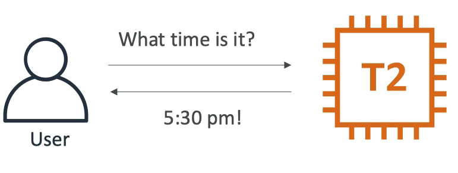

t2.micro 인스턴스와 사용자가 있다.

사용자가 시간을 물어보면 응답값으로 현재 시간을 알려준다.

현재 앱에 고정 IP 주소를 할당해준다. 탄력적 IP 주소를 EC2 인스턴스에 연결해준다.

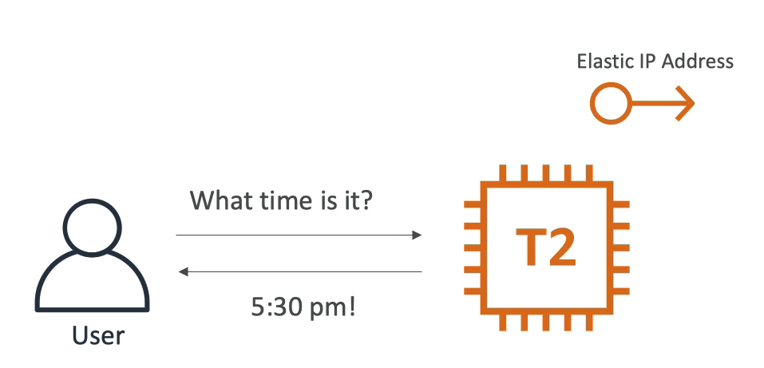

이제 내가 이 웹사이트를 다른 사람들에게 추천을 해서 많은 사람들이 웹사이트에 접속을 하게 된다.

인스턴스에 점점 더 많은 트래픽이 오게 되자 t2.micro 로는 성능이 충분치 않다는 것을 알았다.

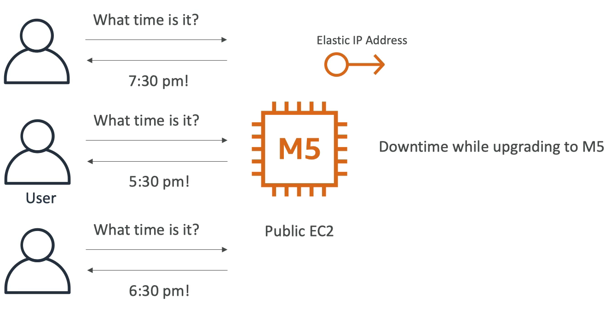

t2.micro 에서 m5.large 유형의 인스턴스로 교체하게 됐고 이를 수직적 확장이라고 부른다.

인스턴스를 중지하고 m5.large 인스턴스로 재실행했다. 

탄력적 IP 를 가지고 연결시켰기 때문에 사용자들은 애플리케이션에 접근할 수는 있었지만

M5 로 업그레이드를 하는 동안 다운 타임이 발생했고 사용자들이 이에 대해 불만을 늘어 놓았다.

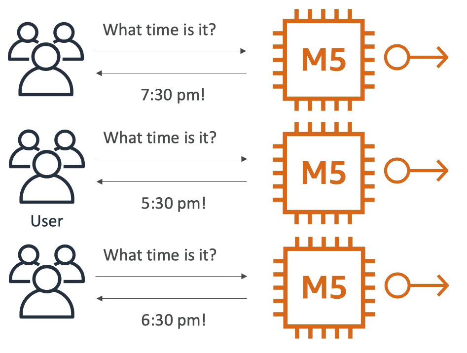

사용자가 계속해서 늘어나서 수평 확장을 해야될 때가 왔다.

M5 애플리케이션은 하나의 public IP 를 가지고 있고 탄력적 IP 가 인스턴스에 연결되어 있는 상태이다.

M5 인스턴스들을 더 추가한다. 해당 인스턴스들에는 모두 탄력적 IP가 연결되어 있다.

사용자들이 인스턴스들과 통신하기 위해서는 세 개의 탄력적 IP 의 정확한 주소를 알고 있어야 한다.

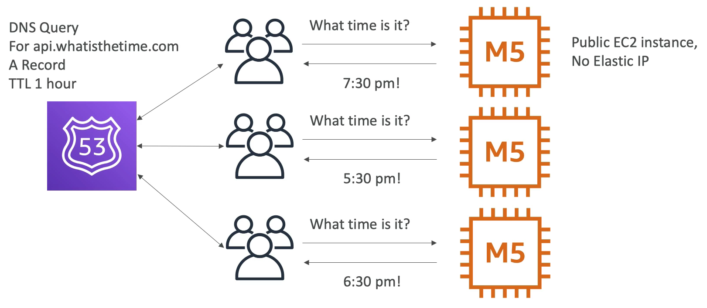

수평적 확장까지 잘 해냈지만 인스턴스가 늘어남에 따라 탄력적 IP 주소를 관리하는 것이 매우 어려워졌다.

다른 방식으로 접근을 해볼 때다.

일단 관리하기 어려운 탄력적 IP 주소들을 모두 제거한다.(최대 5개의 탄력적 IP 생성 가능)

그 대신 Route 53 을 사용해보자.

TTL 을 1시간으로 레코드 타입은 A를 갖는 api.whatisthetime.com 이라는 웹사이트 주소를 생성했다.

A 레코드라는 것은 DNS 로부터 IP 리스트를 받아서 라우팅해주는 것이다.(Route 53의 A 레코드는 IP 이다.)

이제부터 사용자들은 Route 53 에게 쿼리를 날리고 Route 53 이 각각의 인스턴스들의 IP 주소를 클라이언트들에게 준다.

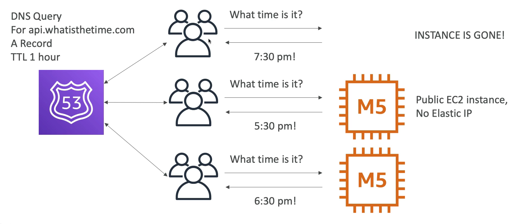

만약 인스턴스가 제거되면 어떻게 될까?

한 클라이언트가 삭제된 인스턴스와 통신 중이었고, TTL 이 1시간이었기 때문에 Route 53 에 쿼리를 시도하면 TTL 이 유지되는 시간 동안은 삭제된 인스턴스의 IP 주소로 라우팅해준다.

이는 좋은 상황이 아니다. 

그러면 어떻게 인스턴스가 삭제되면 바로 정상 작동 중인 인스턴스로 라우팅 시켜줄 수 있을까?

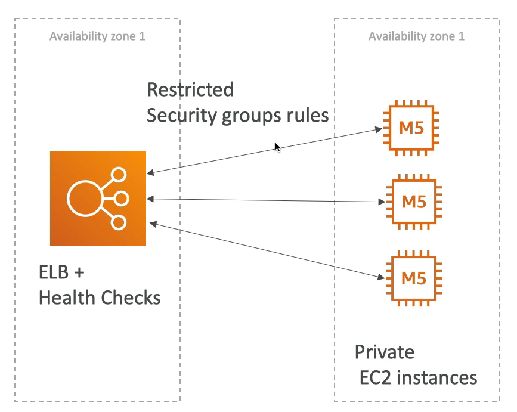

해결 방법으로는 로드 밸런서를 사용해야 한다.

이제 public 인스턴스는 더 이상 없다. 그 대신, private 인스턴스들이 존재한다.

private 인스턴스들은 같은 가용 영역에서 실행된다.

로드 밸런서에는 헬스 체크 기능이 있어서 어떤 인스턴스가 다운되거나 작동하지 않으면 클라이언트에게 해당 인스턴스로 트래픽을 보내지 않는다.

세 개의 m5.large 인스턴스가 있고 이 중 하나의 인스턴스가 다운되면 나머지 2개의 인스턴스로 트래픽을 전송하게 된다.

그래서 전체적인 구조는 모든 사람들에게 보여지는 ELB 와공개되지 않는 private EC2 인스턴스들(보안 그룹을 통해 접속을 허용)로 구성된다.

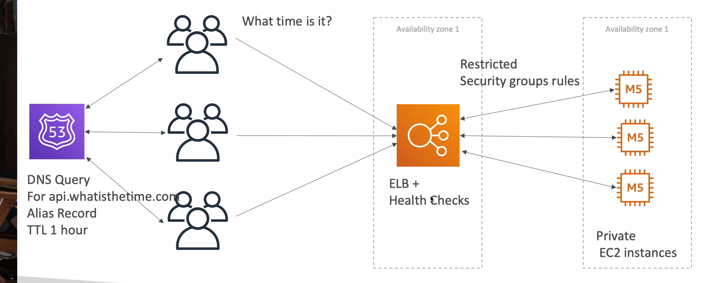

사용자들이 api.whatisthetime.com 으로 쿼리를 보내면 Route 53 에서는 해당 레코드를 CNAME 레코드 타입으로 ELB 와 연결시켜준다.

로드 밸런서는 IP 주소를 계속해서 변경하기 때문에 A 레코드 타입을 사용할 수 없고 대신 CNAME 레코드 타입을 사용해야 한다.

api.whatisthetime.com 는 Route 53 에 의해 ELB 를 가리키게 되고 ELB 는 EC2 인스턴스들로 트래픽을 분산시켜 준다.

즉, 사용자들은 EC2 인스턴스로 바로 접근하는 것이 아니라 DNS 에 의해 로드 밸런서로 접근을 하게 되는 것이다.

그래서 인스턴스가 다운되도 다른 인스턴스로 연결이 되서 다운 타임도 일어나지 않을 것이다.

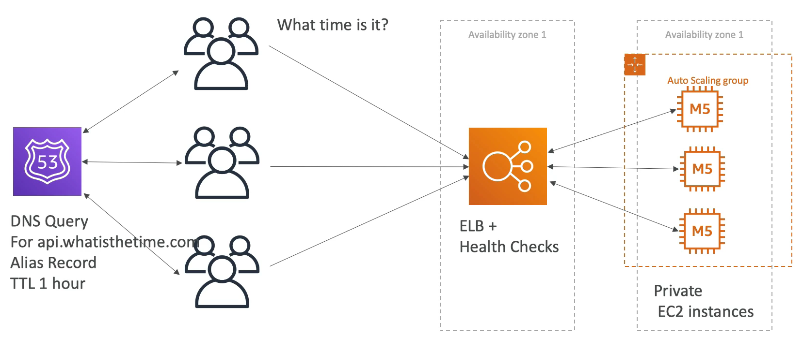

수동으로 로드 밸런서에 인스턴스를 추가하고 제거하는 일은 귀찮고 어려운 일이다.

오토 스케일링 그룹을 사용하면 매우 편리하게 관리할 수 있다.

private 인스턴스들을 오토 스케일링 그룹이 관리를 하게 된다.

오토 스케일링 그룹이 트래픽 양에 따라서 인스턴스를 제거하거나 추가하는 등의 작업을 자동으로 처리해주는 것이다.

아침에는 출근을 해서 사람들이 많이 접속을 하지 않아 인스턴스의 수가 설정한 최소 인스턴스 갯수만큼 줄어들고 

밤에는 사람들이 많이 접속을 해서 인스턴스 갯수가 최대 인스턴스 갯수로 설정만큼 증가할 수도 있다.

트래픽에 따른 확장/축소가 가능해졌고, 애플리케이션의 다운 타임이 없고 오토 스케일링과 로드 밸런싱이 있어서 매우 안정적인 아키텍쳐이다.

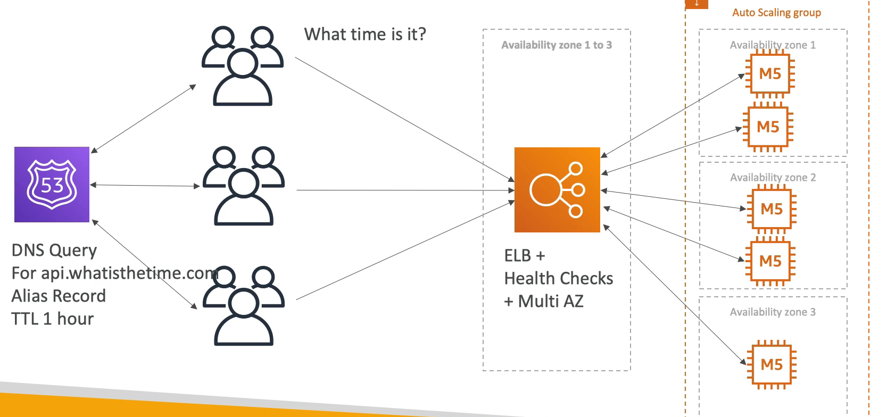

그러나, 지진이 발생하여 가용 영역 1번이 다운될 경우에는 애플리케이션도 완전히 다운되버린다.

내가 multi AZ 를 사용하지 않았기 때문이다.

이렇듯 가용성을 높이기 위해서는 multi AZ 를 사용해야 한다.

이제 ELB 에는 헬스 체크 뿐만 아니라 Multi AZ 기능도 추가된다.

그래서 해당 ELB 에는 세 개의 AZ 가 있다고 가정할 때, 오트 스케일링 그룹 역시 Multi AZ 에 걸쳐 있게 된다.

예를 들어 AZ 1에 두 개의 인스턴스가 있고 AZ 2에 두 개의 인스턴스가 있고 AZ 3에는 하나의 인스턴스가 있다고 가정한다.

이 경우에 AZ 1이 다운되더라도 AZ 2, 3이 있기 때문에 사용자의 트래픽을 처리할 수 있다.

이제 Multi AZ 를 사용해서 가용성을 높였고 장애 발생의 대비도 해놓았다.

더 개선할 여지가 있을까?

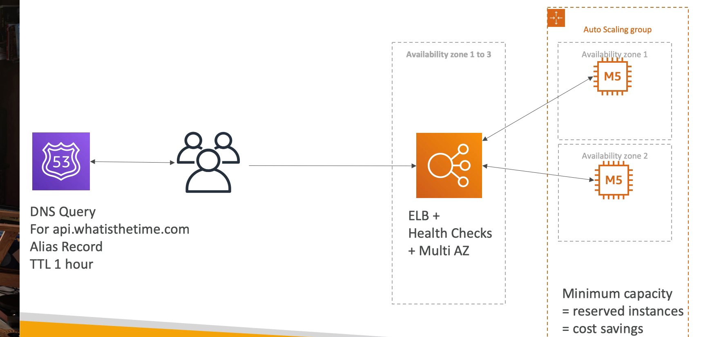

두 개의 AZ 가 있고, 각각의 AZ 에는 최소 하나 이상의 인스턴스가 실행 중일 것이다.

1년 내내 인스턴스가 돌아갈 텐데 비용적으로 꽤 비쌀 것이다.

즉, 인스턴스를 예약함으로써 상당한 비용 절감을 노릴 수 있다.

오토 스케일링 그룹에 의해 인스턴스가 새로 추가되더라도 트래픽이 줄어들면 원래 상태로 되돌아 올 것이다.(일시적)

극단적인 비용 절감으로는 스팟 인스턴스를 사용할 수도 있으나 언제 종료될지 모르기 때문에 안전성에서 매우 떨어진다.

***

### 정리

- EC2 인스턴스와 Public / Private IP 주소의 차이
- 탄력적 IP vs Route 53 vs Load Balancers 를 사용할 때의 장점
- Route 53 의 TTL(IP 주소가 변동된다.) 때문에 A 레코드를 사용할 수 없어서 CNAME 레코드를 사용해야 한다.
- EC2 인스턴스를 수동으로 관리 vs 오토 스케일링 그룹, 오토 스케일링 그룹을 사용하면 비용적으로도 이득이다.
- 재난 극복 방법인 Multi AZ
- 정상 상태의 인스턴스로 트래픽을 라우팅 해주는 ELB 헬스 체크
- Private subnet 에 있는 EC2 인스턴스가 ELB 의 트래픽만 받을 수 있도록 보안 그룹을 설정하는 법
- EC2 인스턴스 예약을 통해 비용 절감

비용, 성능, 신뢰성, 보안, 좋은 운영 이 5가지를 모두 잡으면 AWS 에는 좋은 아키텍쳐라고 부른다.

- 비용 : 인스턴스를 수직으로 확장할 수도 있고 부하에 따라 적절한 양의 인스턴스를 갖기 위해 ASG 을 사용할 수도 있다. 비용 최적화를 위해 인스턴스를 예약할 수도 있다.
- 성능 : 수직 확장을 할 수 있고, ELB 와 ASG 등을 사용했다.
- 신뢰성 : 트래픽을 안정적으로 적절한 인스턴스에 라우팅하기 위해 Route 53 을 사용해봤고, ELB 와 ASG 에 대한 Multi AZ 를 사용했다. 
- 보안 : 로드 밸런서와 인스턴스들을 연결해주기 위해 보안 그룹을 사용했다.
- 좋은 운영 : 매우 투박한 수동 프로세스에서 오토 스케일링 그룹 외의 매우 안정적인 아키텍쳐로 설계를 할 수 있었다.